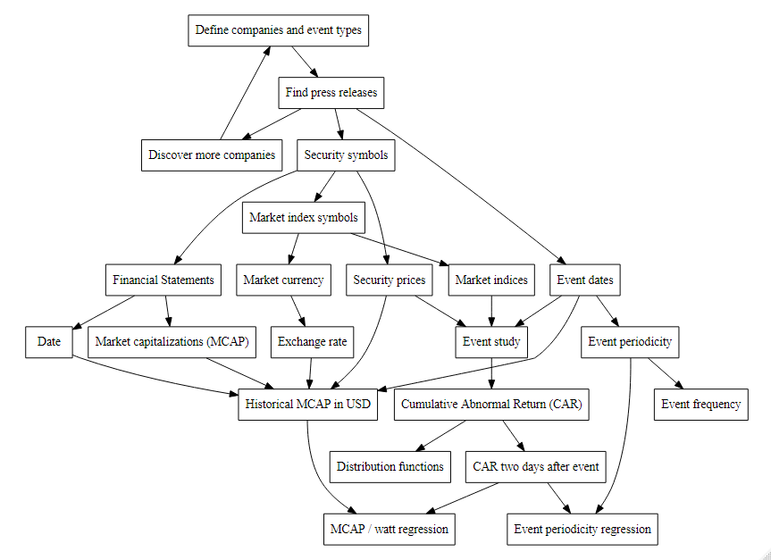

  

```{r setup, include=FALSE}
knitr::opts_chunk$set(
	echo = FALSE,
	message = FALSE,
	warning = FALSE,
	cache = TRUE
)
# knitr::purl("C:/Users/Christian/OneDrive/Rstudio/third_report/third_report3.rmd")
# definition of operator language for R: https://cran.r-project.org/doc/manuals/r-release/R-lang.pdf
# Detailed explanation of the Tilde: https://stackoverflow.com/questions/8055508/in-r-formulas-why-do-i-have-to-use-the-i-function-on-power-terms-like-y-i/8055683#8055683
#
# Sets the working directory for this script
# setwd(getSrcDirectory(function(x) {x}))
#Returns the working directory of this script
work_dir <- getwd()
# package for statistical tables
library(broom)
# package for Type II and Type III statistical tables
library(car)
# package for converting country names to country codes
library(countrycode)
# package for renaming columns in a data.frame:
library(data.table)
# package needed to draw diagrams
library(DiagrammeR)
# package needed to manipulate classes for the data.frame with mutate()
library(dplyr)
# package to draw nice plots
library(ggplot2)
# package to plot ridges:
library(ggridges)
# package to plot multiple grids (not used)
# !!WARNING: seems to kill LaTeX output of bookdown figure references!!:
library(gridExtra)
# package for single event studies with many methods (not currently used)
library(estudy2)
# package for analysis of event studies: https://rdrr.io/cran/eventstudies/f/inst/doc/eventstudies.pdf
library(eventstudies)
# package for eventstudytools.com
library(EventStudy)
# package for advanced tables
library(kableExtra)
# package for Rmarkdown functions
library(knitr)
# package for executing pipes
library(magrittr)
# package for inverse selections
library(mefa4)
#package to manipulate single values in a data.frame
library(plyr)
# package to perform rowwise operations:
library(purrr)
# package to scrape dates from text:
library(qdapRegex)
# package for loading financial data from Yahoo! finance: https://cran.r-project.org/web/packages/quantmod/quantmod.pdf
library(quantmod)
# library for quantile regressions
library(quantreg)
# package to scrape data from text
library(readtext)
# package to melt and cast data
library(reshape2)
# package required by rnaturalearth
library(rgeos)
# package for plotting world maps
library(rnaturalearth)
# package with data for plotting world maps
library(rnaturalearthdata)
# package to define world coordinates
library(sf)
# package for displaying variable chart data app: https://shiny.rstudio.com/tutorial/written-tutorial/lesson6/
library(shiny)
# package for date_format
library(scales)
# package for everything interesting
library(tidyverse)
# package for adding financial indicators for zig zag lines:
library(TTR)
# package for reading and writing excel files: https://cran.r-project.org/web/packages/xlsx/xlsx.pdf
library(xlsx)
# package for non-sequential time series: https://cran.r-project.org/web/packages/zoo/zoo.pdf
library(zoo)
```


```{r datadiff, eval=FALSE, include=FALSE}
# Groves 2020-07-19 R chunk to extract difference in data between the thesis and the changed results

rm(list = ls())

setwd("C:/Users/Christian/OneDrive/Rstudio/final_thesis")

load(file="workspace_image.RData")

regression_watt_old <- regression_watt
regression_watt_old$type = regression_watt_old$name

regression3_old <- regression3 %>% mutate_at(3, round, 9)
regression3_old$type <- regression3_old$name

setwd("C:/Users/Christian/OneDrive/Rstudio/presentation_thesis")

save(regression_watt_old, regression3_old, file = "files_tocheck.rda")

rm(list = ls())

load(file="workspace_thesis.RData")

load(file="files_tocheck.rda")

regression_watt_new <- regression_watt
regression_watt_new$type = regression_watt_new$name

regression3_new <- regression3 %>% mutate_at(3, round, 9)
regression3_new$type = regression3_new$name

regression_watt_diff <- setdiff(regression_watt_old, regression_watt_new)
regression3_diff <-setdiff(regression3_old, regression3_new)

print(regression_watt_diff)
print(regression3_diff)

save(regression_watt_diff, regression3_diff, file = "delta_results.rda")

```


```{r load data}
load(file="workspace_thesis.RData")
load(file="delta_results.rda")
```

# Philosophy & Background

## Philosophy

- (omitted) 

  - *RStudio* for *R* as standard statistical software for students at the (omitted) University  
    
    - *PDF* output for *LaTeX* defined with *Pandoc Markdown* by @rlang and *knitr* by @knitr  
    
    - requisite of the AGPL v.3 license (https://www.gnu.org/) is acknowledging software and publishing code
    
    - *tidyverse* principle of visual data analysis by @datascience:


```{r z-data-science-explore, out.width = "50%", fig.align = "center"}
knitr::include_graphics("z_data-science-explore.png")
```


- *Keine Angst vor dem leeren Blatt: Ohne Schreibblockaden durchs Studium* by @kruseKeineAngstVor2007  

- *Wie schreibe ich eine Seminar- oder Examensarbeit?* by @kramerWieSchreibeIch2009  

- guidelines (omitted)

    - exception: alternative references inline in text instead of as footnotes  

- literature in *Zotero* (https://www.zotero.org/)  

- chapter "Manuals for R" is part of back matter, for orientation, ordered according to utility  

## Structure

Introduction  

  - guidelines of (omitted) does not include abstract for master theses
  
  - hypotheses listed in introduction since study usually defined at beginning
    
\  

Background  

  - read various papers:  
  
    - @Brown_1980, @Brown_1985, @Choi_2015, @Corrado_1989, @Corrado_1992, @corradoConductingEventStudies2008, @Corrado_2010, @Daniel_1998, @dasguptaCapitalMarketResponses1998, @dranevImpactFintechStock2019, @duttaParametricNonparametricEvent2014, @eugenef.famaBehaviorStockMarketPrices1965, @Fama_1969, @Issa_2018, @jainAnalysesDistributionSecurity21, @Kothari_2004, @MacKinlay_1997, @Meulbroek_1992, @Patell_1976, @patnaikForeignInvestorsStress2013, @Penman_1982, @Picha_2015,  @Rose_2003, @Schiereck_2012, @schimmerExpectedReturnModels2012,@Silver_1999, @fourier, @Werner_2010, @Womack_1996
    
  - referenced a selection of relevant papers to the study:  
    
    - @Brown_1980, @Brown_1985, @Choi_2015, @Corrado_1989, @Corrado_1992, @Corrado_2010, @Daniel_1998, @Fama_1969, @Issa_2018, @Kothari_2004, @MacKinlay_1997, @Meulbroek_1992, @Patell_1976, @Penman_1982, @Picha_2015, @Rose_2003, @Schiereck_2012, @Silver_1999, @Werner_2010, @Womack_1996
    

## Background

- @Kothari_2004 reporting 15 years ago over 500 event studies  

- event studies first by @Fama_1969  

- daily stock prices by @Brown_1985  

    - also proposed taking market adjusted returns.  
    
\  
    
- Key assumptions  

  - efficient market hypothesis is valid (@Werner_2010)  

  - winning a contract always results in a positive market reaction (@Choi_2015)  

  - investors:  

    - buy or sell based on company press releases  
  
    - have no detailed knowledge of project worth  
  
    - often read press releases  
  
    - valuate according to power stated (MW)  
  
    - exhibit similar behaviors across continents  
  
    - regard all companies as equal  

## Study comparison

Similar studies:  

\  

::: columns

:::: column

@Schiereck_2012  

\  

- order intakes listed on company websites  

- securities listed on DAX (Germany)  

- various variables, multivariate analysis  

- 16 securities, 192 contract awards  

- 6 confounding events (excluded)  

::::

:::: column

@Choi_2015  

\  

- order intakes from any public source  

- securities on NYSE, Amex, NASDAQ  

- valuated with postdated financial data   

- 23 securities, 813 contract awards  

- 1000's of confounding events (excluded)  

::::

:::

\  

This study  

- order intakes listed on company websites   

- securities listed on various international exchanges   

- response variable is power (MW) in announcement   

- 7 securities, 110 contract awards  

- 106 are confounding events (included)  

    - any other announcement occuring within same event window  
    
    - "clustering"  

# Method & Calculation

## Equations

To calculate the market adjusted returns $A_{i,t}$:

\begin{equation}
  A_{i,t} = R_{i,t} - R_{m,t}
\end{equation}

Where $R_{i,t}$ is the return of security $i$ at day $t$, and $R_{m,t}$ is the return of index $m$ on day $t$. This expression is then augmented to the Ordinary Least Squares (OLS) market model:

\begin{equation}
  A_{i,t} = R_{i,t} - \hat{\alpha_{i}} -  \hat{\beta_{i}}R_{m,t}
\end{equation}

Where $\hat{\alpha_{i}}$ and $\hat{\beta_{i}}$ are OLS values from the estimation period, which is a defined period in the months before the event where the tendency is estimated.


```{r z-estimation-beamer, out.width = "\\textwidth"}
knitr::include_graphics("z_estimation_period.png")
```

## Alternative hypothesis

The resulting Cumulative Abnormal Return (CAR) from the event study is then used in a simple regression with equations adapted from @empirical and @regres.

The null hypothesis to be rejected is:
\begin{equation}
  H_{0}: \beta_{0} = \beta_{1} = 0
\end{equation}
when 
\begin{equation}
  Pr(>|t|) < 0.05
\end{equation}
Similarly, the alternative hypothesis to be accepted is:
\begin{equation}
  H_{A}: \beta_{0} \neq 0 \vee \beta_{1} \neq 0
\end{equation}
for a simple regression 
\begin{equation}
  y = \beta_{0} + \beta_{1}x + u
\end{equation}

\begin{tiny}

where

$Pr(>|t|)$ = *p-value*, results are significant if less than 0.05.

$y$ = Estimate of the dependent variable, Cumulative Abnormal Return (CAR).

$\beta_{0}$ = y-axis intersect, CAR.

$\beta_{1}$ = Slope of the regression.

$x$ = Independent variable, e.g. Megawatts mentioned, cluster size.

$u$ = error term, not directly visible on plots.

\end{tiny}

## Linear method

R determines the simple regression with a linear method which solves via QR decomposition as described in detailed by @lminr and @linpack:

for a simple regression  
\begin{equation}
 y = \cancel{\beta_{0}} + \beta_{1}x + \cancel{u}
\end{equation}

since a linear system $b=Ax$ is equivalent to a system of matrix $A$ and diagonal matrices with scaling factors $D_r,D_c$:  

\begin{equation}
D_rb=(D_rAD_c)(D_{c}^{-1}x)
\end{equation}

where some values are passed to (at least one) coefficient matrix $X$:
\begin{equation}
 X^Ty = X^TX\beta
\end{equation}

This is subjected to a QR decomposition:
\begin{equation}
 X = QR, Q\ othogonal, R\ upper\ triangular
\end{equation}

For the equation with only $\beta$ unknown:
\begin{equation}
 R\beta=Q^Ty
\end{equation}

with the R upper triangular of the matrices found with householder reflections.

The QR decomposition is then solved for the least squares solution.

## Model calibration

::: columns

:::: column


```{r plot-comparison-all-911-beamer, fig.width=6, fig.height=4}
# Calculate median of EventStudyTools.com
median_est_911 <- est_sum_ar_911 %>%
  summarize_all(median)
median_est_911$Event.ID <- "EventStudyTools"
# Calculate median of R eventstudies
median_eventstudies_911 <- Res4 %>%
  summarise_all(median)
median_eventstudies_911$Event.ID <- "R eventstudies"
# Calculate median of R estudy2
median_car_estudy_911 <- plot_car_estudy_911 %>%
  summarize_all(median)
median_car_estudy_911$Event.ID <- "R estudy2"

plot_comparison_all_911 <- median_est_911 %>%
  bind_rows(median_eventstudies_911, median_car_estudy_911) %>%
  select(-when) %>%
  melt(id.vars = 'Event.ID')

print(ggplot(plot_comparison_all_911, aes(x = variable, y = value))
      + geom_line(aes(color = Event.ID, group = Event.ID))
      + geom_point(aes(color = Event.ID, group = Event.ID))
      # + geom_rect(aes(xmin = 0, xmax = 2.5, ymin = -Inf, ymax = Inf), fill = "white", alpha = 0.1)
      # + geom_rect(aes(xmin = 7.5, xmax = 9.5, ymin = -Inf, ymax = Inf), fill = "white", alpha = 0.1)
      + geom_vline(xintercept = 4)
      + geom_hline(yintercept = 0)
      + labs(x = "day", y = "Median % Cumulative Abnormal Return (CAR)", caption = "source is own computation"))
```

 Figure 10: Comparison of all three R packages  
 
 \  
 
 
The 9-11 terrorist attacks were used because:  

- worked example from *R estudy 2*  

- clear market signals  

- various market exchanges  

- international  

- similar number of securities involved  

- event window starts on a weekend  

::::

:::: column


\  

Differences between the packages:  

\  

- *EventStudyTools.com* (page 18)  

  - does not start at zero    
  
  - abnormal returns start before the weekend  
  
    - this is outside the event window  
    
  - analysis starts before event window begins  
  
    - compensates for missing data  
    
\  

- *R eventstudies* (page 20)  

  - zero at beginning of event window  
  
  - accounts for the weekend  
  
  - zero abnormal returns after weekend  
  
    - results adjusted to zero after weekend  

\  

- *R estudy 2*  (page 21)  

  - starts later than other packages  
  
    - does not account for the weekend  
    
    - only calculates results when available  


::::

:::

## Hypotheses

- Cumulative Abnormal Return (CAR) from day 2 is taken  

- various alternative hypotheses were derived

- two looked at in detail

  - increased CAR for higher power generation value mentioned,  
  
    - and when adjusted for Market Capitalization  
    
\  

\  

Additionally, a couple of relationships were examined with box plots

  - increased CAR by energy generation type  
  
  - increased CAR by company  

## Figure 12: Study proceedure


```{r z-event-proceedure, out.width = "90%"}

```


# Results & Discussion

## Changed data entries 

- 1 result has been changed and 2 excluded

\  

- changed result is typing mistake on date which caused wrong month  
    - solar, Marubeni, UAE(Asia, 800 MW), changed to January from February  
    
\  

- two further data samples excluded  

  - study assumes results only from company websites  
  
  - results were published on external websites  
  
  - no record found on company website at similar date.  
  
  - therefore had to be removed from the results  

    - LNGT, Samsung C&T, Vietnam / Asia, 109 MUSD (small influence)  

    - Gas Turbine, Siemens, Bangladesh / Asia, 3600 MW (Big influence)  


## Figure 17: Regression of abnormal return and Megawatt / Table 7

::: columns

:::: column


```{r plot-watt-regression-beamer, fig.width=6, fig.height=4}
# load data required for regression
# load factor for mcap to W
load(file = "mcap_events.rda")
# tidy data to only have what is needed
mcap_data <- mcap_events
event_data <- est_sum_ar %>% select ("2")
# merge data
regression <- cbind(mcap_data, event_data)
regression2 <- regression %>%
  mutate(type = dplyr::recode(type,
                                "GasTurbine" = "Turbine (85)*",
                                "Coal" = "Coal (8)",
                                "WasteEnergy" = "Waste (3)",
                                "Solar" = "Solar (3)",
                                "Energy" = "Energy (1)*",
                                "CombEngine" = "Engine (3)",
                                "Geothermal" = "Geotherm (2)",
                                "Nuclear" = "Nuclear (0)*",
                                "Biomass" = "Biomass (1)"))

regression_watt <- regression2 %>% 
  select(name, type, power_used, "2") %>% 
  data.table::setnames(c("name", "type", "power_used", "abnormal_returns")) %>% 
  na.omit

print(ggplot(regression_watt, aes(x = power_used, y = abnormal_returns)) 
      + geom_smooth(aes(color = type, group = type), method = "lm",
                    se = FALSE)
      + geom_point(aes(color = type, group = type))
      + geom_point(data = regression_watt_diff, aes(shape = "changed results"))
      + labs(x = "log10 Megawatt", y = "% Cumulative Abnormal Return", caption = "source is own computation *excluded missing values, anomaly")
      + scale_x_log10())
```


```{r fit-watt-regression-beamer}
# calculate regression stats
# assign results to a new object
fit_res <- regression_watt  %>%
  dplyr::rename(slope = power_used)
# assign results to the summary data
fit_all <- fit_res
# rename to all
fit_all$type <- "All (106)*"
# calculate statistics
fit <- fit_res %>%
  # add summary data
  bind_rows(fit_all) %>%
  # group by regression name
  group_by(type) %>%
  # create ANOVA table
  do(tidy(lm(abnormal_returns ~ slope, data = .))) %>%
  # replace NA with -
  na.fill("-") %>%
  as.tibble() %>%
  dplyr::rename("type (n)" = type)
# write table
knitr::kable(
    fit,
    digits = 3,
    booktabs = TRUE) %>%
  kableExtra::kable_styling(latex_options = "hold_position", font_size = 3) %>%
  add_footnote("excluded missing values, anomaly. source is own computation", notation = "symbol")
```

::::

:::: column

\  

Differences to results in thesis  

\  

- slope of turbine is "significant"  

  - discounted since was insignificant before  
    
- solar regression has different values  

\  

Assumptions for regression against Megawatt  

\  

- results impartial to generation type  

- scope of supply is ambiguous  

  - no subjective scope of supply  

  - would presume non-public information   

\  

Heterogeneous group sizes  

\  

- only group with a large enough size is gas turbines ("Turbine")  

- groups have too different tendencies to be assessed in unity  

- simple regression against Megawatt shows the best characteristics  


::::

:::

## Figure 18: Regression of abnormal return with MCAP / Table 8

::: columns

:::: column

```{r plot-mcap-regression-beamer, fig.width=6, fig.height=4}
# # # plot data
regression3 <- regression2 %>% 
  select(name, type, watt_mcap, "2") %>% 
  data.table::setnames(c("name", "type", "watt_mcap", "abnormal_returns")) %>% 
  na.omit

# print(ggplot(data = regression3, aes(x = watt_mcap, y = abnormal_returns)) 
#       + geom_point() 
#       + geom_quantile())
# table(regression3$name)

print(ggplot(regression3, aes(x = watt_mcap, y = abnormal_returns)) 
      + geom_smooth(aes(color = type, group = type), method = "lm",
                    se = FALSE)
      + geom_point(aes(color = type, group = type))
      + geom_point(data = regression3_diff, aes(shape = "changed results"))
      + labs(x = "log10 Watt per MCAP", y = "% Cumulative Abnormal Return", caption = "source is own computation * excluded missing values, anomaly")
      + scale_x_log10())

```


```{r fit-mcap-regression-beamer}
# calculate regression stats
# assign results to a new object
fit_res <- regression3 %>%
  dplyr::rename(slope = watt_mcap)
# assign results to the summary data
fit_all <- fit_res
# rename to all
fit_all$type <- "All (106)*"
# calculate statistics
fit <- fit_res %>%
  # add summary data
  bind_rows(fit_all) %>%
  # group by regression name
  group_by(type) %>%
  # create linear regression summary table
  do(tidy(lm(abnormal_returns ~ slope, data = .))) %>%
  # replace NA with -
  na.fill("-") %>%
  as.tibble() %>%
  dplyr::rename("(n) type" = type)

# write table
knitr::kable(
  fit,
  digits = 3,
  booktabs = TRUE) %>%
kableExtra::kable_styling(latex_options = "hold_position", font_size = 3) %>%
  add_footnote("excluded missing values, anomaly. source is own computation", notation = "symbol")
```


::::

:::: column

\  

Assumptions for regression against MCAP  

\  

- significance of Megawatt is proportional to market capitalization (MCAP)  

  - investors relate announcement to MCAP   
  
  - announcement more important to small company
    
\  

Results contrary to assumptions  

\  

- less relationship when MCAP is accounted for  

  - better estimate when ignoring MCAP  

  - company knowledge weakens relationship  

  - undermines assumption that announcement on company website is important  

::::

:::

## Figure 24: Frequency of security announcements / Table 11

::: columns

:::: column

```{r plot-announcements-beamer, fig.width=6, fig.height=4}
# plot frequency of announcements ---------------------------
print(ggplot(melted_annou, aes(x = month, y = count))
      # LOESS method used to show the rough trend
      + geom_smooth(aes(color = company, group = company), method = "loess", 
                    se = FALSE)
      + geom_point(aes(color = company, group = company))
      + labs(x = "date", y = "announcements per month", caption = "source is own computation"))  
```


```{r clustering-overview-beamer}
  # plot table
  knitr::kable(
    cluster_tally, 
    booktabs = TRUE) %>%
kableExtra::kable_styling(latex_options = "hold_position", font_size = 7) %>%
  add_footnote("excluded anomalies. source is own computation", notation = "symbol")
```


::::

:::: column  

Frequent company announcements  

\  
  
- results in significant clustering  

- @Brown_1980, clustering:  
  
  - increases the variance  
  
  - decreases the power of the tests  
  
\  

Main shortfall of study is excessive clustering  

\  

- over seven announcements published within the same event window  

- more clustering within estimation window  

\  

Clustering determined via web scraping  

\  

- all announcements over study time frame  

- scraped from company websites  

- date entries extracted from press indices  
  
::::

:::


```{r load all results}
# calling the saved announcement dates
load(file = "za_sec_announ.rda")

mitsu_event_dates_allan <- mitsubishi_announ %>%
  as_tibble %>%
  add_column(name = "7011.T", .before = "date")

vpower_event_dates_allan <- vpower_announ %>%
  as_tibble %>%
  add_column(name = "1608.HK", .before = "date")

marubeni_event_dates_allan <- marubeni_announ %>%
  as_tibble %>%
  add_column(name = "8002.T", .before = "date")

samsung_event_dates_allan <- samsung_announ %>%
  as_tibble %>%
  add_column(name = "028260.KS", .before = "date")

siemens_event_dates_allan <- siemens_announ %>%
  as_tibble %>%
  add_column(name = "SIE.DE", .before = "date")

ge_event_dates_allan <- ge_announ %>%
  as_tibble %>%
  add_column(name = "GE", .before = "date")

shanghai_event_dates_allan <- shanghai_announ %>%
  as_tibble %>%
  add_column(name = "2727.HK", .before = "date")

event_dates_allan <- rbind(mitsu_event_dates_allan, vpower_event_dates_allan, marubeni_event_dates_allan, samsung_event_dates_allan, ge_event_dates_allan, shanghai_event_dates_allan) %>%
  dplyr::rename("when" = "date") %>%
  # to arrange all the data in an orderly manner
  arrange(when, name) %>%
  # since the for loop for writing the csv data file can only handle data frames
  as.data.frame()

```


```{r load-tibble}
# to read symbol_mcap_allan data
# for rows: name,when,index,currency,mcap,company,nickname
symbol_mcap_lost <- read.csv("z_securities_allan.CSV", header = TRUE, colClasses =c("character","Date","character","character","numeric","character","character"))

# Pipe to add number of results to text
symbol_mcap_allan <- event_dates_allan %>%
  # Names the events list, so that every event  for every company is listed, then removes event dates
  left_join(symbol_mcap_lost, by = "name", suffix = c("_event", "")) %>%
  select(-when_event) %>%
  # tallys the events by company grouping in a new column "n"  
  group_by(name) %>%
  add_tally() %>%
  # concatenates the text into the column nickname. unite() removes all of the columns used
  mutate(beforetext = paste (" ("), aftertext = paste (")")) %>%
  unite(nickname, c(nickname, beforetext, n, aftertext), sep = "") %>%
  # reduces results to unique entries after sums have been added and writes as data.frame to prevent bugs
  unique() %>%
  as.data.frame()
  
# list all of the stock market symbols, so they can be called from Yahoo!Finance. 
# Please check first that the symbols are correct!
event_symbol <- levels(factor(symbol_mcap_allan$name))
# list all of the index symbols, so they can be called from Yahoo!Finance. 
# Please check first that the symbols are correct!
index_symbol <- levels(factor(symbol_mcap_allan$index))
# Add curency symbols to calculate MCAP of foreign companies:
currency_symbol <- levels(factor(symbol_mcap_allan$currency))
# Combine all the symbols to call the symbols from Yahoo! Finance at once:
yahoo_symbol <- c(event_symbol,index_symbol,currency_symbol)


```


```{r listofdata, eval=FALSE, include=FALSE}

data_summary_1 <- event_dates_allan %>%
  left_join(symbol_mcap_allan, by = "name", suffix = c("", "_mcap")) %>%
      dplyr::rename(complete = company) %>%
    dplyr::rename(company = nickname)

data_summary_2 <- data_summary_1
data_summary_2$company <- "All (3152)"
data_summary_2$complete <- "-"
data_summary_2$name <- "-"

data_summary <- data_summary_1 %>%
  bind_rows(data_summary_2) %>%
  group_by(company) %>%
  dplyr::summarise(
    from = min(when),
    to = max(when)
  ) %>%
  dplyr::rename("company (n)" = company)

knitr::kable(
    data_summary,
    booktabs = TRUE) %>%
  kableExtra::kable_styling(latex_options = "hold_position", font_size = 6)
```


```{r analysis-dates}
# chunk to define the analysis dates
# Define the Event Window Length in days:
event_window <- 7
# Define event lead (days before) to start the event:
event_lead <- 3
# Define display event period ("0" is day of event):
num_days <- c(1:(event_window*2))
mid_days <- num_days+event_lead-event_window
# new_days <- sprintf("%+d", mid_days) 
new_days <- mid_days
# Define estimation period:
estimation_period = 60
#find minimum date needed for event study and take one year from it for security:
min_date <- min(event_dates_allan$when) - event_window - 360
#find maximum date needed for event study and add one year to it for security:
max_date <- max(event_dates_allan$when) + event_window + 360

```


```{r get-yahoo-prices, eval=FALSE, warning=FALSE, include=FALSE}
# chunk to download the data needed from Yahoo! Finance---------------------

# download securities data from Yahoo! Finance in a zoo format:
est_securities <- get_prices_from_tickers(event_symbol,  start = min_date ,end = max_date, quote = "Close", retclass = "zoo")
# melt the securities data with fortify.zoo, so that only three columns are present:
est_firm_data <- fortify.zoo(est_securities, names = c("Series", "Index", "Value"), melt = TRUE) %>% .[c("Index", "Series", "Value")]
# save results pulled from Yahoo! Finance as an R data file:
save(est_firm_data, file= "est_firm_data.rda")
# download indices data from Yahoo! Finance in a zoo format:
est_indices <- get_prices_from_tickers(index_symbol, start = min_date , end = max_date, quote = "Close", retclass = "zoo")
# melt the indices data with fortify.zoo, so that only three columns are present:
est_market_data <- fortify.zoo(est_indices, names = c("Series", "Index", "Value"), melt = TRUE) %>% .[c("Index", "Series", "Value")]
# save results pulled from Yahoo! Finance as an R data file:
save(est_market_data, file= "z_est_market_data.rda")
```


```{r eventstudies-yahoo, eval=FALSE, include=FALSE}
#call symbols from Yahoo! Finance ------------------------------------------------
#Combine "Symbols" (tickers) with the "lapply" function from the "dplyr" package as given in https://stackoverflow.com/questions/24377590/getsymbols-downloading-data-for-multiple-symbols-and-calculate-returns:
#use lapply to list the different stocks together. Note the argument "auto.assign" must be = FALSE, otherwise results give an error.
#dailyReturn takes the % change in the closing share price. This has only been taken out of convenience.
aggregate_stocks = lapply(yahoo_symbol, function(sym) dailyReturn(getSymbols(sym, from = min_date, to = max_date, auto.assign = FALSE)))
#AggregateStocks is not a usable dataframe (please DON'T try "head(AggregateStocks)")! So we will merge the dataframe to give us a usable dataframe:
symbol_returns_eventstudies <- do.call(merge, aggregate_stocks)
#the data frame columns must be renamed to match the symbols. Source is in-built R functionality from http://www.cookbook-r.com/Manipulating_data/Renaming_columns_in_a_data_frame/
#The Columns in  SymbolReturns are not related to the tickers any more.
#To rename the columns to be the same as the data called up by "yahoo_symbol":
colnames(symbol_returns_eventstudies) <- yahoo_symbol
# Save the SymbolReturns to a useable data file
save(symbol_returns_eventstudies, file= "z_symbol_returns_eventstudies.rda")
```


```{r analysis-eventstudies, eval=FALSE, include=FALSE}
# DOes not work with eventstudytools.com! will not process data
# Load and condition returns  from Yahoo! Finance ---------------------------------------------
symbol_returns_eventstudies <- NULL
load(file= "z_symbol_returns_eventstudies.rda")

symbol_returns_eventstudies <- na.approx(symbol_returns_eventstudies)

Res3 <- NULL

#Takes the Event Dates and uses them to calculate the single result
EventCoeff <- function(x)
  {
    eventstudy (
      firm.returns = single_returns,
      # pulls event_dates_allan one row at a time in the loop to calculate single results
      event.list=x,
      # event_window is defined as days before and after the event
      event.window=event_window,
      # uses Market Model Method
      type="marketModel",
      to.remap= TRUE, 
      remap = "cumsum", 
      inference = FALSE, 
      inference.strategy = "bootstrap", 
      model.args = list(market.returns = single_market)
    ) %>%

#Extract the results from the list
    extract2(1) %>%

    data.frame %>%
  
    rownames_to_column %>%
    
    gather(var, value, -rowname) %>%
    
    pivot_wider(names_from=rowname, values_from=value) %>%
    
    data.frame %>%
  #deselects the useless "var" column with variable"."
    select(-var) 
}
#Define empty obejects so they can be called within the loop
Res1=data.frame(0)
Res2=data.frame(0)
# Res3 is created by if condition in for loop, therefore is not predefined
for (row in 1:nrow(event_dates_allan)) 
{
  # define event data set
  event_instructions <- NULL
  event_instructions <- event_dates_allan[row, ]
  # add event lead time
  event_instructions$when <- event_instructions$when+event_lead 
  # define the event date
  single_event_date <- NULL
  single_event_date <- event_dates_allan[row, "when"]
  # define the start of the estimation period, given by the stock returns
  start_estimation <- single_event_date-event_window+event_lead-estimation_period
  #combine so the stock return dates can be subsetted
  dates_subset <- paste(start_estimation, max_date, sep = "/")
  # define the event name
  single_event_name <- NULL
  single_event_name <- event_dates_allan[row, "name"]
  # define the market name
  single_market_name <- NULL
  single_market_name <- symbol_mcap_allan[symbol_mcap_allan$name == event_dates_allan[row, "name"], "index"]
  # extract data set for single symbol
  single_returns_xts <- NULL
  single_returns_xts <- 100*symbol_returns_eventstudies[, single_event_name]
  single_returns_xts <- single_returns_xts[dates_subset]
  single_returns <- as.zoo(single_returns_xts)
  # extract market returns for market symbol
  single_market_xts <- NULL
  single_market_xts <- 100*symbol_returns_eventstudies[, single_market_name]
  single_market_xts <- single_market_xts[dates_subset]
  single_market <- as.zoo(single_market_xts)
  # if result is unsuccessful (because no result was possible) return NA and continue to next row: 
  Res1 <- tryCatch(EventCoeff(event_instructions), error=function(err) NA)
  # combine the input variables from event_dates_allan with the results from the package "eventstudies":
  Res2 <- c(event_dates_allan[row, ], Res1)
  # converts Res2 from a list to a data.frame:
  ResZ <- data.frame(Res2)
  # renames ticker name from class factor to class character so that the rbind function still works:
  ResZ$name <- as.character(ResZ$name)
  # renames date from date class to character class, so rbind function still works:
  ResZ$when <- as.character(ResZ$when)
  # Checks if matrix of result doesn't ("!") already exist:
  if (!exists("Res3")) {
    # If doesn't exist, then a new data frame for the result is equal to the new result:
    Res3 <- ResZ
  }
  # If result already exists, then next row is made of previous row with additional new result:
  else {
    # rbind.fill function fills any unfilled values with "NA" 
    # (which also causes a new row "NA." to be created somewhere)
    Res3 <- rbind.fill(Res3, ResZ)
  }
# end if loop to run results
}
# Removes the extra column .NA generated by ~.fill of rbind.fill by declaring it null:
Res3$NA. <- NULL
# Re-indexing of the results by applying an unconditional filter with dpylr,
# rename columns to give days in relation to event
single_results_allan <- Res3 %>% filter() %>% data.table::setnames(c("name","when", as.character(new_days)))
# save the results (it has a lot of data!) ------------------------------------------
save(single_results_allan, file= "z_single_results_allan.rda")
# save data as .xlsx file using xlsx package:
write.xlsx(single_results_allan,"single_results_allan.xlsx")
```


```{r eventstudies-allan}
# Extract cumulated line data from results for plotting graphs, Remove NA results 
load(file = "z_single_results_allan.rda")

Res4_allan <- single_results_allan %>%
  na.omit %>%
  unite(when, c("name", "when"))

melted_results_allan = melt(Res4_allan, id.vars = 'when')

# calculate mean
Res5 <- Res4_allan
Res5$when <- NULL
mean_res <- data.frame(apply(Res5, 2, mean))
# mean_res <- setnames(mean_res, as.character(new_days))

# Anomaly does not exist, since this was not listed on the overall Samsung webpage.
```


```{r plot-allan-ridges, eval=FALSE, fig.height=4, fig.width=6, include=FALSE}
# plot results with ggplot---------------------

melted_allan_short <- Res4_allan %>%
  select(when, "-2":"3") %>%
  melt(id.vars = 'when')

print(ggplot(melted_allan_short, aes(x = value, y = variable, fill = 0.5 - abs(0.5 - stat(ecdf)))) +
  stat_density_ridges(geom = "density_ridges_gradient", calc_ecdf = TRUE) +
  scale_fill_viridis_c(name = "Tail \nprobability", direction = -1)
      + xlim(-5,5)
      + geom_vline(xintercept = 0)
      + labs(x = "% Cumulative Abnormal Return (CAR)", y = "day", caption = "source is own computation"))
```


## Clustering regression


::: columns

:::: column

```{r calc-clustering-allan}
# function to determine clusters in events
# create a list containing lists of all the announcements
all_annou <- list(mitsubishi_announ, vpower_announ, marubeni_announ, samsung_announ, siemens_announ, ge_announ, shanghai_announ)
# name lists according to symbols
names(all_annou) = c("7011.T", "1608.HK", "8002.T", "028260.KS", "SIE.DE", "GE", "2727.HK")
# function to calcualte cluster. "x" is the row as a character
  cluster_calc <- function(x, output)
  {
  # define name of event to select list
  cluster_symbol <- x["name"]
  # fetch date of event
  cluster_date <- as.Date(x["when"])
  # define start of event window
  cluster_start <- cluster_date+min(new_days)
  # define end of event window
  cluster_end <- cluster_date+3
  # draw list of all of the events in this window from this company
  cluster_list <- all_annou[[as.character(cluster_symbol)]]
  # subset the dates in this list to those in the cluster
  cluster_short <- cluster_list %>% 
    .[.$date >= cluster_start,] %>%
    as.data.frame() %>%
    data.table::setnames("date") %>%
    .[.$date <= cluster_end,] %>%
    as.data.frame() %>%
    data.table::setnames("date")
    # count number of events for each event in the cluster
    cluster_n <- as.numeric(nrow(cluster_short))
}
  # function to calculate clustering
  cluster_allan_res <- event_dates_allan %>% mutate(cluster = apply(., 1, cluster_calc))
```


```{r list-clustering-allan}
  # function to plot clustering
  cluster_allan_res2 <- cluster_allan_res  %>%
  left_join(symbol_mcap_allan, by = "name", suffix = c("", "_mcap")) %>%
  select(nickname, when, cluster) %>% 
  data.table::setnames(c("company", "when", "cluster"))  

# function to list clustering
  cluster_allan_tally <- cluster_allan_res2 %>%
    group_by(company) %>% 
    dplyr::summarise(
      clusters = sum(cluster), 
      average = round(mean(cluster),1)
      ) %>%
  as.data.frame() %>%
  dplyr::rename("(n) company" = company)
```


```{r plot-clustering-regression-allan, fig.width=6, fig.height=4}
  # select only the results and names from cluster_res and bind them with the results of day 2 from the results of the CAR model of EventStudyTools.com

event_data <- Res4_allan %>% select ("2")

  regression_cluster_allan_long <- cluster_allan_res %>% 
    cbind(event_data) %>%
    left_join(symbol_mcap_allan, by = "name", suffix = c("", "_mcap")) %>%
      select(nickname, when, cluster, "2") %>% 
    data.table::setnames(c("company", "when", "cluster", "abnormal_returns")) %>%
    group_by(company)

regression_cluster_allan_long$cluster <- as.factor(regression_cluster_allan_long$cluster)

  # plot:
  print(ggplot(regression_cluster_allan_long, 
               aes(x = cluster, y = abnormal_returns))
        + geom_point(aes(color = company, group = company))
        + geom_boxplot( 
                       varwidth = TRUE, 
                       notchwidth = 1)
        + labs(x = "Size of cluster per event", y = "Abnormal returns", caption = "Width of box ~ sqrt n obs. Whiskers until 1.5x Inter-Quartile Range of hinge.\nSource is own computation"))
```
\  

\  

```{r plot-clustering-ridges-allan, fig.width=6, fig.height=4}
  # select only the results and names from cluster_res and bind them with the results of day 2 from the results of the CAR model of EventStudyTools.com

event_data <- Res4_allan %>% select ("2")

  regression_cluster_allan_short <- cluster_allan_res %>% 
    cbind(event_data) %>%
    left_join(symbol_mcap_allan, by = "name", suffix = c("", "_mcap")) %>%
      select(nickname, when, cluster, "2") %>% 
    data.table::setnames(c("company", "when", "cluster", "abnormal_returns")) %>%
    group_by(company) %>% 
    # limit to the first 8 clusters, so effect of increasing clusters can be better
    filter(cluster == 1:8)
  
regression_cluster_allan_short$cluster <- as.factor(regression_cluster_allan_short$cluster)

  # plot:
print(ggplot(regression_cluster_allan_short, aes(x = abnormal_returns, y = cluster, fill = 0.5 - abs(0.5 - stat(ecdf)))) +
  stat_density_ridges(geom = "density_ridges_gradient", calc_ecdf = TRUE) +
  scale_fill_viridis_c(name = "Tail \nprobability", direction = -1)
      + xlim(-5,5)
      + geom_vline(xintercept = 0)
      + labs(x = "% Cumulative Abnormal Return (CAR)", y = "cluster size", caption = "source is own computation"))
```

::::

:::: column  

CAR from all company announcements  

\  

- results from figure 24  

- gathered to determine clustering  

- collection of thousands of announcements  

- announcements neither assessed nor factored  

\  

Near comprehensive listing from websites  

\  

  - Samsung filters some announcements  
  
  - Shanghai Electric publishes Ansaldo Energía separately  

- displays parametric distribution  


\  

No relationship between size of cluster and abnormal returns  

\  

- increasing number of results without evaluation has no effect  
  
\ 

No two-tailed distribution when no simultaneous events  

\  

- announcements without evaluation have no effect  

  
::::

:::

# Conclusion

## Conclusion

Results are not conclusive

\  

- @Schiereck_2012, @Choi_2015 show significant results  

\  

- too little data, too much clustering of events  

\  

- different group sizes restrict sufficient sample size  

\  

- could be an error in the programming  


## References {.allowframebreaks}
