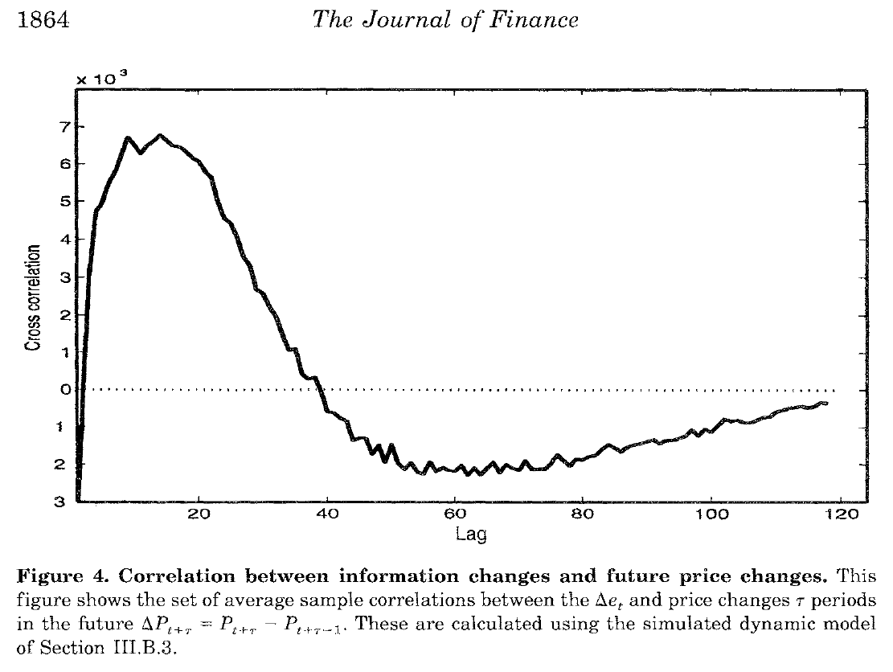
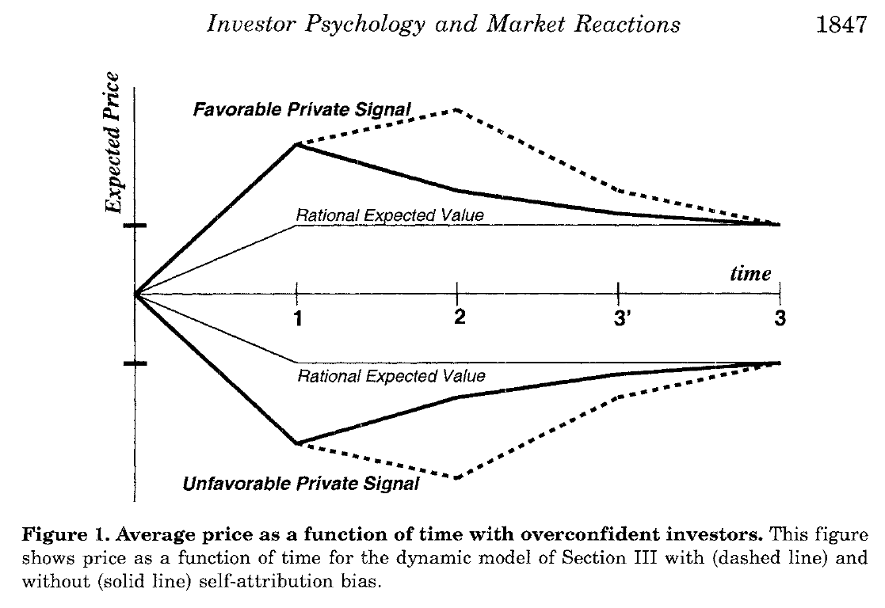
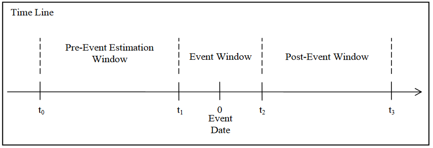
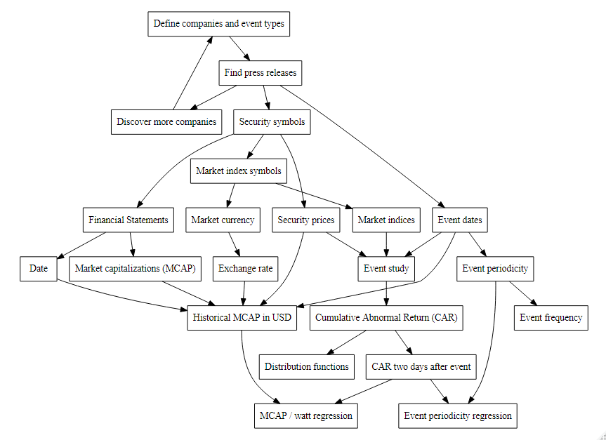
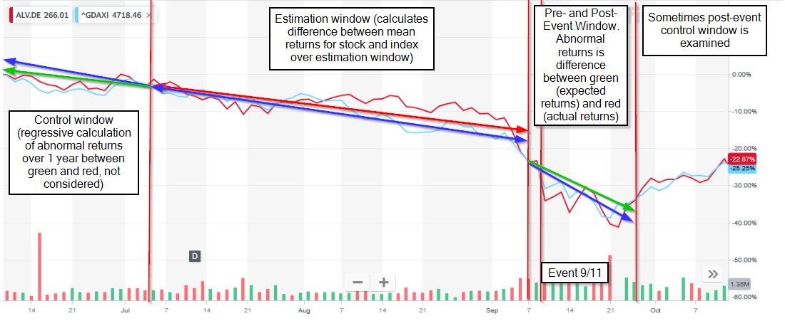
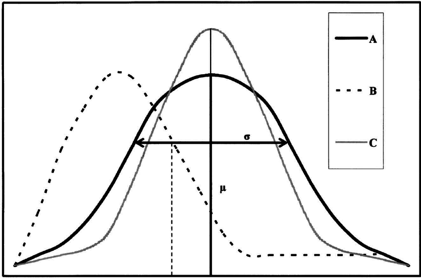
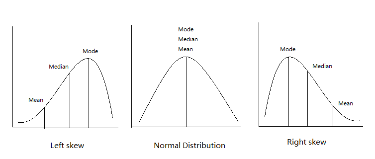
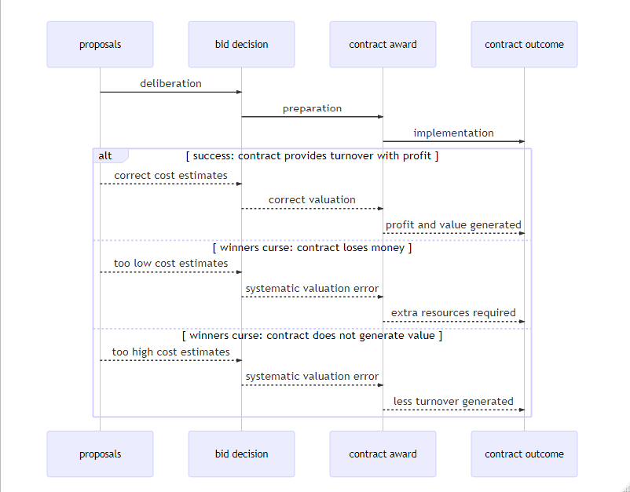

```{r setup, include=FALSE}
knitr::opts_chunk$set(
	echo = FALSE,
	message = FALSE,
	warning = FALSE,
	cache = TRUE
)
# knitr::purl("C:/Users/Christian/OneDrive/Rstudio/third_report/third_report3.rmd")
# definition of operator language for R: https://cran.r-project.org/doc/manuals/r-release/R-lang.pdf
# Detailed explanation of the Tilde: https://stackoverflow.com/questions/8055508/in-r-formulas-why-do-i-have-to-use-the-i-function-on-power-terms-like-y-i/8055683#8055683
#
# Sets the working directory for this script
# setwd(getSrcDirectory(function(x) {x}))
#Returns the working directory of this script
work_dir <- getwd()
# package for converting country names to country codes
library(countrycode)
# package for renaming columns in a data.frame:
library(data.table)
# package needed to draw diagrams
library(DiagrammeR)
# package needed to manipulate classes for the data.frame with mutate()
library(dplyr)
# package to draw nice plots
library(ggplot2)
# package to plot ridges:
library(ggridges)
# package for single event studies with many methods (not currently used)
library(estudy2)
# package for analysis of event studies: https://rdrr.io/cran/eventstudies/f/inst/doc/eventstudies.pdf
library(eventstudies)
# package for eventstudytools.com
library(EventStudy)
# package for Rmarkdown functions
library(knitr)
# package for executing pipes
library(magrittr)
# package for inverse selections
library(mefa4)
#package to manipulate single values in a data.frame
library(plyr)
# package to perform rowwise operations:
library(purrr)
# package to scrape dates from text:
library(qdapRegex)
# package for loading financial data from Yahoo! finance: https://cran.r-project.org/web/packages/quantmod/quantmod.pdf
library(quantmod)
# library for quantile regressions
library(quantreg)
# package to scrape data from text
library(readtext)
# package to melt and cast data
library(reshape2)
# package required by rnaturalearth
library(rgeos)
# package for plotting world maps
library(rnaturalearth)
# package with data for plotting world maps
library(rnaturalearthdata)
# package to define world coordinates
library(sf)
# package for displaying variable chart data app: https://shiny.rstudio.com/tutorial/written-tutorial/lesson6/
library(shiny)
# package for date_format
library(scales)
# package for everything interesting
library(tidyverse)
# package for adding financial indicators for zig zag lines:
library(TTR)
# package for reading and writing excel files: https://cran.r-project.org/web/packages/xlsx/xlsx.pdf
library(xlsx)
# package for non-sequential time series: https://cran.r-project.org/web/packages/zoo/zoo.pdf
library(zoo)
```

```{r event-data}
# method source: https://rstudio-pubs-static.s3.amazonaws.com/24352_f737954ed8804a3ba8fd5a209f843879.html
# Embedding raw data in an rmarkdown file

# embed all data from .xlsx files here:
# 911 events
# 911 company data
# study events
# study company data
```

\justify

\newpage

\tableofcontents

\newpage

\listoffigures

\listoftables

\newpage

# Abbreviations {-}

API
:    Application Programming Interfac

CAR
:   Cumulative Abnormal Return

EMH
:   Efficient Market Hypothesis

EPC
:   Engineering, Procurement, Construction

FX
:   Exchange Rate

GDP
:   Gross Domestic Product

GE
:   General Electric Company

MCAP
:   Market CAPitalization

NA
:   Not Available

NYSE
:   New York Stock Exchange

LOESS
:   LOcally Estimated Scatterplot Smoothing

OLS
:   Ordinary Least Squares

OTC
:   Over The Counter

USA
:  United States of America

USD
:  United States Dollars

\newpage

## To do list

- List hypotheses and relative results
- Show numer of events country vs. return country
- add tables
- add group sizes to legends

\newpage
# Introduction

There are increases of 1%-2% in company share values after gaining a large order for manufacturing energy generation infrastructure [^Schiereck_2012]. This is also reflected in a study of EPC contract awards, which shows that an average of 5% are added to contract award share prices for EPC energy projects [^Choi_2015].

[^Schiereck_2012]: @Schiereck_2012
[^Choi_2015]: @Choi_2015

The market model adjustment is used, since this appears to be the most commonly used, simple, and provides comparable results to more complicated methods. Beta is calculated with the ordinary least squares (OLS) method, which provides comparably low prediction error rates to more complex methods @Jain_1986, [p. 96]. Only 114 samples are used, which give a low chance of rejecting the null hypothesis [^MacKinlay_1997].

[^Jain_1986]: @Jain_1986 p.96
[^MacKinlay_1997]: @MacKinlay_1997

Daily stock returns are used since monthly would not show any effect and intraday stock returns would be too volatile. Furthermore only daily stock returns are both archived over several years and freely available.

Ad hoc announcements can only be sourced directly from the company websites, and not from journals or newspapers, since the announcements there are often delayed by several days and contain different information to that released on the company website.

\newpage
# Background

Event studies are a popular and integral part of econometrics, with over 500 event studies having been published already 15 years ago [^Kothari_2004]. Event studies became popular with the papers by Fama[^Fama_1969] and by monthly prices by Brown [^Brown_1980]. This was then later applied to daily stock prices [^Brown_1985]. This paper proponed taking market adjusted returns $A_{i,t}$: 
$$ A_{i,t} = R_{i,t} - R_{m,t} $$
Where $R_{i,t}$ is the return of security $i$ at day $t$, and $R_{m,t}$ is the return of index $m$ on day $t$. This expresion is then augmented to the Ordinary Least Squares (OLS) market model: 
$$ A_{i,t} = R_{i,t} - \hat{\alpha_{i}} -  \hat{\beta_{i}}R_{m,t} $$
Where $\hat{\alpha_{i}}$ and $\hat{\beta_{i}}$ are are OLS values from the estimation period, which is a defined period in the months before the event where the tendancy is estimated. Standard deviations would then be taken to disprove the null hypothesis. The null hypothesis calculates what would be the maximum possible change by chance which could be reasonably expected. The observed results would need show an average change higher than that expected by the null hypothesis, thereby showing that the observed results are most likely not due to chance. Since no overall change in the share price is observed in this thesis, the null hypothesis is not needed to be rejected.

The more robust Corrado Rank test [^Corrado_1989] was also looked at, but did not provide conclusive results for the calibration of the models. Therefore it was not used for modelling of the results.

[^Kothari_2004]: @Kothari_2004
[^Fama_1969]: @Fama_1969
[^Brown_1980]: @Brown_1980
[^Brown_1985]: @Brown_1985
[^Corrado_1989]: @Corrado_1989

\pagebreak

Press reports for income orders for energy power producers in Germany [^Schiereck_2012_p2880] and press reports for Engineering, Procurement, Construction (EPC) contractors in the USA [^Choi_2015] have shown significant positive reactions in the daily market prices of securities.

[^Schiereck_2012_p2880]: @Schiereck_2012, p.2880
[^Choi_2015]: @Choi_2015

EPC contractors are used to construct large construction projects, which is used for large scale infrastructure projects, "where cirtainty of final price, and often of completion date, are of extreme importance". [^Silver_1999] In this case, EPC power plant projects and retrofitting awards are looked at, with project values ranging from approximately 100 million USD to approximately 12 billion USD.

[^Silver_1999]: @Silver_1999

Since announcements on the company website related to energy newbuilds were both relatively rare and diverse in the scope of delivery, with announcements ranging from service agreements and spare parts deliveries to turnkey EPC contracts, contract size varied significantly. Since the price is not often stated, a subjective estimate was made on the basis of the generation type.


\pagebreak

This thesis examines events using sliced inputs of individual events examined with the market model in an R[^rlang] package eventstudies [^eventstudies], with the data imported from Yahoo! Finance[^yahoo_data] with the R package quantmod [^quantmod]. This refers to the event study methodology review by @Corrado_2010, which describes an event study as an econometric observation of the affect on share price of a single stock-listed company, in this case represented by a single market symbol, and caused by a single event. In this case, with the market model, the abnormal returns of the company stock are looked at, once any market trends have been taken into account [^Corrado_2010]. Therefore, a similar effect is expected as with the figure below, showing the correlation between information changes and future price changes [^Daniel_1998_p1864]:

[^rlang]: @rlang
[^eventstudies]: @eventstudies
[^yahoo_data]: @yahoo_data
[^quantmod]: @quantmod
[^Corrado_2010]: @Corrado_2010
[^Daniel_1998_p1864]:@Daniel_1998, p.1864

{ height=300px }

\pagebreak

It is expected that over time the stock price will be the same as it would have been without the announcement. This is because without any price signals, but with turnover and profit, the company would in the long term be equally attractive to investors. However, since only the early post-event window is looked at, this would most likely not affect the results. A return autocorelation is expected after the event, resulting in a positive price increase for a favourable signal from the company, and a negative price increase for an unfavorable signal from the company. This would have a momentum phase, where the price increase builds up over time, before reducing to the increased rational expected value after the event [^Daniel_1998_p1847]:

[^Daniel_1998_p1847]: @Daniel_1998, p.1847

{ height=300px }

Where the "self attribution bias" represents the level of over confidence of the investor [^Daniel_1998_p1861]. Since the company requires contract awards to meet the turnover, it is expected that contract awards are a favorable private signal. The increased rational expected value is assumed to carry on for a month after the event in post-event drift [^Womack_1996], and thereby stay conisistently positive in the cumulative returns. THe effects of insider trading are mentioned in the discussion.

[^Daniel_1998_p1861]: @Daniel_1998, p.1861
[^Womack_1996]: @Womack_1996, p.156

The market model was chosen, as this is both the most widely used methodology for event study analysis, and also the easiest to understand from a logical viewpoint. This requires for each company event a listed symbol for the company and a listed market index for a representative market. Since any results must be similar for similar conditions, similar events are looked at for different dates over several years, across different stock listed companies in different continents, and in their respective markets where they are traded.

Over The Counter (OTC) of foreign traded stocks were not used to substitute foreign stocks traded on foreign market indicies due to the high attributed search costs, resulting in low transparency and high asymmetry. Instead OTC markets are opaque and disperse [^Issa_2018]. This would violate the Efficient Market Hypothesis (EMH) needed to predict expected returns for event study analysis, since any new information on the market would lead to ann according adjustment of the stock price [^Werner_2010]. Therefore, they would most likely increase interference in the model, rather than decrease it. For this reason, only locally traded stocks were examined against their local market index, but with a multitude of international indicies.

[^Werner_2010]: @Werner_2010, p.49

\pagebreak

The R package eventstudies only handles a single market index. Another possibility would be to valuate all of the indicies against a common index which would be representative of all the individual indicies, in this case the Dow Jones Industrial Average. However, as can be seen below, the Dow Jones Industrial Average varies significantly to the local indicies of other companies studied[^yahoo_data]:

[^yahoo_data]: @yahoo_data

{ width=500px }

The exception to the rule is General Electric Company (GE), which is indexed against the Dow Jones Industrial Average index (^DJI), not the NYSE Composite (^NYA). This will need to be changed to the NYSE composite, since GE is no longer listed on the ^DJI.

[^Issa_2018]: @Issa_2018, p.2605

\pagebreak

# Software implementation

This thesis is written in RStudio [^rstudio] with *bookdown* and *Pandoc's markdown for R*[^rlang], and converted to Portable Document Format (*PDF*) via *knitr* [^knitr], *BibLaTeX* and LaTex, as described in the R markdown manual [^rmarkdown]. This is compiled in Texmaker (https://www.xm1math.net/texmaker/) and viewed in SumatraPDF (https://www.sumatrapdfreader.org/). The full code is also written into the document using *chunks*. For this reason, the Keep It Simple, Stupid (KISS) technique is used to improve compatibility and the R code within the R markdown *chunks* are heavily commented. Plots are with ggplot2 [^ggplot2], which builds part of the extensively used *Tidyverse* [^tidyverse]. Diagrams are via *DiagrammeR* [^diagrammer] using *grViz* and *Mermaid*.

R was learnt for writing the thesis, thereby R was first used to write the first analysis of the thesis. As time progresses, more advanced methods were learnt. A Graphical User Interface (GUI) was not used due to the GUI impairing an understanding of the data and of the data manipulations occuring, as described in detail by Hadley Wickham [^cantdoGUI].

[^cantdoGUI]: @cantdoGUI

## Code sources

R was first learnt with Swirl [^swirl] http://mathalope.co.uk/swirl-r-programming-console-log-index-page/. Solutions have been adapted from Google https://www.google.com/, which in most cases leads to stack overflow https://stackoverflow.com/, R.CRAN https://cran.r-project.org/, R Package Documentation https://rdrr.io/, Github https://github.com/, and various manuals for R, such as bookdown https://bookdown.org/, Tidyverse style guide https://style.tidyverse.org/, R for Data Science https://r4ds.had.co.nz/, DiagrammeR https://rich-iannone.github.io/DiagrammeR/.

## Structure

The size of the code, with thousands of operations, hundreds of different data objects (*R-Objects*) and dozens of source files, combined with writing and modifying code, causes rapid cluttering of the *Global Environment*. This leads to failures and unresolvable errors. Additionally, the process of *knitting* to *PDF* populates the *working directory* with hundreds of residual files. To allow a new *environment* to be created, all files required to run the thesis start with the character *"z"*. These can then be copied into a new directory. Rmarkdown builds the document within a unique environment, with the code automatically setting the directory with the *.rmd* document as the *working directory* for running the code and knitting to Pandoc. *Chunks* which require sending Application Programming Interface (API) queries and loading external files are present, but disabled. The results of these *chunks* are written within the same chunk as R data files (*.rda*) to the working directory. These are loaded by the other *chunks* automatically as required.

## Coding

The code is written according to Hadley Wickham's tidyverse style guide [^styleguide]. The chapter starts with a quote from Phil Karlton: *“There are only two hard things in Computer Science: cache invalidation and naming things.”* Ideally, object names are normally made of between two and four words, connected with an underscore "_", and only made of lower case letters and numbers. e.g. *object_name_derivative5*. This makes objects easy to distinguish from functions and operators. Due to time limitations, learning by doing, no knowledge of computer design principles, and since the code will not be reused, the code is very disorderly (otherwise known as *cowboy coding*).

## Piping

*Piping*, the process by which results from one operation are passed on to the next operation through *pipe operators* without explicitally storing the *R-Objects*, like a "hot potato", are used wherever practical to limit the number of *R-Objects*. This means the code was first written as many simple operations, and then consolidated into *pipes* from the R package *magrittr* [^magrittr] for linear sequential operations without combining *R-Objects*. Nevertheless, the amount of memory used is less than 1 GB, which can be called with the function *pryr::mem_used()* [^pryr], or much less than a billion integers. Too much memory use is to be avoided, since memory would be freed up with an automatic memory dumping process called *garbage collection*, information called up by *gcinfo(TRUE)*. Significant *garbage collection* still occurs within *functions* wrapped in *pipes*. It does not seem to affect the results.

## Functions

Where reasonable, *Functions*, blocks of code which provide outputs to any input by performing specialized tasks, are mostly used in combination with the *apply* family to substitute for row wise looping operations with outputs to *data frames* within *pipes*. The advantage of using *functions* within *pipes* is that the complex operations of the *function* do not cause any *R-Objects* to be created. The exception is when working with *data frames* embedded in *lists*, since the vectorization of the *apply* family causes errors in the *pipes* used to cycle the *apply* loops. *Lists* have only been used for announcements for clustering. In retrospect the use of a *list* could have been avoided by *grouping* the securities.

## Issues and fixes

### the use of for loops instead of apply

For loops from base R are used extensively instead of the *tidyverse* apply functions from the R package *dplyr* [^dplyr] due to values requested as *data tables* and not as *vectors*, since *apply* loops can only work with *vectors*. Most likely it would be possible to circumvent this issue with more advanced R skills. Also working code written at the beginning of the study has not been rewritten according to the proverb "never change a running system". Theoretically there is no reason to use *for* loops instead of the *apply* family of functions and wrapped functions within the R package *purrr* [^purrr], and the use of *for* loops from *base R *should be avoided to implement the functional programming philosophy of *tidyverse* as described in "R for Data Science" [^datascience].

### Various time series

*Date* class variables from base R, S3 Infrastructure for Regular and Irregular Time Series (Z's Ordered Observations) (*zoo*) [^zoo], Extensible Time Series (*xts*) [^xts] and *lubridate* within the *Tidyverse* are all used interchangeably and where most convenient in the code. This is because data manipulation and plotting is easiest in the *Date* class, which has the simplest data structure, but R packages for event studies based on data from the R package *Quantmod* require both *zoo* and *xts* data to interpolate missing data.

### Plots

For clarity, the R plotting package *ggplot2* only allows for 6 different shapes representing variables to be shown for a grouping. However 7 securities are investigated. With two of the securities, there are insufficient results to calculate estimates for trends based on the statistical algorithms used. Therefore the plots are very code heavy, with 15 lines of code required for each plot instead of the standard 4, and with seperate legends for lines and shapes. 

World plots are with the R package *rnaturalearth* [^rnaturalearth], using the other R packages *countrycode*[^countrycode], *rgeos*  [^rgeos], *sf*[^sf], *viridis*[^viridis] and the *Lambert Azimuthal Equal Area* projection coordinate system, as shown on a tutorial by @beautifulmaps on *r-spatial.org*.

[^rnaturalearth]: @rnaturalearth
[^countrycode]: @countrycode
[^rgeos]: @rgeos
[^sf]: @sf
[^viridis]: @viridis

Boxplots are according to Tukey [^Tukey_1978], with the width of the box and notch proportional to the square root of the number of observations. The notches on the end of the whiskers are at 1.5* the Inter-Quartile Range (IQR) of the hinge (edge of the box in the boxplot) [^geomboxplot]. The median is in the middle of the hinge, with the upper quartile as the top of the hinge and the lower quartile as the bottom of the hinge [^boxplotstats].

[^Tukey_1978]: @Tukey_1978
[^geomboxplot]: @geomboxplot
[^boxplotstats]: @boxplotstats

Distribution ridge plots are with the R package *ggridges* [^ggridges].

[^ggridges]: @ggridges

### Diagrams

*DiagrammeR* diagrams with grViz above a cirtain complexity shink in size as to be ineligible. Mermaid diagrams do not appear in the PDF. This seems to be an issue with the R package *Webshot* [^webshot] when Pandoc *markdown* [^markdown] exports to LaTex. Therefore the diagrams are plotted in Rstudio, saved as an image, and then inserted as a figure where issues occur.

### Disappearing operators and functions

The thesis calls functions from approximately 100 packages, as shown by *sessionInfo()* in the console. Approximately 20 packages are explicitally called. All packages are exclusively and alphabetically loaded into the session library immediately after the *YAML* [^yaml] header in the global chunk *{r setup}*. There are over 100 conflicts for functions from packages in the R session library, which can shown by *conflicts()* in the console. The operator *%notin%* (inverted *%in%*) from the R package *mefa4* [^mefa4], functions from the R package dplyr and the function *setnames()* from the R package *data.table* [^datatable] have a tendancy to dissappear from the R library, for this reason they must be explicitally installed and called both in the library and the packages are accessed directly when calling the functions in the format *package::function*, i.e. *mefa4::%notin%*, *dplyr::rename()*, *dplyr::summarize*, and *data.table::setnames()*.

### Reproducability

The more data and code included in the thesis, the less of an overview which is possible. For this reason, all data needed to reproduce the results has been included in the *.rmd* source file, but the file itself or the results are not reproducable without significant work within R studio. The environment would need to be expanded, explicit, commented out data tables built into the correct data objects, disabled chunks run selectively and data calculated by external sources. Child documents have not been used.

## Citations

Bibtex citations are via the R function citation, R package rcrossref [^rcrossref] for Crossref Digital Object Identifiers (DOI) (https://www.crossref.org/), the services provided by EBSCO Connect, ResearchGate DOI (https://www.researchgate.net/) or otherwise Google scholar (https://scholar.google.com/). R packages have been referenced when explicitally called in the library of the code for this thesis, as requested by the R core team.

[^rstudio]: @rstudio
[^swirl]: @swirl
[^rlang]: @rlang
[^knitr]: @knitr
[^rmarkdown]: @rmarkdown
[^ggplot2]: @ggplot2
[^diagrammer]: @diagrammer
[^tidyverse]: @tidyverse
[^styleguide]: @styleguide
[^dplyr]: @dplyr
[^purrr]: @purrr
[^datascience]: @datascience
[^zoo]: @zoo
[^xts]: @xts
[^webshot]: @webshot
[^markdown]: @markdown
[^yaml]: @yaml
[^mefa4]: @mefa4
[^datatable]: @data.table
[^pryr]: @pryr
[^magrittr]: @magrittr
[^rcrossref]: @rcrossref

# Method

The event estimation is split into several different periods[^source]:

{ width=500px }

[^source]: @Werner_2010, p.55, from @Campbell_1997, p. 157

\pagebreak

This can be elaborated to show how the different periods of the market model are defined in this study:

```{r study-sequence, eval=FALSE, cache=TRUE, include=FALSE}

mermaid("
sequenceDiagram
  participant start estimation
  participant finish estimation
  participant start event window
  participant event
  participant finish event window
  participant finish observation
  
  start estimation->finish estimation: estimate OLS regressions
  finish estimation-->>start event window: pass alpha, beta
  start event window->>finish observation: cumulative abnormal returns
")

```  



\pagebreak

The market model is based on the difference in the expected return over the pre-event estimation window within the event window:


  


\newpage

The market model uses the past to predict the future, in that the estimation period ends before the estimation period starts.The Cumulative Abnormal Returns (CARs) are then calculated for the period to give the result.

```{r load-data-911}
# Chunk to load data needed for the results
# name source file (File must be in same directory)
source_file <- "z_event_dates_911.xlsx"
# open source file (Important: Date format must be YYYY-MM-DD, 
# column 1 must be "name", column two "when", all in lower case!)
sheets_911 <- getwd() %>% file.path(source_file) %>%  loadWorkbook() %>% getSheets
#loads only first sheet from wb 
{
  sheet_events_911 <- sheets_911 [[1]]
  #loads data from sheet 1 into event_dates
  event_dates_911 <-readColumns(sheet = sheet_events_911, 1, 2, 1, colClasses =c("character","Date"))
  #event_dates<-readColumns(sheet = sheet, 1, 3, 1, colClasses =c("character","Date","character"))
  #converts first column from class Factor to class Character (no reason why it is converted to factor) with the package dplyr)
  event_dates_911 <- event_dates_911 %>% mutate_if(is.factor, as.character) %>% arrange(when, name)
  # loads only the second sheet from wb for calculating market capitalization
  sheet_mcap_911 <- sheets_911 [[2]]
  # loads data from sheet 1 into event_dates
  symbol_mcap_911 <- readColumns(sheet = sheet_mcap_911, 1, 6, 1, colClasses =c(
    "character","Date","character","character","numeric","character"))
  # converts first column from class Factor to class Character 
  # (no reason why it is converted to factor) with the package dplyr)
  symbol_mcap_911 <- symbol_mcap_911 %>% mutate_if(is.factor, as.character)
}
# list all of the stock market symbols, so they can be called from Yahoo!Finance. 
# Please check first that the symbols are correct!
event_symbol_911 <- levels(factor(symbol_mcap_911$name))
# list all of the index symbols, so they can be called from Yahoo!Finance. 
# Please check first that the symbols are correct!
index_symbol_911 <- levels(factor(symbol_mcap_911$index))
# Combine all the symbols to call the symbols from Yahoo! Finance at once:
yahoo_symbol_911 <- c(event_symbol_911,index_symbol_911)
```

```{r setup-dates-911}
# chunk to define the analysis dates
# Define the Event Window Length in days:
event_window_911 <- 7
# Define event lead (days before) to start the event:
event_lead_911 <- 3
# Define display event period ("0" is day of event):
num_days_911 <- c(1:(event_window_911*2))
mid_days_911 <- num_days_911+event_lead_911-event_window_911
# new_days <- sprintf("%+d", mid_days) 
new_days_911 <- mid_days_911
# Define estimation period:
estimation_period_911 = 60
#find minimum date needed for event study and take one year from it for security:
min_date_911 <- min(event_dates_911$when) - event_window_911 - 360
#find maximum date needed for event study and add one year to it for security:
max_date_911 <- max(event_dates_911$when) + event_window_911 + 360

```

```{r get-yahoo-prices-911, eval=FALSE, include=FALSE}
# chunk to download the data needed from Yahoo! Finance---------------------

# download securities data from Yahoo! Finance in a zoo format:
est_securities_911 <- get_prices_from_tickers(event_symbol_911,  start = min_date_911 ,end = max_date_911, quote = "Close", retclass = "zoo")
# melt the securities data with fortify.zoo, so that only three columns are present:
est_firm_data_911 <- fortify.zoo(est_securities_911, names = c("Series", "Index", "Value"), melt = TRUE) %>% .[c("Index", "Series", "Value")]
# save results pulled from Yahoo! Finance as an R data file:
save(est_firm_data_911, file= "est_firm_data_911.rda")
# download indices data from Yahoo! Finance in a zoo format:
est_indices_911 <- get_prices_from_tickers(index_symbol_911, start = min_date_911 , end = max_date_911, quote = "Close", retclass = "zoo")
# melt the indices data with fortify.zoo, so that only three columns are present:
est_market_data_911 <- fortify.zoo(est_indices_911, names = c("Series", "Index", "Value"), melt = TRUE) %>% .[c("Index", "Series", "Value")]
# save results pulled from Yahoo! Finance as an R data file:
save(est_market_data_911, file= "est_market_data_911.rda")
# write the information from Yahoo! Finance as the .csv file required:
# securities data:
write.table(est_firm_data_911, file="02_FirmData_911.csv", row.names=FALSE, col.names=FALSE, sep=";", quote = FALSE)
# market data:
write.table(est_market_data_911, file="03_MarketData_911.csv", row.names=FALSE, col.names=FALSE, sep=";", quote = FALSE)
```

```{r eventstudies-yahoo-911, eval=FALSE, include=FALSE}
#call symbols from Yahoo! Finance ------------------------------------------------
#Combine "Symbols" (tickers) with the "lapply" function from the "dplyr" package as given in https://stackoverflow.com/questions/24377590/getsymbols-downloading-data-for-multiple-symbols-and-calculate-returns:
#use lapply to list the different stocks together. Note the argument "auto.assign" must be = FALSE, otherwise results give an error.
#dailyReturn takes the % change in the closing share price. This has only been taken out of convenience.
aggregate_stocks_911 = lapply(yahoo_symbol_911, function(sym) dailyReturn(getSymbols(sym, from = min_date_911, to = max_date_911, auto.assign = FALSE)))
#AggregateStocks is not a usable dataframe (please DON'T try "head(AggregateStocks)")! So we will merge the dataframe to give us a usable dataframe:
symbol_returns_eventstudies_911 <- do.call(merge, aggregate_stocks_911)
#the data frame columns must be renamed to match the symbols. Source is in-built R functionality from http://www.cookbook-r.com/Manipulating_data/Renaming_columns_in_a_data_frame/
#The Columns in  SymbolReturns are not related to the tickers any more.
#
#The Columns in  SymbolReturns are not related to the tickers any more.
#To rename the columns to be the same as the data called up by "yahoo_symbol":
colnames(symbol_returns_eventstudies_911) <- yahoo_symbol_911
# Save the SymbolReturns to a useable data file
save(symbol_returns_eventstudies_911, file= "z_symbol_returns_eventstudies_911.rda")
```

```{r analysis-eventstudies-911}
#Load and condition returns  from Yahoo! Finance ---------------------------------------------
symbol_returns_eventstudies_911 <- NULL
load(file= "z_symbol_returns_eventstudies_911.rda")

symbol_returns_eventstudies_911 <- na.approx(symbol_returns_eventstudies_911)

Res3 <- NULL

#Takes the Event Dates and uses them to calculate the single result
EventCoeff <- function(x)
  {
    eventstudy (
      firm.returns = single_returns,
      # pulls event_dates one row at a time in the loop to calculate single results
      event.list=x,
      # event_window is defined as days before and after the event
      event.window=event_window_911,
      # uses Market Model Method
      type="marketModel",
      to.remap= TRUE, 
      remap = "cumsum", 
      inference = FALSE, 
      inference.strategy = "bootstrap", 
      model.args = list(market.returns = single_market)
    ) %>%

#Extract the results from the list
    extract2(1) %>%

    data.frame %>%
  
    rownames_to_column %>%
    
    gather(var, value, -rowname) %>%
    
    pivot_wider(names_from=rowname, values_from=value) %>%
    
    data.frame %>%
  #deselects the useless "var" column with variable"."
    select(-var) 
}
#Define empty obejects so they can be called within the loop
Res1=data.frame(0)
Res2=data.frame(0)
# Res3 is created by if condition in for loop, therefore is not predefined
for (row in 1:nrow(event_dates_911)) 
{
  # define event data set
  event_instructions <- NULL
  event_instructions <- event_dates_911[row, ]
  # add event lead time
  event_instructions$when <- event_instructions$when+event_lead_911 
  # define the event date
  single_event_date <- NULL
  single_event_date <- event_dates_911[row, "when"]
  # define the start of the estimation period, given by the stock returns
  start_estimation <- single_event_date-event_window_911+event_lead_911-estimation_period_911
  #combine so the stock return dates can be subsetted
  dates_subset <- paste(start_estimation, max_date_911, sep = "/")
  # define the event name
  single_event_name <- NULL
  single_event_name <- event_dates_911[row, "name"]
  # define the market name
  single_market_name <- NULL
  single_market_name <- symbol_mcap_911[symbol_mcap_911$name == event_dates_911[row, "name"], "index"]
  # extract data set for single symbol
  single_returns_xts <- NULL
  single_returns_xts <- 100*symbol_returns_eventstudies_911[, single_event_name]
  single_returns_xts <- single_returns_xts[dates_subset]
  single_returns <- as.zoo(single_returns_xts)
  # extract market returns for market symbol
  single_market_xts <- NULL
  single_market_xts <- 100*symbol_returns_eventstudies_911[, single_market_name]
  single_market_xts <- single_market_xts[dates_subset]
  single_market <- as.zoo(single_market_xts)
  # if result is unsuccessful (because no result was possible) return NA and continue to next row: 
  Res1 <- tryCatch(EventCoeff(event_instructions), error=function(err) NA)
  # combine the input variables from event_dates with the results from the package "eventstudies":
  Res2 <- c(event_dates_911[row, ], Res1)
  # converts Res2 from a list to a data.frame:
  ResZ <- data.frame(Res2)
  # renames ticker name from class factor to class character so that the rbind function still works:
  ResZ$name <- as.character(ResZ$name)
  # renames date from date class to character class, so rbind function still works:
  ResZ$when <- as.character(ResZ$when)
  # Checks if matrix of result doesn't ("!") already exist:
  if (!exists("Res3")) {
    # If doesn't exist, then a new data frame for the result is equal to the new result:
    Res3 <- ResZ
  }
  # If result already exists, then next row is made of previous row with additional new result:
  else {
    # rbind.fill function fills any unfilled values with "NA" 
    # (which also causes a new row "NA." to be created somewhere)
    Res3 <- rbind.fill(Res3, ResZ)
  }
# end if loop to run results
}
# Removes the extra column .NA generated by ~.fill of rbind.fill by declaring it null:
Res3$NA. <- NULL
# Re-indexing of the results by applying an unconditional filter with dpylr,
# rename columns to give days in relation to event
single_results_911 <- Res3 %>% filter() %>% data.table::setnames(c("name","when", as.character(new_days_911)))
# save the results (it has a lot of data!) ------------------------------------------
save(single_results_911, file= "single_results_911.rda")
# save data as .xlsx file using xlsx package:
write.xlsx(single_results_911,"single_results_911.xlsx")
```

```{r plot-ALV-DAX, fig.cap = "Example of security ALV.DE against the index ^GDAXI"}
# define end to estimation period
end_estimation <- start_estimation + estimation_period_911 
# define new dates for subset
dates_subset_ALV_DAX <- paste(start_estimation, end_estimation, sep = "/")

example_ALV_DAX <- symbol_returns_eventstudies_911 %>% 
  .[, c("ALV.DE", "^GDAXI")] %>%
  .[dates_subset_ALV_DAX] %>%
  cumsum

example_ALV_DAX$delta <- example_ALV_DAX$"ALV.DE"-example_ALV_DAX$"^GDAXI"
# plot code from: http://rstudio-pubs-static.s3.amazonaws.com/265813_dab79c8eb62d41e381a7e230465573ab.html  
plot(as.zoo(example_ALV_DAX), screens = 1, lty = c(1,3), 
     col = c("red","blue","green"), xlab = "Date", ylab = "Price")
par(new =TRUE)
# plot(as.zoo(example_ALV_DAX$"ALV.DE"-example_ALV_DAX$"^GDAXI"),screens = 1,lty = 5, 
#      col = "blue",xlab = "",ylab = "", xaxt = "n", yaxt = "n")
axis(4)
mtext("Price", side = 4, line = 3)
legend("topleft", c("ALV.DE (red)", "^GDAXI (blue)", "delta (green)"),
       lty = c(1,3,5), cex = 0.5)
```


\pagebreak

In this case, abnormal results are looked for in the form of a positive skewed result, which shows that there are more positive then negative results in the normal distribution. Below is an explanation of skewness:

{height=150px}

"FIGURE 1. Mean (m), standard deviation (s), skewness, and kurtosis of a probability distribution. “A” illustrates a normal distribution, with corresponding mean (solid vertical line) and standard deviation (horizontal arrowed lines). “B” illustrates a positively skewed
distribution and corresponding shift in mean (dotted vertical line). “C” illustrates a peaked distribution with a corresponding positive kurtosis (note that distributions A and C have the same mean)."[^Tanner_2005]

[^Tanner_2005]: @Tanner_2005, p.214

The normality of distributions are used as a measure of the statisitical validity of the results, since the results must either show normally distributed data, or calcualting the number of abnormal returns over the control period. [^Corrado_2010_p211] Since no control period is examined, the results should be as close to "A" as possible, but with the whole distribution shifted negatively on the Y-axis for the calibration model, and shifted positively on the Y-axis for the results of the study.

[^Corrado_2010_p211]: @Corrado_2010, p.211

\pagebreak

One reason why skew should be avoided is because it is very difficult to compute the *mode* (the most common result) in a normal distribution, since it is difficult to define if there is no one number which occurs more freqently than the others. The numbers would have to be clustered into factors, which is very subjective. The *median* is possible, but also relatively difficult to define. The easiest and default of this is the *mean*. Unfortunately, this is also that which is furthest away from what provides the best indication, the *mode* in a skewed distribution [^modemedianmean]:

[^modemedianmean]: @modemedianmean

{width=100%}

Therefore, in contrast to the standard results given by the R packages *eventstudies* and *estudy2* for parametric tests, different summary statistics are used. The mean *smean.sdl* (Summary variables MEAN Standard Deviation lower and upper Gaussian confidence Limits) with limits of 0.05 and 0.95 in red, and the median *smedian.hilow* (Summary variables MEDIAN HIgh LOW) with the default lower qunatile of 0.025 and upper quantile of 0.975 in black are used from the R package Hmisc [^Hmisc].

[^Hmisc]: @Hmisc

For best fit curves, the default R method LOcally Estimated Scatterplot Smoothing (LOESS) is used, which fits point locally with ratios based on exponentials of their distance, and weighted with the least squares of the values [^loess].

[^loess]: @loess, *loess* for R package *stats*, chapter Details

\pagebreak

# Different models used

It is difficult to know what exactly the estimation models do, since the implementations are very broad but are not explained in detail. The packages eventstudies and estudy2 have fundamental differences to the package EventStudyTools.com, which is why a comparison is given for all three models.

A non-parametric rank test according to @Corrado_1992 [^Corrado_1992_p467] perform better for Asian markets, whilst presenting no disadvantages within the U.S. markets [^Corrado_2008_p518] and is implemented with the package estudy2 [^estudy2_p21].

[^Corrado_1992_p467]: @Corrado_1992, p.467
[^Corrado_2008_p518]: @Corrado_2007, p.518
[^estudy2_p21]: @estudy2, p.21

## Model evaluation

To evaluate the three different models, first a simple example of insurance companies adversely affectly by the 9/11 terrorist attacks where taken from two different models, the R package eventstudies and the R wrapper EventStudy for EventStudyTools.com.

```{r showsymbols-911}
symbol_list_911 <- symbol_mcap_911 %>%
  select(name, index, company) %>%
  dplyr::rename(security = name) %>%
  str_trunc(40, "right", ellipsis = "")
  
kable(
  symbol_list_911, 
  booktabs = TRUE,
  caption = "Properties of securities for model evaluation")
```


```{r showdates-911}
show_event_911 <- event_dates_911[1, "when"]
show_eve_start = event_dates_911[1, "when"] + min(new_days_911)
show_eve_end = event_dates_911[1, "when"] + max(new_days_911)

show_dates_eve <- seq(show_eve_start, show_eve_end, "day") %>%
  tibble::enframe(name = NULL) %>%
  cbind(new_days_911) %>%
  dplyr::rename("date"="value","days"="new_days_911") %>%
  as.data.table
  
show_dates_eve <- cbind(show_dates_eve[1:7], show_dates_eve[8:14])


kable(
  show_dates_eve,
  booktabs = TRUE,
  caption = "Check for correct event dates used"
)
```


The model takes securities defined by the 9/11 example used by the R package *estudy2*. A difference is that separate indices closest to the symbols used are used for the adjusted market model. This allows the calibration model to better represent the actual results used at a later date. This example was taken, since it is visually easy to identify and uses a similar number of securities (8) compared to the securities examined for this study (7). Furthermore, both numbers are slightly higher than the maximum of 6 numbers for subsetted variables defined for visual modelling in the R package *ggplot*. 

\pagebreak

These values are then used to collect the event study data from Yahoo! Finance, and redistributed to the R package which calculates the event study, with a comparison of the results. This example allows the data to be calibrated, since the result is known in advance. This is imperative, since the actual study does not show any correlations, and so cannot be verified.

```{r diagram-911, fig.cap="Evaluation proceedure"}
grViz("digraph {
  
graph [layout = dot]

node [shape = rectangle]

a [label = 'Estudy2 example with 9/11 insurance companies']
c [label = 'Event dates']
d [label = 'Security symbols']
d1 [label = 'Security prices']
e [label = 'Market index symbols']
f1 [label = 'Market indices']
x [label = 'Event study']
h [label = 'R package Eventstudies']
h1 [label = 'Cumulative Abnormal Return (CAR)']
h3 [label = 'Distribution functions']
i [label = 'R wrapper for EventStudyTools.com']
i1 [label = 'Cumulative Abnormal Return (CAR)']
i3 [label = 'Distribution functions']
j [label = 'Absolute CAR difference']

a -> d -> e
d -> d1
e -> f1
a -> c
# event study
c -> x -> h -> h1 -> j
d1 -> x
f1 -> x
h1 -> h3
x -> i -> i1 -> j
i1 -> i3


}",
height = 900)
```

\pagebreak

```{r est-preparation-911}

# loop for writing data frame to load to EventStudyTools-----------------------------

# define constants

z4 <- grouping_variable_911 <- "Addition"
z5 <- start_event_window_911 <- min(new_days_911)
z6 <- end_event_window_911 <- max(new_days_911)
# Take off two weeks since the pre-event window is often extended
z7 <- end_estimation_window_911 <- start_event_window_911-14
z8 <- estimation_window_length_911 <- estimation_period_911

x_col_911 <- NULL
i_col_911 <- NULL

for (row in 1:nrow(event_dates_911)) 
{
  
  # defines inputs as required by tool
  # define variables
  z0 <- event_id <- 10000+row
  z1 <- firm_id_911 <- event_dates_911[row, "name"]
  z2 <- market_id_911 <- symbol_mcap_911[symbol_mcap_911$name == event_dates_911[row, "name"], "index"]
  z3 <- eventdate_911 <- event_dates_911[row, "when"]
  
  i_col_911 <- data.frame(z0, z1, z2, z3, z4, z5, z6, z7, z8)
  
  if (!exists("x_col_911")) {
    # If doesn't exist, then a new data frame for the result is equal to the new result:
    x_col_911 <- i_col_911
  }
  # If result already exists, then next row is made of previous row with additional new result:
  else {
    # rbind.fill function fills any unfilled values with "NA" 
    # (which also causes a new row "NA." to be created somewhere)
    x_col_911 <- rbind(x_col_911, i_col_911)
  }
}

df_request_911 <- x_col_911

# write data to a .csv file to upload:
write.table(df_request_911, file="01_RequestFile_911.csv", row.names=FALSE, col.names=FALSE, sep=";", quote = FALSE)
```

```{r est-analysis-911, eval=FALSE, include=FALSE}
#set apiKey for EventStudies
apiKey <- "573e58c665fcc08cc6e5a660beaad0cb"
# The URL is already set by default
options(EventStudy.KEY = apiKey)
# initialize object
estSetup <- EventStudyAPI$new()
# set Event Study parameters
estType <- "arc"
dataFiles <- c("request_file" = "01_RequestFile_911.csv",
               "firm_data" = "02_firmData_911.csv",
               "market_data" = "03_MarketData_911.csv")
resultPath <- getwd()
# Perform Event Study
estResult <- estSetup$performDefaultEventStudy(estType = estType,
                                               dataFiles = dataFiles,
                                               destDir = resultPath)
# read abnormal returns from csv file
ar_results_911 <- read.csv("AR_results.csv", sep = ";")
# save the data in a normal data format
save(ar_results_911, file= "z_ar_results_911.rda")
# write the results to a unique .csv so that the information is still available after downloading the other results
write.csv(ar_results_911, "AR_results_911.csv", sep = ";")
```

The results from *EventStudyTools.com* are used as the benchmark, since this is the recommended implementation, as shown below in Figure \@ref(fig:plot-est-results-911):

```{r plot-est-results-911, fig.cap="Results of EventStudyTools.com"}
# reload results
load(file = "z_ar_results_911.rda")
# modify the event_dates source
est_event_dates_911 <- event_dates_911 %>% unite(when, c("name", "when"))
# rename events in results with names and dates of events
ar_results_911$Event.ID <- est_event_dates_911$when
   
#condition results:------------------------------------------------
# Select raw abnormal returns
est_sum_ar_911 <- ar_results_911 %>% 
  select("Event.ID":"AR.10.") %>%
  data.table::setnames(c("Event.ID", as.character(new_days_911)))
# cumulate results and convert from absolute to %
est_sum_ar_911[, 2:ncol(est_sum_ar_911)] <- 100*t(apply(est_sum_ar_911[, -1], 1, function(x)cumsum(x))) 
# save results
save(est_sum_ar_911, file= "z_est_sum_ar_911.rda")
# melt cumulated results
est_melted_ar_911 <- melt(est_sum_ar_911, id.vars = "Event.ID")

# plot results with ggplot---------------------
print(ggplot(est_melted_ar_911, aes(x = variable, y = value))
      + ylim(-100,+50)
      + geom_line(aes(color = Event.ID, group = Event.ID))
      + geom_rect(aes(xmin = 0, xmax = 2, ymin = -Inf, ymax = Inf), alpha = 0.1)
      + geom_rect(aes(xmin = 7, xmax = 9, ymin = -Inf, ymax = Inf), alpha = 0.1)
      + geom_smooth(group = "Event.ID")
      + stat_summary(fun.data = "mean_sdl", colour = "red", size = 1.5)
      + stat_summary(fun.data = "median_hilow", colour = "blue", size = 1)
      + theme(legend.position="none")
      + geom_vline(xintercept = 4)
      + geom_hline(yintercept = 0)
      + labs(x = "day", y = "% Cumulative Abnormal Return (CAR)", caption = "Red = Mean with limits of 0.05 and 0.95, source = own computation\nBlue = median with lower quantile limit of 0.025 and upper quantile limit of 0.975"))
```

The abnormal returns at the start of the results do not start at zero and also start on the weekend, where there are no returns for the security. This is because the anaylsis is set to extend the study when days of the study fall on days without any security returns.

Also interesting is that the median (in blue) is less negative than the mean (in red), suggesting a negative skew.

\pagebreak

```{r plot-distribution-results-911, fig.cap="Distribution of EventStudyTools.com"}
est_distr_ar_911 <- est_sum_ar_911 %>% select("Event.ID","0":"3")
melted_results2_911 = melt(est_distr_ar_911, id.vars = "Event.ID")
print(ggplot(melted_results2_911, aes(x=value, colour=variable)) 
      + geom_density(size=2) 
      + ylim(-0, 0.1) 
      + xlim(-60, +20)
      + geom_vline(xintercept = 0)
      +labs(colour="day", caption = "source is own computation")
      +xlab("% Cumulative Abnormal Return (CAR)"))
```

The negative skew suggested by the more negative mean than the median in the previous figure is more apparent here, with kurtosis decreasiing and the skew becoming more negative as the days of the event progress. The result on day 0 the event day, is attributed to the 9/11 terrorist attacks occuring in the morning when the european stock markets were still open, so the closing price of the securities could show a reaction to the event on the same day. However, since the time of the events analysed in this study are not known, they may not be taken into account on the same day. So day 0 cannot be used. Day 3 shows much skew, with day 2 showing the most normal distribution. Therefore, day 2 will be used for regressions in the event study.

```{r confidence-results-911, eval=FALSE, include=FALSE}
print(ggplot(est_melted_ar_911, aes(x = variable, y = value))
      + stat_summary(fun.data = "mean_sd", colour = "blue", size = 1)
      + stat_summary(fun.data = "mean_cl_boot", colour = "red", size = 1)
      + geom_vline(xintercept = 4)
      + geom_hline(yintercept = 0)
      + labs(x = "day", y = "interval 2 sigma / 95% confidence"))
```

\pagebreak

This is then compared to the results from the R package *eventstudies*:

```{r plot-eventstudies-911, fig.cap="Results of R package eventstudies"}
# Extract cumulated line data from results for plotting graphs, Remove NA results 
Res4 <- single_results_911 %>%
  na.omit %>%
  unite(when, c("name", "when"))

melted_results = melt(Res4, id.vars = 'when')

# calculate mean
Res5 <- Res4
Res5$when <- NULL
mean_res <- data.frame(apply(Res5, 2, mean))
# mean_res <- setnames(mean_res, as.character(new_days))

# plot results abe label axis
# draw seperate lines for seperate dates
# Hide legend
print(ggplot(melted_results, aes(x = variable, y = value))
      + ylim(-100,+50)
      + geom_line(aes(color = when, group = when))
      + geom_rect(aes(xmin = 0, xmax = 2, ymin = -Inf, ymax = Inf), alpha = 0.1)
      + geom_rect(aes(xmin = 7, xmax = 9, ymin = -Inf, ymax = Inf), alpha = 0.1)
      + stat_summary(fun.data = "mean_sdl", colour = "red", size = 1.5)
      + stat_summary(fun.data = "median_hilow", colour = "blue", size = 1)
      + theme(legend.position="none")
      + geom_vline(xintercept = 4)
      + geom_hline(yintercept = 0)
      + labs(x = "day", y = "% Cumulative Abnormal Return (CAR)", caption = "Red = Mean with limits of 0.05 and 0.95, source = own computation\nBlue = median with lower quantile limit of 0.025 and upper quantile limit of 0.975"))
```

Here both the mean and the median are closer to zero, suggesting that the results of the R package *eventstudies* results are of a lesser magnitude than those of the R wrapper *EventStudyTools.com*.

Likewise the results start on the weekend, where there are no returns for the security, but in this case they remain neutral until the day of the event. This suggests that the results are based on the returns from before the weekend, but are adjusted to be zero on the first day of the observation window.

\pagebreak

```{r plot-eventstudies-911-distribution, fig.cap="Distribution of R package eventstudies"}
Res6 <- Res4 %>% select("when","0":"3")
melted_results2 = melt(Res6, id.vars = 'when')
print(ggplot(melted_results2, aes(x=value, colour=variable)) 
      + geom_density(size=2) 
      + ylim(-0, 0.1) 
      + xlim(-60, +20)
      + geom_vline(xintercept = 0)
      +labs(colour="day", caption = "source is own computation")
      +xlab("% Cumulative Abnormal Return (CAR)"))
```

The distribution for the first four days immedately after the event for the R package *eventstudies* are similar to those of the R wrapper *EventStudyTools.com*. 

\pagebreak

Even though the results from the R package *eventstudies* and the R wrapper *EventStudyTools.com* look very similar, there is an absolute difference between the two results of sveral percent, with the R wrapper EventStudyTools.com providing a more negative, and therefore stronger, result.

```{r plot-comparison-911, fig.cap="Comparison of R eventstudies and EventStudyTools.com"}
# remove index
est_sum_comp <- est_sum_ar_911 %>% select(-"Event.ID")
# remove index
Res4_comp <- Res4 %>% select(-"when")
comp_df <- est_sum_comp - Res4_comp
# comp_index <- Res4 %>% select ("when")
res_comp <- cbind(Res4$when, comp_df) 
names(res_comp)[1]<- "when"
# melt results
melted_comp = melt(res_comp, id.vars = 'when')
# plot results abe label axis
# draw seperate lines for seperate dates
# Hide legend
print(ggplot(melted_comp, aes(x = variable, y = value))
      + ylim(-100,+50)
      + geom_line(aes(color = when, group = when))
      + geom_rect(aes(xmin = 0, xmax = 2, ymin = -Inf, ymax = Inf), alpha = 0.1)
      + geom_rect(aes(xmin = 7, xmax = 9, ymin = -Inf, ymax = Inf), alpha = 0.1)
      + stat_summary(fun.data = "mean_sdl", colour = "red", size = 1.5)
      + stat_summary(fun.data = "median_hilow", colour = "blue", size = 1)
      + theme(legend.position="none")
      + geom_vline(xintercept = 4)
      + geom_hline(yintercept = 0)
      + labs(x = "day", y = "% Cumulative Abnormal Return (CAR)", caption = "Red = Mean with limits of 0.05 and 0.95, source = own computation\nBlue = median with lower quantile limit of 0.025 and upper quantile limit of 0.975"))
```

\pagebreak

The package *estudy2* [^estudy2] is also looked at, since it provides the same functionality as the r wrapper *EventStudyTools.com*, but without needing to interact with an external internet server via an Application Programming Interface (API), and also providing open source code. As with the other packages, events are studied individually. Due to the form of the required inputs and outputs, which only give the averages for sets with multiple security returns \(n \geq 2\), the single security returns are duplicated from a list to an array of two identical columns before looping through *estudy2*. The results show a delayed trend when compared to the previous packages, with no values (*NA*) being presented for the start of the observation window, which was on a weekend.

```{r estudy2-prepare-911}

# Preparing the financial data for use in the 911 test:
estudy2_symbol_returns <- symbol_returns_eventstudies_911

# Pipe to prepare a tibble which contains all of the information needed to calculate the results:
# Take the list with indices for companies
symbol_mcap_911 %>%
  # convert to tibble before piping with Tidyverse "tidying":
  as_tibble() %>%
  # select only the names and indices
  select("name", "index") %>%
  # add additional column with the index for each company
  inner_join(event_dates_911, by = "name") %>%
  # only select securities, dates and indices (data does not need to be rearranged)
  select("name", when, "index") %>%
  # add column with date of end of event window
  mutate(eve_end = when + max(new_days_911)) %>%
  # add column with date of beginning of event window
  mutate(eve_start = when + min(new_days_911)) %>%
  # add column with date of start of estimation window  
  mutate(estim_end = eve_start - 14) %>%
  # add column with date of end of estimation window 
  mutate(estim_start = estim_end - estimation_period_911) ->
  # return result as 
  input_estudy2_911

```

```{r estudy2-para-func}
# Function to calculate the results from the prepared data set
estudy2_car <- function(x, output)
{
  # directly return single security data on row x. no zoo class required.
  estudy2_symbol_returns %>%
  .[, x["name"]] %>%
  # duplicate security data, so that the mean result can be given by doubling and then halving the results. Package estudy2 only functions with average results taken from a nonsingular selection of securities.
  merge(., .) ->
  security_returns_estudy2
  # directly return single index data on row x. no zoo class required.
estudy2_symbol_returns %>%
  .[, x["index"]] ->
  index_returns_estudy2 
# functions from estudy2:
    security_returns_estudy2 %>%
# calculate the alpha and beta values needed for the market model
  estudy2::apply_market_model(regressor = index_returns_estudy2,
                      # this must be true for only one index.
                       same_regressor_for_all = TRUE,
                      # market adjusted takes alpha and beta into account
                       market_model = "mrkt_adj",
                      # start of estimation period
                       estimation_start = as.Date(x["estim_start"]),
                      # end of estimation period
                       estimation_end = as.Date(x["estim_end"])) %>%
      # function to calculate non-parametric tests, start of observation window
    estudy2::parametric_tests(event_start = as.Date(x["eve_start"]),
                    # end of observation window
                     event_end = as.Date(x["eve_end"])) ->
  # returns results from the package to be manipulated
  return_results
    
    
  # preparation so observation period always remains the same size by converting to calendar days:-----
  # fill missing time solutions from Github:
  # https://gist.github.com/ateucher/e2e5bd0b592f3efd6d56  
  # Calculate the actual number of days passed, to determine the event date:
  event_passed_days <- seq(as.Date(x["eve_start"]), 
                           as.Date(x["eve_end"]), 
                           # list all calendar days
                           "day") %>%
  # convert to a data frame to can be merged with another data frame and assigns it to the column "date" (otherwise it is just a vector)
  data.frame(date = .)
  
    
# manipulate results to only those required for plotting before returning outside of function:------
  return_results2 <- return_results %>%
  # only the date and rank according to corrado are required
  select("date","mean")
    
    
  # cumulated values calculated for the mean column,
  # then multiplied from absolute to percent.
  # Only works in base R so pipe cannot be used.
  return_results2$mean <- cumsum(return_results2$mean)*100
  
  
  # the actual dates cannot be used 
  # because they only take working days and not calendar days into account, 
  # so the event would not take place at the same point in the event window any more
  # fill missing time solutions from Github https://gist.github.com/ateucher/e2e5bd0b592f3efd6d56
  # fill missing values (NA) from day sequence of same time period with interpolated values:
  return_results2 <- return_results2 %>%
  # add the NA values where required:
    merge(event_passed_days, ., by = "date", all.x = TRUE) %>%
  # transpose from a vertical list to a horizontal vector
  t %>%
  # select only results, drop the dates, 
  # since only vectors can be returned without nesting:
  .[-1, ]
    
    
  # end of function
    }
```

```{r estudy2-para-results-911}
# combines the rowwise results for individual securies with the original data frame:
  car_results_estudy2 <- input_estudy2_911 %>%
    # apply function to call estudy2 package rowwise:
    apply(., 1, estudy2_car) %>%
    # transposes results in columns to results in rows
    t %>%
    # convert results from list class to numeric class
    apply(2, as.numeric) %>%
    # fill in the missing days with estimated values
    apply(1, na.approx, na.rm = FALSE) %>%
    # transposes the results in columns into rows
    t %>%
    # converts results to a data frame
    as.data.frame() %>%
    # renames columns accordin to day of observation period
    data.table::setnames(as.character(new_days_911)) %>%
    # converts to a tibble
    as_tibble() %>%
    # appends new columns onto the original file
    cbind(input_estudy2_911, .)
    
```

```{r estudy2-para-plot-911, fig.cap="Parametric adjusted market model results of the estudy2 package"}
# prepares results for plotting:-------
plot_car_estudy_911 <- car_results_estudy2 %>%
    # combine the name and when so the results are unique
    unite(when, c("name", "when")) %>%
    # removed unwanted information
    select(when, "-3":"10") %>%
    # rename results
    dplyr::rename("Event.ID" = "when")
    # melt results (gives warning that variables are dropped: this is fine, they are NAs anyway)
  
plot_car_estudy_911_melt <- plot_car_estudy_911 %>%
    reshape2::melt(id.vars = "Event.ID")

# plots results     
# plot results with ggplot---------------------

print(ggplot(plot_car_estudy_911_melt, aes(x = variable, y = value))
      + ylim(-100,+50)
      + geom_line(aes(color = Event.ID, group = Event.ID))
      + geom_rect(aes(xmin = 0, xmax = 2, ymin = -Inf, ymax = Inf), alpha = 0.1)
      + geom_rect(aes(xmin = 7, xmax = 9, ymin = -Inf, ymax = Inf), alpha = 0.1)
      + stat_summary(fun.data = "mean_sdl", colour = "red", size = 1.5)
      + stat_summary(fun.data = "median_hilow", colour = "blue", size = 1)
      + theme(legend.position="none")
      + geom_vline(xintercept = 4)
      + geom_hline(yintercept = 0)
      + labs(x = "day", y = "% Cumulative Abnormal Return (CAR)", caption = "Red = Mean with limits of 0.05 and 0.95, source = own computation\nBlue = median with lower quantile limit of 0.025 and upper quantile limit of 0.975"))

```

\pagebreak

```{r plot-comparison-911-estudy2, fig.cap="Comparison of R estudy2 and EventStudyTools.com @Corrado_1989"}
# remove index
est_sum_comp_estudy2 <- est_sum_ar_911 %>% 
  select(-"Event.ID")
# remove index
sum_comp_estudy2 <- plot_car_estudy_911 %>% 
  select(-"Event.ID") # %>%
# # replacement of NAs with zero has been removed,
# # since there is no logical reason why NA should be zero.
#  dplyr::mutate_all(~replace(., is.na(.), 0))
# perform delta on value differences
comp_df_estudy2 <- est_sum_comp_estudy2 - sum_comp_estudy2
# comp_index <- Res4 %>% select ("when")
res_comp_estudy2 <- cbind(plot_car_estudy_911$Event.ID, comp_df_estudy2)
# rename column to that needed
names(res_comp_estudy2)[1] <- "Event.ID"
# melt results
melted_comp_estudy2 = melt(res_comp_estudy2, id.vars = 'Event.ID')
# plot results abe label axis
# draw seperate lines for seperate dates
# Hide legend
print(ggplot(melted_comp_estudy2, aes(x = variable, y = value))
      + ylim(-100,+50)
      + geom_line(aes(color = Event.ID, group = Event.ID))
      + geom_rect(aes(xmin = 0, xmax = 2, ymin = -Inf, ymax = Inf), alpha = 0.1)
      + geom_rect(aes(xmin = 7, xmax = 9, ymin = -Inf, ymax = Inf), alpha = 0.1)
      + stat_summary(fun.data = "mean_sdl", colour = "red", size = 1.5)
      + stat_summary(fun.data = "median_hilow", colour = "blue", size = 1)
      + theme(legend.position="none")
      + geom_vline(xintercept = 4)
      + geom_hline(yintercept = 0)
      + labs(x = "day", y = "% Cumulative Abnormal Return (CAR)", caption = "Red = Mean with limits of 0.05 and 0.95, source = own computation\nBlue = median with lower quantile limit of 0.025 and upper quantile limit of 0.975"))
```

Figure \@ref(fig:plot-comparison-911-estudy2) shows that before even considering misspecification leading to false rejections of the null hypothesis as discussed in detail by @Brown_1985 and @Corrado_1989, there is significant event-date excess-returns variance present merely by selecting different means of taking days without stock market returns into account. Another possible factor is that the observation windows for the R packages are symmetrical. Therefore, the R program calculates with an observation window from -6 days to +7 days, and a +3 day lead is imposed on the event date. This then gives results for -3 days to +10 days. This, and forcing the programs to give single results which are defined as average results, may be causing the differences noticed.

\pagebreak

```{r estudy2-nonpara-func}
# Function to calculate the results from the prepared data set
estudy2_rank <- function(x, output)
{
  # directly return single security data on row x. no zoo class required.
  estudy2_symbol_returns %>%
  .[, x["name"]] %>%
  # duplicate security data, so that the mean result can be given by doubling and then halving the results. Package estudy2 only functions with average results taken from a nonsingular selection of securities.
  merge(., .) ->
  security_returns_estudy2
  # directly return single index data on row x. no zoo class required.
estudy2_symbol_returns %>%
  .[, x["index"]] ->
  index_returns_estudy2 
# functions from estudy2:
    security_returns_estudy2 %>%
# calculate the alpha and beta values needed for the market model
  estudy2::apply_market_model(regressor = index_returns_estudy2,
                      # this must be true for only one index.
                       same_regressor_for_all = TRUE,
                      # market adjusted takes alpha and beta into account
                       market_model = "sim",
                      # uses ordinary least squares to calculate alpha and beta
                      estimation_method = "ols",
                      # start of estimation period
                       estimation_start = as.Date(x["estim_start"]),
                      # end of estimation period
                       estimation_end = as.Date(x["estim_end"])) %>%
      # function to calculate non-parametric tests, start of observation window
    estudy2::nonparametric_tests(event_start = as.Date(x["eve_start"]),
                    # end of observation window
                     event_end = as.Date(x["eve_end"])) ->
  # returns results from the package to be manipulated
  return_results
    
    
  # preparation so observation period always remains the same size by converting to calendar days:-----
  # fill missing time solutions from Github:
  # https://gist.github.com/ateucher/e2e5bd0b592f3efd6d56  
  # Calculate the actual number of days passed, to determine the event date:
  event_passed_days <- seq(as.Date(x["eve_start"]), 
                           as.Date(x["eve_end"]), 
                           # list all calendar days
                           "day") %>%
  # convert to a data frame to can be merged with another data frame and assigns it to the column "date" (otherwise it is just a vector)
  data.frame(date = .)
  
    
# manipulate results to only those required for plotting before returning outside of function:------
  return_results2 <- return_results %>%
  # only the date and rank according to corrado are required
  select("date","mrank_stat") %>%
  # the actual dates cannot be used because they only take working days and not calendar days into account, so the event would not take place at the same point in the event window any more
  # fill missing time solutions from Github https://gist.github.com/ateucher/e2e5bd0b592f3efd6d56
  # fill missing values (NA) from day sequence of same time period with interpolated values:
  merge(event_passed_days, ., by = "date", all.x = TRUE) %>%
  # NOTE: na.approx() %>% could be used here in the pipe if interpolated values are needed
  # transpose from a vertical list to a horizontal vector
  t %>%
  # select only results, drop the dates, since only vectors can be returned without nesting:
    .[-1, ]
    
    
  # end of function
    }
```

```{r estudy2-nonpara-results-911}
# combines the rowwise results for individual securies with the original data frame:
  rank_results_estudy2 <- input_estudy2_911 %>%
    # apply function to call estudy2 package rowwise:
    apply(., 1, estudy2_rank) %>%
    # transposes results in columns to results in rows
    t %>%
    # converts results to a data frame
    as.data.frame() %>%
    # renames columns accordin to day of observation period
    data.table::setnames(as.character(new_days_911)) %>%
    # converts to a tibble
    as_tibble() %>%
    # convert results from list class to numeric class
    apply(2, as.numeric) %>%
    # appends new columns onto the original file
    cbind(input_estudy2_911, .)
    
```

The more robust Corrado rank test [^Corrado_1989] was also looked at with the R package *estudy2*. The results would also be available directly from the results of the wrapper *EventStudyTools.com*.

```{r estudy2-nonpara-plot-911, fig.cap="Nonparametric Corrado rank test results of the estudy2 package"}
# prepares results for plotting:-------
plot_rank_estudy_911 <- rank_results_estudy2 %>%
    # combine the name and when so the results are unique
    unite(when, c("name", "when")) %>%
    # removed unwanted information
    select(when, "-3":"10") %>%
    # rename results
    dplyr::rename("Event.ID" = "when") %>%
    # melt results (gives warning that variables are dropped: this is fine, they are NAs anyway)
    reshape2::melt(id.vars = "Event.ID")

# plots results     
# plot results with ggplot---------------------
print(ggplot(plot_rank_estudy_911, aes(x = variable, y = value))
      + geom_boxplot()
      + geom_point(aes(color = Event.ID, group = Event.ID))
            + geom_line(aes(color = Event.ID, group = Event.ID))
      + theme(legend.position="none")
      + geom_vline(xintercept = 4)
      + geom_hline(yintercept = 0)
      + labs(x = "day", y = "rank significance", caption = "source is own computation"))
```

However, the results shown in Figure \@ref(fig:estudy2-nonpara-plot-911) do not appear too consistent when compared to the results of the parametric event study shown in Figure \@ref(fig:estudy2-para-plot-911).

It must be relatively clear which day to use for the abnormal returns to ensure than the results provide enough consitency to identify any regressions. Therefore, the Cumulative Abnormal Return (CAR) of the R wrapper *EventStudyTools.com* on day 2 will be used for the results of this study.

[^Corrado_1989]: @Corrado_1989

\pagebreak

## Study proceedure

Figure \@ref(fig:z-event-proceedure), below:

```{r z-event-proceedure, fig.cap="Study proceedure", out.width = "\\textwidth"}

```


```{r diagram, eval=FALSE, fig.cap="Study proceedure", include=FALSE}
grViz("digraph {
  
graph [layout = dot]

node [shape = rectangle]

a [label = 'Define companies and event types']
b [label = 'Find press releases']
b1[label = 'Discover more companies']
c [label = 'Event dates']
c1 [label = 'Event periodicity']
c2 [label = 'Event periodicity regression']
c3 [label = 'Event frequency']
d [label = 'Security symbols']
d1 [label = 'Security prices']
e [label = 'Market index symbols']
f1 [label = 'Market indices']
f2 [label = 'Market currency']
f3 [label = 'Exchange rate']
f4 [label = 'Financial Statements']
f5 [label = 'Market capitalizations (MCAP)']
f6 [label = 'Date']
g [label = 'Historical MCAP in USD']
g1 [label = 'MCAP / watt regression']
h [label = 'Event study']
h1 [label = 'Cumulative Abnormal Return (CAR)']
h2 [label = 'CAR two days after event']
h3 [label = 'Distribution functions']

a -> b -> c
b -> d -> e
d -> f4 -> f5 -> g
f4 -> f6 -> g
d -> d1
b -> b1 -> a
e -> f1
e -> f2 -> f3
c -> g
d1 -> g
f3 -> g -> g1
c -> c1 -> c2
c1 -> c3
# event study
c -> h -> h1 -> h2
d1 -> h
f1 -> h
h1 -> h3
h2 -> c2
h2 -> g1

}")
```

\pagebreak

## Watt / historical MCAP regression

It was assumed that the magnitude of share price change would be related to the ratio of relative value of contract award compared to market capitalization. Thereby, larger contract orders would be associated with higher security price increases. The historical MCAP was calculated from the MCAP given by Yahoo! Finance, $MCAP_{financials}$. This was preferrably taken from the last end of year financial statement, but in any case from a fixed given date, $date_{financials}$. If the markets were closed on this date, such as around new year, the date three days before is taken. This is then related to the security price at this date, $price_{financials}$. It is assumed that he number of outstandiong shares of the security does not change over time. Therefore the historical MCAP on the date of the event $date_{event}$ is assumed to be proportional to $MCAP_{financials}$ at $date_{financials}$. This is given by the ratio of $price_{financials}/price_{event}$. This is then converted from the local currency of the security to USD with the exchange rate ("FX") $FX_{financials}$ at $date_{financials}$ to give the assumed historical MCAP:

$$MCAP_{historical}\, \Big|_{date_{financials}}^{date_{event}} \ = MCAP_{financials} \times FX_{financials} \times \frac {price_{event}} {price_{financials}}$$

\pagebreak

## Mean periodicity regression

Here the rolling mean time between the previous ten events and the current event were calculated. Hence, the rolling mean between ten dates is taken. Two independant events are on the same day, when two separate contract award announcements related to the same security occur on the same day, for example Siemens on 2019-07-09 with separate contracts in Mexico and Iraq and Marubeni on 2016-04-19 with two separate awards in Bangladesh and the USA. Two depentdant events are on the same day, when the same contract is awarded to two different companies, with the EPC build contract split between Marubeni and General Electric. The contract awards were then announced on both websites on 2019-02-21 and on 2017-07-19. It would not make sense to remove dependant ananouncements, since the event study is based on announcements on the security website and not the signing of EPC contracts themselves. The event study must be based on the announcement to meet the Efficient Market Hypothesis (EMH), which stipulates that the public share price will reflect publically available information at that point in time. To satisfy the EMH, only the mean of past event and not of past and furutre events is taken. Additionally, the cyclical nature of power generation newbuilds and the use of estimation periods and event windows which also contain many other events would not make it reasonable to subset for multiple events for the same security on the same day, but not to subset for multiple events in the same event window, estimation period, month or year.

\pagebreak

## Clustering

To highlight the significant clustering issues with looking at select announcements for promenent market securities, all of the announcements are taken off the securities' websites. These announcements are then listed and the number of announcements which fall within the event window of the individual event investigated. Whilst the list of the announcements investigated involves a detailed examination of the announcements, a list of all of the announcements on the company website are "scraped", the process where key data, in this case announcement dates, are extracted. This is either by web scraping in JavaScript [^Haddad] or via text scraping with text copied from the website pages and the R package qdapRegex [^qdapRegex].

[^Haddad]:@Haddad
[^qdapRegex]:@qdapRegex

## GDP per capita

GDP, population, country and continent data is from the R package *rnaturaleathdata* [^rnaturalearthdata].

[^rnaturalearthdata]: @rnaturalearthdata

\pagebreak

# Results

This section describes the data collected, subsetting off the data, the results of the event studies and the regressions drawn from the results.

## Collected data

```{r load-tibble}
# Import csv file from xls file, defining column classes, and sort by 1st date and 2nd name:
z_event_dates <- read.csv("z_event_dates.CSV", header = TRUE, colClasses = c(
    "character", "Date", "character", "character", "character", "character", "character", "numeric", "character", "numeric", "numeric", "numeric", "numeric", "character", "character", "character")) %>%
  as_tibble() %>%
  arrange(when, name)
```


```{r load-data}
# Chunk to load data needed for the results
# name source file (File must be in same directory)
source_file <- "z_event_dates.xlsx"
# open source file (Important: Date format must be YYYY-MM-DD, 
# column 1 must be "name", column two "when", all in lower case!)
sheets <- getwd() %>% file.path(source_file) %>%  loadWorkbook() %>% getSheets
#loads only first sheet from wb 
{
  sheet_events<-sheets[[1]]
  #loads data from sheet 1 into event_dates
  event_dates<-readColumns(sheet = sheet_events, 1, 2, 1, colClasses =c("character","Date")) %>% arrange(when, name)
  # loads longer data
    event_dates_long <- readColumns(sheet = sheet_events, 1, 16, 1, colClasses =c(
    "character", "Date", "character", "character", "character", "character", "character", "character", "numeric", "numeric", "numeric", "numeric", "character", "character", "character" , "character"))
  #event_dates<-readColumns(sheet = sheet, 1, 3, 1, colClasses =c("character","Date","character"))
  #converts first column from class Factor to class Character (no reason why it is converted to factor) with the package dplyr)
  event_dates <- event_dates %>% mutate_if(is.factor, as.character) %>% arrange(when, name)
  # loads only the second sheet from wb for calculating market capitalization
  sheet_mcap <- sheets[[2]]
  # loads data from sheet 1 into event_dates
  symbol_mcap <- readColumns(sheet = sheet_mcap, 1, 6, 1, colClasses =c(
    "character","Date","character","character","numeric","character"))
  # converts first column from class Factor to class Character 
  # (no reason why it is converted to factor) with the package dplyr)
  symbol_mcap <- symbol_mcap %>% mutate_if(is.factor, as.character)
}
# list all of the stock market symbols, so they can be called from Yahoo!Finance. 
# Please check first that the symbols are correct!
event_symbol <- levels(factor(symbol_mcap$name))
# list all of the index symbols, so they can be called from Yahoo!Finance. 
# Please check first that the symbols are correct!
index_symbol <- levels(factor(symbol_mcap$index))
# Add curency symbols to calculate MCAP of foreign companies:
currency_symbol <- levels(factor(symbol_mcap$currency))
# Combine all the symbols to call the symbols from Yahoo! Finance at once:
yahoo_symbol <- c(event_symbol,index_symbol,currency_symbol)
```

The all of the ad-hoc announcements for power plant contracts were looked at for several different companies on their websites. Since only a limited number of articles were posted, part deliveries of the contracts were also included. Hence, the announcements show all contracts available for power generation:

```{r listofdata}

event_list <- cbind(tail(event_dates),head(event_dates))

kable(
  event_list,
  booktabs = TRUE,
  caption = "Most recent and old subset of collected data")
```

\pagebreak

All of the symbols for securities, indices and currencies where combined to call at the same time from Yahoo! Finance. The currency suffix "=X" indicates the exchange rate is to USD. Since there is no exchange rate for USD to USD, "USD" pulls the share price for the security "USD". All USD values in the results are then converted to unity (1) so that the calculations function. This is much simpler than the alternative of removing USD from the request symbols, and then inserting a new column called "USD" in the results with all rows as unity (1).

```{r listofsecurites}

symbol_list <- symbol_mcap %>%
  dplyr::rename(security = name) %>%
  dplyr::rename("date MCAP" = when) %>%
  dplyr::rename(MCAP = mcap) %>%
  stringr::str_trunc(18, "right", ellipsis = "")
  
kable(
  symbol_list, 
  booktabs = TRUE,
  caption = "Properties of securities examined")
```

Definition of the obervation window used, with the event occuring on day 0:

```{r analysis-dates}
# chunk to define the analysis dates
# Define the Event Window Length in days:
event_window <- 7
# Define event lead (days before) to start the event:
event_lead <- 3
# Define display event period ("0" is day of event):
num_days <- c(1:(event_window*2))
mid_days <- num_days+event_lead-event_window
# new_days <- sprintf("%+d", mid_days) 
new_days <- mid_days
cat("the observation window covers from day", min(new_days), "to day", max(new_days), 
    ",") 
cat("i.e. x-axis of <", new_days, ">")
# Define estimation period:
estimation_period = 60
#find minimum date needed for event study and take one year from it for security:
min_date <- min(event_dates$when) - event_window - 360
#find maximum date needed for event study and add one year to it for security:
max_date <- max(event_dates$when) + event_window + 360

```

\pagebreak

```{r get-yahoo-prices, eval=FALSE, warning=FALSE, include=FALSE}
# chunk to download the data needed from Yahoo! Finance---------------------

# download securities data from Yahoo! Finance in a zoo format:
est_securities <- get_prices_from_tickers(event_symbol,  start = min_date ,end = max_date, quote = "Close", retclass = "zoo")
# melt the securities data with fortify.zoo, so that only three columns are present:
est_firm_data <- fortify.zoo(est_securities, names = c("Series", "Index", "Value"), melt = TRUE) %>% .[c("Index", "Series", "Value")]
# save results pulled from Yahoo! Finance as an R data file:
save(est_firm_data, file= "est_firm_data.rda")
# download indices data from Yahoo! Finance in a zoo format:
est_indices <- get_prices_from_tickers(index_symbol, start = min_date , end = max_date, quote = "Close", retclass = "zoo")
# melt the indices data with fortify.zoo, so that only three columns are present:
est_market_data <- fortify.zoo(est_indices, names = c("Series", "Index", "Value"), melt = TRUE) %>% .[c("Index", "Series", "Value")]
# save results pulled from Yahoo! Finance as an R data file:
save(est_market_data, file= "est_market_data.rda")
```


```{r est-preparation, eval=FALSE, include=FALSE}
# write the information from Yahoo! Finance as the .csv file required:
# securities data:
write.table(est_firm_data, file="02_FirmData.csv", row.names=FALSE, col.names=FALSE, sep=";", quote = FALSE)
# market data:
write.table(est_market_data, file="03_MarketData.csv", row.names=FALSE, col.names=FALSE, sep=";", quote = FALSE)

# loop for writing data frame to load to EventStudyTools-----------------------------

# define constants

z4 <- grouping_variable <- "Addition"
z5 <- start_event_window <- min(new_days)
z6 <- end_event_window <- max(new_days)
# Take off two weeks since the pre-event window is often extended
z7 <- end_estimation_window <- start_event_window-14
z8 <- estimation_window_length <- estimation_period

x_col <- NULL
i_col <- NULL

for (row in 1:nrow(event_dates)) 
{
  
  # defines inputs as required by tool
  # define variables
  z0 <- event_id <- 10000+row
  z1 <- firm_id <- event_dates[row, "name"]
  z2 <- market_id <- symbol_mcap[symbol_mcap$name == event_dates[row, "name"], "index"]
  z3 <- eventdate <- event_dates[row, "when"]
  
  i_col <- data.frame(z0, z1, z2, z3, z4, z5, z6, z7, z8)
  
  if (!exists("x_col")) {
    # If doesn't exist, then a new data frame for the result is equal to the new result:
    x_col <- i_col
  }
  # If result already exists, then next row is made of previous row with additional new result:
  else {
    # rbind.fill function fills any unfilled values with "NA" 
    # (which also causes a new row "NA." to be created somewhere)
    x_col <- rbind(x_col, i_col)
  }
}

df_request <- x_col

# write data to a .csv file to upload:
write.table(df_request, file="01_RequestFile.csv", row.names=FALSE, col.names=FALSE, sep=";", quote = FALSE)
```

```{r est-analysis, eval=FALSE, include=FALSE}
#set apiKey for EventStudies
apiKey <- "573e58c665fcc08cc6e5a660beaad0cb"
# The URL is already set by default
options(EventStudy.KEY = apiKey)
# initialize object
estSetup <- EventStudyAPI$new()
# set Event Study parameters
estType <- "arc"
dataFiles <- c("request_file" = "01_RequestFile.csv",
               "firm_data" = "02_firmData.csv",
               "market_data" = "03_MarketData.csv")
resultPath <- getwd()
# Perform Event Study
estResult <- estSetup$performDefaultEventStudy(estType = estType,
                                               dataFiles = dataFiles,
                                               destDir = resultPath)
# read abnormal returns from csv file
ar_results <- read.csv("AR_results.csv", sep = ";")
# save the data in a normal data format
save(ar_results, file= "z_ar_results.rda")
```

```{r plot-est-results, fig.cap="Results of complete data"}
# load results from R data format
load(file= "z_ar_results.rda")
# modify the event_dates source
est_event_dates <- event_dates %>% unite(when, c("name", "when"))
# rename events in results with names and dates of events
ar_results$Event.ID <- est_event_dates$when
   
#condition results:------------------------------------------------
# Select raw abnormal returns
est_sum_ar <- ar_results %>% 
select("Event.ID":"AR.10.") %>%
data.table::setnames(c("Event.ID", as.character(new_days_911)))
# cumulate results and convert from absolute to %
est_sum_ar[, 2:ncol(est_sum_ar)] <- 100*t(apply(est_sum_ar[, -1], 1, function(x)cumsum(x)))
# save results
save(est_sum_ar, file= "est_sum_ar.rda")
# melt cumulated results
est_melted_ar <- melt(est_sum_ar, id.vars = "Event.ID")

# plot results with ggplot---------------------
print(ggplot(est_melted_ar, aes(x = variable, y = value)) 
      + geom_line(aes(color = Event.ID, group = Event.ID))
      + ylim(-40,20)
      + stat_summary(fun.data = "median_hilow", colour = "blue", size = 2)
      + stat_summary(fun.data = "mean_sdl", colour = "red", size = 1)
      + theme(legend.position="none")
      + geom_vline(xintercept = 4)
      + geom_hline(yintercept = 0)
      + labs(x = "day", y = "% Cumulative Abnormal Return (CAR)", caption = "Red = Mean with limits of 0.05 and 0.95, source = own computation\nBlue = median with lower quantile limit of 0.025 and upper quantile limit of 0.975"))
```

When looking at an observation window of (from -3 to +7, i.e. 10 days) the results do not show any tendency for positive or negative results. Both the median and blue and the mean in red show similar, symmetric expansion about the axis for zero change, suggesting a random, normal distributon, with only one noticible outlier.

\pagebreak

The normality of the results are more evident by looking at the tail probabilities of the individual distributions for each day:

```{r plot-est-ridges, fig.cap="Daily distributions of events", fig.height=4}
# plot results with ggplot---------------------
print(ggplot(est_melted_ar, aes(x = value, y = variable, fill = 0.5 - abs(0.5 - stat(ecdf)))) +
  stat_density_ridges(geom = "density_ridges_gradient", calc_ecdf = TRUE) +
  scale_fill_viridis_c(name = "Tail \nprobability", direction = -1)
      + xlim(-10,10)
      + geom_vline(xintercept = 0)
      + labs(x = "% Cumulative Abnormal Return (CAR)", y = "day", caption = "source is own computation"))
```

However, only the days immediately after the events, from day 0 to day +3 are interesting for regressions. The distribution by day shows that the results are not skewed, but there are several outliers:

```{r plot-distribution-results, fig.cap="Distribution of complete data", fig.height=2}
est_distr_ar <- est_sum_ar %>% select("Event.ID","0":"3")
melted_results2 = melt(est_distr_ar, id.vars = "Event.ID")
print(ggplot(melted_results2, aes(x=value, colour=variable)) 
      + geom_density(size=2) 
      + ylim(-0, 0.17) 
      + xlim(-40, +20)
      + geom_vline(xintercept = 0)
      +labs(colour="day", caption = "source is own computation")
      +xlab("% Cumulative Abnormal Return (CAR)"))
```

\pagebreak

To summarize, the results do not show any abnormal returns. This is the same for all possible subsets of data. This is also the same when comparing any abnormal returns against the number of Watts stated in the ad hoc announcement against the historical market capitalization of the company, as shown below in Figure \@ref(fig:plot-mcap-regression):

```{r double-mcap}
  event_dates_mcap <- event_dates_long %>% mutate_if(is.factor, as.character) %>% arrange(when, name)
  # # loads only the second sheet from wb for calculating market capitalization
  # sheet_mcap <- sheets[[2]]
  # # loads data from sheet 1 into event_dates
  # symbol_mcap <- readColumns(sheet = sheet_mcap, 1, 6, 1, colClasses =c(
  #   "character","Date","character","character","numeric","character"))
  # # converts first column from class Factor to class Character 
  # # (no reason why it is converted to factor) with the package dplyr)
  # symbol_mcap <- symbol_mcap %>% mutate_if(is.factor, as.character)

# list all of the stock market symbols, so they can be called from Yahoo!Finance. 
# Please check first that the symbols are correct!
event_symbol <- levels(factor(symbol_mcap$name))
# list all of the index symbols, so they can be called from Yahoo!Finance. 
# Please check first that the symbols are correct!
index_symbol <- levels(factor(symbol_mcap$index))
# Add MarketSymbol (Ticker for Market Method)
currency_symbol <- levels(factor(symbol_mcap$currency))
# Add MarketSymbol (Ticker for Market Method)
yahoo_symbol <- c(event_symbol,index_symbol,currency_symbol)
# Define the Event Window Length in days:
event_window <- 5
{
  # find minimum date needed for event study and take two months from it,
  # to allow for the normal returns estimation:
  min_date_event <- min(event_dates_mcap$when) - event_window - 60
  # find minimum MCAP date needed to gain financial results, 
  # with two weeks more in case old data is called:
  min_date_mcap <- min(symbol_mcap$when) - 14
  # take the minimum date of the two:
  min_date <- min(min_date_event, min_date_mcap)
}
{
  # find maximum date needed for event study and add a week to it for security:
  max_date_event <- max(event_dates_mcap$when) + event_window + 60
  # find maximum MCAP date needed to gain financial results, 
  # with two weeks more in case old data is called:
  max_date_mcap <- max(symbol_mcap$when) + 14
  #take the maximum date of the two:
  max_date <- max(max_date_event, max_date_mcap)
}
```

```{r get-yahoo-mcap, eval=FALSE, include=FALSE}
# function to gain results from tickers ------------------------------------------
# Combine "Symbols" (tickers) with the "lapply" function from the "dplyr" package as given in https://stackoverflow.com/questions/24377590/getsymbols-downloading-data-for-multiple-symbols-and-calculate-returns:
# use lapply to list the different stocks together. Note the argument "auto.assign" must be = FALSE, otherwise results give an error.
# "(Ad" takes only the adjusted share price price at the end of the trading day. This has only been taken out of convenience.
AggregateStocksMCAP = lapply(yahoo_symbol, function(sym) (Ad(getSymbols(sym, from = min_date, to = max_date, auto.assign = FALSE))))
# symbol_returns_mcap = getSymbols(yahoo_symbolols, from = min_date, to = max_date)
# AggregateStocks is not a usable dataframe (please DON'T try "head(AggregateStocks)")! So we will merge the dataframe to give us a usable dataframe:
symbol_returns_mcap <- do.call(merge, AggregateStocksMCAP)
# The Columns in  SymbolReturns are not related to the tickers any more.
# To rename the columns to be the same as the data called up by "yahoo_symbolols":
colnames(symbol_returns_mcap) <- yahoo_symbol
# "USD" pulled the ticker USD and not dollar currency, which in this case sould be unity (USD/USD=1). Changing all values for USD to 1:
symbol_returns_mcap$USD <- 1
#show the type of file and first entries of SymbolReturns:
print(str(symbol_returns_mcap))
print(head(symbol_returns_mcap))
# save the file (it has a lot of data!)
save(symbol_returns_mcap, file= "z_symbol_returns_mcap.rda")
# and to load the file again:
# load(file = "symbol_returns_mcap.rda")
```

```{r prepare-mcap-regression}
load(file = "z_symbol_returns_mcap.rda")
# Interpolate missing values with "NA" to ensure that no valuesa are missing for the MCAP estimation:
symbol_returns_mcap <- na.approx(symbol_returns_mcap)
# loop to calculate factors ----------------------------------------------
# Define variables so they can be called in the R loop:
delt0 = 0
delt1 = data.frame(0)
delt2 = data.frame(0)
fx_rate = 0
currency = 0
for (row in 1:nrow(event_dates_mcap))
  {
      {  
        # Calculates the date at which the Yahoo! Finacne MCAP was calculated from the ticker. 
        # Make sure there are prices for this day! 
        # 2019-12-30 had to be used instead of 2019-12-31, 
        # since there were no prices available on the 2019-12-31:
        mcap_date <-  symbol_mcap[symbol_mcap$name == event_dates_mcap[row,"name"], "when"]
        # Fetches the date of the last MCAP estimation from Yahoo!Finance
        yahoo_mcap <- as.numeric(symbol_mcap[symbol_mcap$name == event_dates_mcap[row,"name"],"mcap"])
            {   
                # Fetches the corresponding currency symbol for the event ticker
                currency <-  symbol_mcap[symbol_mcap$name == event_dates_mcap[row,"name"], "currency"]
                # Fetches the exchange rate three days earlier, 
                # so that a price is still taken when the stock market is closed on event day:
                fx_rate_old  <- as.numeric(symbol_returns_mcap[event_dates_mcap[row,"when"]-3,currency])
                # Fetches the exchange rate on the day of the event
                fx_rate_day  <- as.numeric(symbol_returns_mcap[event_dates_mcap[row,"when"],currency])
            } 
            # Takes the first result of the vector, i.e. takes the event day if a price is given, 
            # otherwise takes the price 3 days before:
            fx_rate <- c(fx_rate_day, fx_rate_old) [1]
            {
                #Then fetch the share price three days earlier, 
                # so that a price is still taken when the stock market is closed on event day:
                price_event_old <- as.numeric(
                  symbol_returns_mcap[event_dates_mcap[row,"when"]-3,event_dates_mcap[row,"name"]])
                # Fetch the share price on the date of the event:
                price_event_day <- as.numeric(
                  symbol_returns_mcap[event_dates_mcap[row,"when"],event_dates_mcap[row,"name"]])
            } 
            # Takes the first result of the vector, i.e. takes the event day if a price is given, 
            # otherwise takes the price 3 days before:
            price_event <- c(price_event_day, price_event_old) [1]
        # Function to calculate the change in share price of the stocks, 
        # since the date of the given MCAP value:
        price_financial_statement <- as.numeric(symbol_returns_mcap[mcap_date,event_dates_mcap[row,"name"]])
        # Calculates the MCAP of the company in USD on the day of the event, 
        # assuming the number of outstanding shares stays constant;
        est_mcap_x <- (yahoo_mcap*fx_rate)*(price_event/price_financial_statement)
        
        } 
      # a vector of length two is built, and only the first value is returned;
      # If the first value does not exist, the second value "NA" will be returned;    
      # Thereby either an answer or "NA" is given, and not the empty value numeric(0):
      est_mcap <- c(est_mcap_x, NA) [1]
      # calculate the coefficient used of W (converted from MW) built per dollar MCAP, 
      # and give NA if not possible:
      res_watt_mcap <- tryCatch(
        1000000*as.numeric(event_dates_mcap[row,"power_used"])/est_mcap, error=function(err) NA) 
      # combine the input variables from event_dates_mcap with the results from the package "eventstudies":
      delt0 <- as.vector(c(event_dates_mcap[row,], est_mcap, res_watt_mcap))
      # converts Res2 from a list to a data.frame:
      delt1 <- data.frame(delt0)
      # renames ticker name from class factor to class character, 
      # so that the rbind function still works:
      delt1$name <- as.character(delt1$name)
      # renames date from date class to character class, so rbind function still works:
      delt1$when <- as.character(delt1$when)
      # rename the new (last) column so result is always added to the same column by rbind;
      # This is by giving the column number as the same as the total number of columns:
      names(delt1)[ncol(delt1)-1]<-"mcap"
      names(delt1)[ncol(delt1)]<-"watt_mcap"
      
  if (!exists("delt2")) {
        # If doesn't exist, then a new data frame for the result is equal to the new result:
        delt2 <- delt1
      }
      # If result already exists, then next row is made of previous row with additional new result:
      else {
        # rbind.fill function fills any unfilled values with "NA"
        # (which also causes a new row "NA." to be created somewhere)
        delt2 <- rbind.fill(delt2, delt1)
      }
    # end if loop to run results
}
    # clean the results after for loop ------------------------------------
    #Removes the extra column .NA generated by ~.fill of rbind.fill by declaring it null:
    delt2$X0 <- NULL
    #Removes the first (empty) row of the data frame by deselecting the first row and rewriting:
    delt2 <- delt2 [-1,]
    # Rename result as as relative stock price:
    mcap_events <- delt2
    # Re-indexing of the results by applying an unconditional filter with dpylr:
    mcap_events <- mcap_events %>% filter()

# save the results (it has a lot of data!) ------------------------------------------
save(mcap_events, file = "mcap_events.rda")
# Filters the results to only show those of gas turbines:
# mcap_events_gt <- mcap_events %>% select(name, when, Type, mcap, watt_mcap) %>% filter(Type == "GasTurbine")

```

```{r plot-mcap-regression, fig.cap="Regression of market reaction and security MCAP"}
# load data required for regression
# load factor for mcap to W
load(file = "mcap_events.rda")
# load results for individual events
# results are in the same order, TRUE if correct:
# a <- mcap_events %>% select(name, when)
# b <- est_sum_ar %>% select (name, when)
# ifelse(all(a == b), print("events match"), stop("events do not match"))
# tidy data to only have what is needed
mcap_data <- mcap_events
event_data <- est_sum_ar %>% select ("2")
# merge data
regression <- cbind(mcap_data, event_data)
regression2 <- regression # %>% filter(type == "GasTurbine")
# calculate regression trend
# fit <- predict(lm(watt_mcap~regression2, col="blue")
# # plot data
regression3 <- regression2 %>% 
  select(name, watt_mcap, "2") %>% 
  data.table::setnames(c("name", "watt_mcap", "abnormal_returns")) %>% 
  na.omit

# print(ggplot(data = regression3, aes(x = watt_mcap, y = abnormal_returns)) 
#       + geom_point() 
#       + geom_quantile())
# table(regression3$name)

print(ggplot(regression3, aes(x = watt_mcap, y = abnormal_returns)) 
      + geom_smooth(aes(color = name, group = name), method = "gam",
                    se = FALSE)
      + geom_point(aes(color = name, group = name))
      + labs(x = "log10 Watt per MCAP", y = "% abnormal returns", caption = "source is own computation")
      + scale_x_log10()
      + scale_colour_discrete(name  ="Company",
                     breaks=c("7011.T", "1608.HK", "8002.T", "028260.KS", "SIE.DE",
                                "GE", "2727.HK"),
                     labels=c("Mitsubishi", "VPower", "Marubeni", "Samsung", "Siemens",
                                "GE", "Ansaldo")))
```


Figure \@ref(fig:plot-mcap-regression) does not show any 

\pagebreak

### Comparison of companies and generation types

```{r plot-generation, fig.cap="Abnormal return for generation types"}
# add results to event_dates:
historical_res <- z_event_dates %>%
  dplyr::select(name, type) %>%
cbind(event_data) %>%
  # rename column as "abnormal_returns"
  dplyr::rename("abnormal_return" = "2") 

    # plot results:
  print(ggplot(historical_res, aes(x = type, y = abnormal_return))
        # use "gam" method because "loess" method does not compute
        + geom_point(aes(colour = name, group = name), size = 5)
        + geom_boxplot(varwidth = TRUE, notchwidth = 1)
        + geom_hline(yintercept = 0)
        + labs(x = "type", y = "abnormal return", caption = "Width of box ~ sqrt n obs. Whiskers until 1.5x Inter-Quartile Range of hinge.\nSource is own computation")
        + scale_colour_discrete(name  ="Company",
                     breaks=c("7011.T", "1608.HK", "8002.T", "028260.KS", "SIE.DE",
                                "GE", "2727.HK"),
                     labels=c("Mitsubishi", "VPower", "Marubeni", "Samsung", "Siemens",
                                "GE", "Ansaldo"))
        + theme(axis.text.x = element_text(angle = 90, hjust = 1)))
```

The outlier is a gas turbine announcement from Samsung. Gas turbines is the only group which is big enough to have to possibility of being statistically significant. 

\pagebreak 

```{r plot-generation-alt, fig.cap="Abnormal return for companies"}
# add results to event_dates:
historical_res <- z_event_dates %>%
  dplyr::select(name, type) %>%
cbind(event_data) %>%
  # rename column as "abnormal_returns"
  dplyr::rename("abnormal_return" = "2") 

    # plot results:
  print(ggplot(historical_res, aes(x = name, y = abnormal_return))
        # use "gam" method because "loess" method does not compute
        + geom_point(aes(colour = type, group = type), size = 5)
        + geom_boxplot(varwidth = TRUE, notchwidth = 1)
        + geom_hline(yintercept = 0)
        + labs(x = "name", y = "abnormal return", caption = "Width of box ~ sqrt n obs. Whiskers until 1.5x Inter-Quartile Range of hinge.\nSource is own computation")
        + scale_x_discrete(name  ="Company",
                     breaks=c("7011.T", "1608.HK", "8002.T", "028260.KS", "SIE.DE",
                                "GE", "2727.HK"),
                     labels=c("Mitsubishi", "VPower", "Marubeni", "Samsung", "Siemens",
                                "GE", "Ansaldo")))
```

\pagebreak

### Historical results

```{r plot-historical, fig.cap="Historical returns"}
# add results to event_dates:
historical_res <- cbind(event_dates, event_data) %>%
  # rename column as "abnormal_returns"
  dplyr::rename("abnormal_return" = "2")

    # plot results:
  print(ggplot(historical_res, aes(x = when, y = abnormal_return))
        # use "gam" method because "loess" method does not compute
        + geom_smooth(aes(color = name, group = name), method = "gam",
                      se = FALSE)
        + geom_point(aes(color = name, group = name))
        + geom_hline(yintercept = 0)
        + labs(x = "date", y = "abnormal return", caption = "source is own computation")
        + scale_colour_discrete(name  ="Company",
                     breaks=c("7011.T", "1608.HK", "8002.T", "028260.KS", "SIE.DE",
                                "GE", "2727.HK"),
                     labels=c("Mitsubishi", "VPower", "Marubeni", "Samsung", "Siemens",
                                "GE", "Ansaldo")))
```

\pagebreak

### Highly cyclical nature of power generation newbuilds

```{r plot_seasonality, fig.cap="Distribution of announcements", fig.height=3}
# makes a new data frame called EventCount
EventCount<-event_dates
# Adds a column to the data frame which categorises the events by month
EventCount$month<-as.Date(cut(EventCount$when, breaks = "month"))
# Lists events as they occur per month
print(ggplot(data = EventCount, aes(month, 1)) 
      + stat_summary(fun.y = sum, geom = "bar") 
      + scale_x_date (labels = date_format("%Y"), breaks = "1 year") 
      + labs(x = "date", y = "occurances per month", caption = "source is own computation"))
```
This shows there were very few newbuilds (contract awards) in 2018, but many in 2019.

```{r calc_periodicity}
event_duplicates <- cbind(event_dates, duplicated(event_dates))

df <- event_dates$when
r1 <-  lag(df, 0) - lag(df, 1)
r2 <-  lag(df, 0) - lag(df, 2)
r3 <-  lag(df, 0) - lag(df, 3)
r4 <-  lag(df, 0) - lag(df, 4)
r5 <-  lag(df, 0) - lag(df, 5)
r6 <-  lag(df, 0) - lag(df, 6)
r7 <-  lag(df, 0) - lag(df, 7)
r8 <-  lag(df, 0) - lag(df, 8)
r9 <-  lag(df, 0) - lag(df, 9)
r10 <-  lag(df, 0) - lag(df, 10)
# from data frames with all lags
test_res <- cbind(r1, r2, r3, r4, r5, r6, r7, r8, r9, r10)
# calculate mean lag
mean_res <- apply(test_res, 1, mean)
# o1 <- tail(mean_res, -2)
date <- event_dates$when
mean_period <- cbind.data.frame(date, mean_res)
```

Investor sentiment is assumed with the mean periodocity, which shows at any date the mean time passed from the last ten announcements.

```{r plot_periodicity, fig.cap="Mean interval of last ten announcements", fig.height=2}
print(ggplot(mean_period, aes(x = date, y = mean_res)) 
      + geom_line()
      # + stat_summary(fun.data = "mean_sdl", colour = "blue", size = 1)
      + theme(legend.position="none")
      + geom_vline(xintercept = 4)
      + geom_hline(yintercept = 0)
      + labs(x = "date", y = "rolling mean periodicity", caption = "source is own computation"))
```

\pagebreak

This is then correlated against the returns. There is no correlation, since the regression is horizontal.

```{r plot-period-regression, fig.cap="Regression of market reaction and interval of last announcements", fig.height=5}
# period_data <- mean_period
event_data <- est_sum_ar %>% select ("2")
# merge data
regression_period <- cbind(mean_period, event_data, z_event_dates)
regression_period_2 <- regression_period
# calculate regression trend
# fit <- predict(lm(watt_mcap~regression2, col="blue")
# # plot data
regression_period_3 <- regression_period_2 %>% 
  select(name, mean_res,"2") %>% 
  data.table::setnames(c("name", "mean_period", "abnormal_returns")) %>% 
  na.omit

# print(ggplot(data = regression_period_3, aes(x = mean_period, y = abnormal_returns)) 
#       + scale_x_log10()
#       + geom_point() 
#       + geom_quantile())

print(ggplot(regression_period_3, aes(x = mean_period, y = abnormal_returns)) 
      + geom_smooth(aes(color = name, group = name), method = "gam", se = FALSE)
      + geom_point(aes(color = name, group = name))
      + labs(x = "log10 mean period", y = "% abnormal returns", caption = "source is own computation")
      + scale_x_log10()
      + scale_colour_discrete(name  ="Company",
                     breaks=c("7011.T", "1608.HK", "8002.T", "028260.KS", "SIE.DE",
                                "GE", "2727.HK"),
                     labels=c("Mitsubishi", "VPower", "Marubeni", "Samsung", "Siemens",
                                "GE", "Ansaldo")))
```

\pagebreak

### Clustering

```{r compute-clustering, eval=FALSE, include=FALSE}
# Loading of raw data for date results -----------------

# Samsung

"samsung_announ" <- strsplit("Apr 23, 2020;Mar 20, 2020;Feb 27, 2020;Feb 26, 2020;Jan 22, 2020;Jan 08, 2020;Dec 16, 2019;Nov 05, 2019;Nov 05, 2019;Oct 25, 2019;Oct 23, 2019;Sep 23, 2019;Aug 23, 2019;Jul 24, 2019;Jun 05, 2019;May 08, 2019;Apr 25, 2019;Jan 24, 2019;Jan 11, 2019;Dec 31, 2018;Dec 27, 2018;Oct 24, 2018;Oct 19, 2018;Oct 05, 2018;Sep 17, 2018;Aug 31, 2018;Aug 10, 2018;Jul 25, 2018;Apr 30, 2018;Apr 26, 2018;Mar 22, 2018;Feb 28, 2018;Jan 09, 2018;Jan 08, 2018;Jan 03, 2018;Dec 29, 2017;Dec 26, 2017;Nov 27, 2017;Oct 27, 2017;Oct 23, 2017;Sep 26, 2017;Sep 05, 2017;Jul 18, 2017;Jul 17, 2017;Jul 13, 2017;Jun 28, 2017;Jun 21, 2017;Jun 02, 2017;May 30, 2017;May 10, 2017;Apr 28, 2017;Apr 27, 2017;Apr 18, 2017;Apr 07, 2017;Mar 24, 2017;Feb 21, 2017;Feb 15, 2017;Feb 09, 2017;Feb 07, 2017;Feb 07, 2017;Feb 01, 2017;Jan 09, 2017;Jan 05, 2017;Jan 04, 2017;Dec 29, 2016;Dec 14, 2016;Dec 07, 2016;Dec 01, 2016;Nov 30, 2016;Nov 21, 2016;Nov 02, 2016;Oct 04, 2016;Sep 29, 2016;Sep 26, 2016;Sep 20, 2016;Aug 19, 2016;Aug 12, 2016;Aug 08, 2016;Aug 02, 2016;Jun 28, 2016;Jun 23, 2016;Jun 09, 2016;May 30, 2016;May 29, 2016;May 29, 2016", ";") %>%
  as.data.frame() %>%
  dplyr::rename(date = 1) %>%
  mutate(date=as.Date(date, format = "%b %d, %Y")) %>%
  arrange(date)

#GE

"GE_2020" <- strsplit("May 27, 2020;May 22, 2020;May 21, 2020;May 27, 2020;May 22, 2020;May 21, 2020;May 20, 2020;May 19, 2020;May 18, 2020;May 15, 2020;May 14, 2020;May 13, 2020;May 13, 2020;May 07, 2020;May 07, 2020;May 06, 2020;May 06, 2020;May 06, 2020;May 04, 2020;April 29, 2020;April 23, 2020;April 23, 2020;April 22, 2020;April 21, 2020;April 20, 2020;April 17, 2020;April 16, 2020;April 15, 2020;April 15, 2020;April 14, 2020;April 13, 2020;April 13, 2020;April 09, 2020;April 09, 2020;April 06, 2020;March 31, 2020;March 30, 2020;March 24, 2020;March 23, 2020;March 19, 2020;March 19, 2020;March 09, 2020;March 04, 2020;March 04, 2020;March 04, 2020;March 03, 2020;March 03, 2020;March 02, 2020;March 02, 2020;March 02, 2020;March 02, 2020;February 28, 2020;February 26, 2020;February 26, 2020;February 26, 2020;February 26, 2020;February 20, 2020;February 19, 2020;February 18, 2020;February 18, 2020;February 14, 2020;February 13, 2020;February 12, 2020;February 10, 2020;February 06, 2020;February 06, 2020;February 05, 2020;February 04, 2020;February 04, 2020;February 03, 2020;January 31, 2020;January 30, 2020;January 29, 2020;January 29, 2020;January 28, 2020;January 22, 2020;January 21, 2020;January 21, 2020;January 16, 2020;January 15, 2020;January 14, 2020;January 14, 2020;January 08, 2020", ";") %>%
as.data.frame() %>%
  dplyr::rename(date = 1)
                 
"GE_2019_S2" <- strsplit("December 23, 2019;December 18, 2019;December 18, 2019;December 17, 2019;December 17, 2019;December 16, 2019;December 12, 2019;December 12, 2019;December 12, 2019;December 11, 2019;December 08, 2019;December 06, 2019;December 04, 2019;December 04, 2019;December 04, 2019;December 03, 2019;December 02, 2019;December 02, 2019;December 01, 2019;December 01, 2019;November 30, 2019;November 26, 2019;November 25, 2019;November 21, 2019;November 20, 2019;November 19, 2019;November 19, 2019;November 18, 2019;November 18, 2019;November 17, 2019;November 17, 2019;November 13, 2019;November 12, 2019;November 12, 2019;November 08, 2019;November 07, 2019;November 07, 2019;November 07, 2019;November 07, 2019;November 06, 2019;November 06, 2019;November 06, 2019;November 05, 2019;November 04, 2019;November 04, 2019;November 02, 2019;October 30, 2019;October 28, 2019;October 24, 2019;October 24, 2019;October 23, 2019;October 23, 2019;October 22, 2019;October 21, 2019;October 17, 2019;October 16, 2019;October 16, 2019;October 10, 2019;October 09, 2019;October 08, 2019;October 07, 2019;October 07, 2019;October 07, 2019;October 02, 2019;October 02, 2019;October 02, 2019;October 01, 2019;September 30, 2019;September 30, 2019;September 30, 2019;September 27, 2019;September 26, 2019;September 26, 2019;September 26, 2019;September 26, 2019;September 25, 2019;September 24, 2019;September 24, 2019;September 24, 2019;September 24, 2019;September 24, 2019;September 19, 2019;September 19, 2019;September 19, 2019;September 18, 2019;September 15, 2019;September 12, 2019;September 12, 2019;September 11, 2019;September 11, 2019;September 11, 2019;September 11, 2019;September 11, 2019;September 10, 2019;September 09, 2019;September 06, 2019;September 05, 2019;August 29, 2019;August 27, 2019;August 27, 2019;August 15, 2019;August 13, 2019;August 13, 2019;August 12, 2019;August 11, 2019;August 08, 2019;August 06, 2019;July 31, 2019;July 31, 2019;July 31, 2019;July 31, 2019;July 25, 2019;July 25, 2019;July 24, 2019;July 24, 2019;July 23, 2019;July 22, 2019;July 17, 2019;July 17, 2019;July 12, 2019;July 12, 2019;July 11, 2019;July 11, 2019;July 10, 2019;July 10, 2019;July 10, 2019;July 10, 2019;July 10, 2019;July 10, 2019;July 10, 2019", ";") %>%
  as.data.frame() %>%
  dplyr::rename(date = 1)

"GE_2019_S1" <- strsplit("June 27, 2019;June 27, 2019;June 26, 2019;June 25, 2019;June 25, 2019;June 24, 2019;June 24, 2019;June 21, 2019;June 19, 2019;June 19, 2019;June 18, 2019;June 18, 2019;June 18, 2019;June 17, 2019;June 17, 2019;June 14, 2019;June 13, 2019;June 13, 2019;June 13, 2019;June 13, 2019;June 12, 2019;June 11, 2019;June 11, 2019;June 10, 2019;June 10, 2019;June 07, 2019;June 07, 2019;June 07, 2019;June 07, 2019;June 05, 2019;June 04, 2019;June 04, 2019;June 03, 2019;May 29, 2019;May 28, 2019;May 28, 2019;May 27, 2019;May 22, 2019;May 22, 2019;May 22, 2019;May 21, 2019;May 21, 2019;May 21, 2019;May 21, 2019;May 20, 2019;May 20, 2019;May 19, 2019;May 15, 2019;May 15, 2019;May 15, 2019;May 14, 2019;May 14, 2019;May 14, 2019;May 14, 2019;May 13, 2019;May 13, 2019;May 13, 2019;May 09, 2019;May 09, 2019;May 06, 2019;May 02, 2019;May 02, 2019;May 01, 2019;April 30, 2019;April 25, 2019;April 24, 2019;April 24, 2019;April 18, 2019;April 17, 2019;April 16, 2019;April 16, 2019;April 15, 2019;April 15, 2019;April 15, 2019;April 15, 2019;April 15, 2019;April 12, 2019;April 12, 2019;April 11, 2019;April 11, 2019;April 11, 2019;April 10, 2019;April 10, 2019;April 09, 2019;April 09, 2019;April 08, 2019;April 04, 2019;April 04, 2019;April 03, 2019;April 03, 2019;April 03, 2019;April 03, 2019;April 03, 2019;April 02, 2019;April 02, 2019;April 01, 2019;March 28, 2019;March 28, 2019;March 27, 2019;March 27, 2019;March 25, 2019;March 22, 2019;March 22, 2019;March 18, 2019;March 18, 2019;March 15, 2019;March 14, 2019;March 13, 2019;March 13, 2019;March 13, 2019;March 12, 2019;March 11, 2019;March 11, 2019;March 11, 2019;March 07, 2019;March 07, 2019;March 06, 2019;March 06, 2019;March 06, 2019;March 05, 2019;March 04, 2019;March 02, 2019;March 01, 2019;February 27, 2019;February 26, 2019;February 26, 2019;February 25, 2019;February 25, 2019;February 21, 2019;February 21, 2019;February 21, 2019;February 20, 2019;February 20, 2019;February 20, 2019;February 19, 2019;February 19, 2019;February 19, 2019;February 18, 2019;February 15, 2019;February 15, 2019;February 14, 2019;February 14, 2019;February 12, 2019;February 11, 2019;February 11, 2019;February 11, 2019;February 07, 2019;February 06, 2019;February 06, 2019;February 05, 2019;February 05, 2019;February 04, 2019;February 04, 2019;February 04, 2019;January 31, 2019;January 31, 2019;January 30, 2019;January 30, 2019;January 30, 2019;January 29, 2019;January 28, 2019;January 25, 2019;January 25, 2019;January 24, 2019;January 24, 2019;January 23, 2019;January 23, 2019;January 21, 2019;January 16, 2019;January 16, 2019;January 14, 2019;January 10, 2019;January 06, 2019;January 04, 2019", ";") %>%
  as.data.frame() %>%
  dplyr::rename(date = 1)

"GE_2018_S2" <- strsplit("December 21, 2018;December 20, 2018;December 19, 2018;December 19, 2018;December 19, 2018;December 18, 2018;December 18, 2018;December 18, 2018;December 17, 2018;December 17, 2018;December 14, 2018;December 13, 2018;December 12, 2018;December 12, 2018;December 11, 2018;December 10, 2018;December 10, 2018;December 10, 2018;December 10, 2018;December 10, 2018;December 07, 2018;December 07, 2018;December 06, 2018;December 06, 2018;December 05, 2018;December 05, 2018;December 05, 2018;December 04, 2018;December 04, 2018;December 03, 2018;November 30, 2018;November 29, 2018;November 29, 2018;November 28, 2018;November 27, 2018;November 27, 2018;November 27, 2018;November 26, 2018;November 25, 2018;November 25, 2018;November 24, 2018;November 24, 2018;November 22, 2018;November 21, 2018;November 21, 2018;November 20, 2018;November 20, 2018;November 20, 2018;November 20, 2018;November 19, 2018;November 16, 2018;November 15, 2018;November 15, 2018;November 15, 2018;November 14, 2018;November 13, 2018;November 13, 2018;November 13, 2018;November 13, 2018;November 13, 2018;November 11, 2018;November 09, 2018;November 08, 2018;November 07, 2018;November 07, 2018;November 06, 2018;November 06, 2018;November 06, 2018;November 05, 2018;November 05, 2018;November 01, 2018;November 01, 2018;October 31, 2018;October 30, 2018;October 26, 2018;October 25, 2018;October 25, 2018;October 25, 2018;October 23, 2018;October 21, 2018;October 18, 2018;October 17, 2018;October 16, 2018;October 12, 2018;October 12, 2018;October 11, 2018;October 11, 2018;October 11, 2018;October 11, 2018;October 11, 2018;October 09, 2018;October 09, 2018;October 09, 2018;October 09, 2018;October 08, 2018;October 07, 2018;October 04, 2018;October 04, 2018;October 04, 2018;October 03, 2018;October 02, 2018;October 02, 2018;October 02, 2018;October 01, 2018;October 01, 2018;October 01, 2018;October 01, 2018;September 28, 2018;September 28, 2018;September 27, 2018;September 26, 2018;September 24, 2018;September 21, 2018;September 20, 2018;September 20, 2018;September 19, 2018;September 17, 2018;September 14, 2018;September 14, 2018;September 12, 2018;September 11, 2018;September 10, 2018;September 07, 2018;September 06, 2018;September 06, 2018;September 05, 2018;August 30, 2018;August 30, 2018;August 28, 2018;August 28, 2018;August 28, 2018;August 28, 2018;August 27, 2018;August 24, 2018;August 21, 2018;August 21, 2018;August 14, 2018;August 09, 2018;August 08, 2018;July 31, 2018;July 30, 2018;July 25, 2018;July 20, 2018;July 19, 2018;July 19, 2018;July 18, 2018;July 18, 2018;July 17, 2018;July 17, 2018;July 16, 2018;July 16, 2018;July 16, 2018;July 16, 2018;July 16, 2018;July 12, 2018;July 12, 2018;July 12, 2018;July 11, 2018;July 10, 2018;July 09, 2018;July 05, 2018;July 04, 2018;July 03, 2018", ";") %>%
  as.data.frame() %>%
  dplyr::rename(date = 1)

"GE_2018_S1" <- strsplit("June 29, 2018;June 28, 2018;June 28, 2018;June 28, 2018;June 28, 2018;June 28, 2018;June 27, 2018;June 27, 2018;June 26, 2018;June 26, 2018;June 25, 2018;June 24, 2018;June 20, 2018;June 20, 2018;June 19, 2018;June 19, 2018;June 19, 2018;June 19, 2018;June 14, 2018;June 14, 2018;June 12, 2018;June 11, 2018;June 11, 2018;June 11, 2018;June 08, 2018;June 07, 2018;June 07, 2018;June 06, 2018;June 05, 2018;June 04, 2018;June 01, 2018;June 01, 2018;May 31, 2018;May 30, 2018;May 30, 2018;May 22, 2018;May 21, 2018;May 21, 2018;May 21, 2018;May 17, 2018;May 16, 2018;May 15, 2018;May 15, 2018;May 10, 2018;May 09, 2018;May 09, 2018;May 09, 2018;May 08, 2018;May 08, 2018;May 08, 2018;May 08, 2018;May 03, 2018;May 02, 2018;May 01, 2018;April 30, 2018;April 26, 2018;April 26, 2018;April 25, 2018;April 24, 2018;April 24, 2018;April 24, 2018;April 20, 2018;April 20, 2018;April 20, 2018;April 16, 2018;April 16, 2018;April 16, 2018;April 16, 2018;April 13, 2018;April 12, 2018;April 11, 2018;April 11, 2018;April 11, 2018;April 11, 2018;April 11, 2018;April 09, 2018;April 08, 2018;April 05, 2018;April 04, 2018;April 04, 2018;April 04, 2018;April 03, 2018;April 02, 2018;April 02, 2018;March 27, 2018;March 27, 2018;March 26, 2018;March 22, 2018;March 21, 2018;March 21, 2018;March 20, 2018;March 19, 2018;March 14, 2018;March 14, 2018;March 12, 2018;March 08, 2018;March 08, 2018;March 07, 2018;March 07, 2018;March 07, 2018;March 04, 2018;March 01, 2018;March 01, 2018;February 28, 2018;February 27, 2018;February 26, 2018;February 23, 2018;February 22, 2018;February 22, 2018;February 21, 2018;February 20, 2018;February 14, 2018;February 14, 2018;February 14, 2018;February 14, 2018;February 13, 2018;February 13, 2018;February 12, 2018;February 09, 2018;February 07, 2018;February 07, 2018;February 07, 2018;February 07, 2018;February 07, 2018;February 05, 2018;February 05, 2018;February 04, 2018;February 01, 2018;January 31, 2018;January 30, 2018;January 30, 2018;January 30, 2018;January 29, 2018;January 28, 2018;January 25, 2018;January 24, 2018;January 22, 2018;January 22, 2018;January 18, 2018;January 18, 2018;January 17, 2018;January 17, 2018;January 16, 2018;January 16, 2018;January 16, 2018;January 12, 2018;January 11, 2018;January 11, 2018;January 10, 2018;January 09, 2018;January 08, 2018;January 08, 2018", ";") %>%
  as.data.frame() %>%
  dplyr::rename(date = 1)

"GE_2017_S2" <- strsplit("December 22, 2017;December 20, 2017;December 20, 2017;December 18, 2017;December 18, 2017;December 13, 2017;December 13, 2017;December 13, 2017;December 12, 2017;December 12, 2017;December 12, 2017;December 12, 2017;December 11, 2017;December 08, 2017;December 07, 2017;December 07, 2017;December 07, 2017;December 07, 2017;December 06, 2017;December 05, 2017;December 05, 2017;December 04, 2017;November 30, 2017;November 30, 2017;November 30, 2017;November 29, 2017;November 29, 2017;November 29, 2017;November 29, 2017;November 29, 2017;November 28, 2017;November 28, 2017;November 28, 2017;November 28, 2017;November 24, 2017;November 23, 2017;November 23, 2017;November 23, 2017;November 22, 2017;November 22, 2017;November 21, 2017;November 15, 2017;November 15, 2017;November 14, 2017;November 14, 2017;November 13, 2017;November 08, 2017;November 07, 2017;November 01, 2017;November 01, 2017;October 31, 2017;October 30, 2017;October 29, 2017;October 26, 2017;October 26, 2017;October 26, 2017;October 26, 2017;October 25, 2017;October 25, 2017;October 25, 2017;October 25, 2017;October 24, 2017;October 23, 2017;October 23, 2017;October 19, 2017;October 18, 2017;October 18, 2017;October 16, 2017;October 16, 2017;October 12, 2017;October 12, 2017;October 11, 2017;October 11, 2017;October 11, 2017;October 09, 2017;October 09, 2017;October 09, 2017;October 09, 2017;October 09, 2017;October 06, 2017;October 06, 2017;October 06, 2017;October 05, 2017;October 04, 2017;October 03, 2017;October 03, 2017;October 03, 2017;October 03, 2017;October 02, 2017;October 02, 2017;October 02, 2017;October 02, 2017;September 28, 2017;September 26, 2017;September 25, 2017;September 25, 2017;September 22, 2017;September 21, 2017;September 20, 2017;September 19, 2017;September 19, 2017;September 19, 2017;September 18, 2017;September 14, 2017;September 14, 2017;September 13, 2017;September 13, 2017;September 13, 2017;September 12, 2017;September 11, 2017;September 09, 2017;September 08, 2017;September 07, 2017;September 07, 2017;September 07, 2017;September 06, 2017;September 06, 2017;September 05, 2017;September 05, 2017;August 31, 2017;August 30, 2017;August 30, 2017;August 29, 2017;August 29, 2017;August 28, 2017;August 28, 2017;August 28, 2017;August 24, 2017;August 24, 2017;August 23, 2017;August 17, 2017;August 17, 2017;August 16, 2017;August 15, 2017;August 10, 2017;August 08, 2017;August 08, 2017;August 05, 2017;August 04, 2017;August 04, 2017;August 04, 2017;August 03, 2017;August 01, 2017;July 31, 2017;July 31, 2017;July 27, 2017;July 27, 2017;July 27, 2017;July 26, 2017;July 25, 2017;July 19, 2017;July 19, 2017;July 19, 2017;July 19, 2017;July 19, 2017;July 19, 2017;July 18, 2017;July 18, 2017;July 18, 2017;July 17, 2017;July 17, 2017;July 12, 2017;July 12, 2017;July 10, 2017;July 09, 2017;July 07, 2017;July 07, 2017;July 06, 2017;July 05, 2017;July 05, 2017;July 05, 2017;July 05, 2017;July 04, 2017;July 03, 2017;July 03, 2017;July 03, 2017", ";") %>%
  as.data.frame() %>%
  dplyr::rename(date = 1)

"GE_2017_S1" <- strsplit("June 30, 2017;June 29, 2017;June 29, 2017;June 29, 2017;June 29, 2017;June 28, 2017;June 28, 2017;June 28, 2017;June 28, 2017;June 27, 2017;June 27, 2017;June 27, 2017;June 27, 2017;June 27, 2017;June 26, 2017;June 22, 2017;June 21, 2017;June 21, 2017;June 21, 2017;June 20, 2017;June 20, 2017;June 20, 2017;June 20, 2017;June 19, 2017;June 19, 2017;June 19, 2017;June 19, 2017;June 18, 2017;June 14, 2017;June 14, 2017;June 14, 2017;June 13, 2017;June 13, 2017;June 12, 2017;June 12, 2017;June 12, 2017;June 12, 2017;June 11, 2017;June 09, 2017;June 09, 2017;June 09, 2017;June 08, 2017;June 08, 2017;June 07, 2017;June 07, 2017;June 06, 2017;June 06, 2017;June 06, 2017;June 06, 2017;June 05, 2017;June 02, 2017;June 01, 2017;June 01, 2017;May 31, 2017;May 31, 2017;May 31, 2017;May 31, 2017;May 31, 2017;May 31, 2017;May 30, 2017;May 29, 2017;May 29, 2017;May 24, 2017;May 24, 2017;May 24, 2017;May 23, 2017;May 23, 2017;May 23, 2017;May 23, 2017;May 23, 2017;May 23, 2017;May 20, 2017;May 18, 2017;May 18, 2017;May 17, 2017;May 17, 2017;May 17, 2017;May 17, 2017;May 16, 2017;May 16, 2017;May 16, 2017;May 16, 2017;May 11, 2017;May 10, 2017;May 10, 2017;May 09, 2017;May 09, 2017;May 09, 2017;May 08, 2017;May 08, 2017;May 08, 2017;May 08, 2017;May 05, 2017;May 05, 2017;May 04, 2017;May 04, 2017;May 02, 2017;May 02, 2017;May 02, 2017;May 01, 2017;April 28, 2017;April 27, 2017;April 27, 2017;April 27, 2017;April 27, 2017;April 26, 2017;April 26, 2017;April 25, 2017;April 25, 2017;April 25, 2017;April 25, 2017;April 24, 2017;April 24, 2017;April 24, 2017;April 24, 2017;April 24, 2017;April 21, 2017;April 20, 2017;April 19, 2017;April 19, 2017;April 18, 2017;April 17, 2017;April 17, 2017;April 17, 2017;April 17, 2017;April 12, 2017;April 12, 2017;April 12, 2017;April 11, 2017;April 10, 2017;April 10, 2017;April 10, 2017;April 06, 2017;April 06, 2017;April 05, 2017;April 05, 2017;April 05, 2017;April 04, 2017;April 03, 2017;April 03, 2017;April 03, 2017;March 30, 2017;March 30, 2017;March 30, 2017;March 29, 2017;March 28, 2017;March 28, 2017;March 28, 2017;March 27, 2017;March 27, 2017;March 27, 2017;March 27, 2017;March 26, 2017;March 26, 2017;March 24, 2017;March 23, 2017;March 22, 2017;March 22, 2017;March 22, 2017;March 22, 2017;March 22, 2017;March 22, 2017;March 20, 2017;March 16, 2017;March 16, 2017;March 16, 2017;March 14, 2017;March 14, 2017;March 13, 2017;March 13, 2017;March 13, 2017;March 10, 2017;March 08, 2017;March 08, 2017;March 06, 2017;March 06, 2017;March 03, 2017;March 02, 2017;March 02, 2017;March 01, 2017;March 01, 2017;February 28, 2017;February 22, 2017;February 22, 2017;February 21, 2017;February 16, 2017;February 16, 2017;February 16, 2017;February 14, 2017;February 14, 2017;February 14, 2017;February 13, 2017;February 10, 2017;February 09, 2017;February 09, 2017;February 08, 2017;February 07, 2017;February 07, 2017;February 07, 2017;February 07, 2017;February 07, 2017;February 06, 2017;February 05, 2017;February 02, 2017;February 02, 2017;February 01, 2017;January 31, 2017;January 31, 2017;January 30, 2017;January 27, 2017;January 26, 2017;January 26, 2017;January 26, 2017;January 26, 2017;January 25, 2017;January 25, 2017;January 23, 2017;January 23, 2017;January 20, 2017;January 19, 2017;January 18, 2017;January 18, 2017;January 17, 2017;January 17, 2017;January 16, 2017;January 13, 2017;January 11, 2017;January 11, 2017;January 11, 2017;January 11, 2017;January 10, 2017;January 04, 2017;January 03, 2017;January 03, 2017;December 22, 2016;December 20, 2016;December 19, 2016;December 19, 2016;December 19, 2016;December 15, 2016;December 14, 2016;December 13, 2016;December 13, 2016;December 13, 2016;December 12, 2016;December 09, 2016;December 09, 2016;December 08, 2016;December 08, 2016;December 07, 2016;December 06, 2016;December 06, 2016;December 05, 2016;December 05, 2016;December 05, 2016;December 01, 2016;December 01, 2016", ";") %>%
  as.data.frame() %>%
  dplyr::rename(date = 1)

ge_announ <- rbind(GE_2017_S1,GE_2017_S2,GE_2018_S1,GE_2018_S2,GE_2019_S1,GE_2019_S2,GE_2020) %>%
  mutate(date=as.Date(date, format = "%b %d, %Y")) %>%
  arrange(date)

# Marubeni

"marubeni_2020" <- strsplit("May 27. 2020;May 20. 2020;May 18. 2020;May 15. 2020;May 15. 2020;May 15. 2020;May 07. 2020;May 07. 2020;May 07. 2020;Apr 24. 2020;Apr 22. 2020;Apr 16. 2020;Apr 14. 2020;Apr 09. 2020;Apr 03. 2020;Mar 31. 2020;Mar 31. 2020;Mar 30. 2020;Mar 30. 2020;Mar 27. 2020;Mar 27. 2020;Mar 26. 2020;Mar 25. 2020;Mar 25. 2020;Mar 25. 2020;Mar 25. 2020;Mar 25. 2020;Mar 24. 2020;Mar 05. 2020;Feb 28. 2020;Feb 27. 2020;Feb 27. 2020;Feb 25. 2020;Feb 25. 2020;Feb 21. 2020;Feb 21. 2020;Feb 20. 2020;Feb 17. 2020;Feb 12. 2020;Feb 06. 2020;Feb 06. 2020;Feb 05. 2020;Feb 04. 2020;Feb 03. 2020;Jan 30. 2020;Jan 29. 2020;Jan 29. 2020;Jan 24. 2020;Jan 22. 2020;Jan 20. 2020;Jan 20. 2020;Jan 09. 2020;Jan 06. 2020", ";") %>%
  as.data.frame() %>%
  dplyr::rename(date = 1)

"marubeni_2019" <- strsplit("Dec 17. 2019;Dec 13. 2019;Dec 12. 2019;Dec 10. 2019;Dec 09. 2019;Dec 05. 2019;Dec 05. 2019;Dec 04. 2019;Nov 25. 2019;Nov 25. 2019;Nov 13. 2019;Nov 12. 2019;Nov 12. 2019;Nov 11. 2019;Nov 11. 2019;Nov 07. 2019;Nov 07. 2019;Nov 05. 2019;Oct 25. 2019;Oct 23. 2019;Oct 07. 2019;Oct 07. 2019;Oct 04. 2019;Oct 04. 2019;Oct 01. 2019;Sep 24. 2019;Sep 20. 2019;Sep 18. 2019;Sep 03. 2019;Aug 30. 2019;Aug 29. 2019;Aug 26. 2019;Aug 21. 2019;Aug 08. 2019;Aug 02. 2019;Jul 26. 2019;Jul 26. 2019;Jul 09. 2019;Jul 09. 2019;Jul 05. 2019;Jul 01. 2019;Jun 26. 2019;Jun 25. 2019;Jun 25. 2019;Jun 21. 2019;Jun 21. 2019;Jun 21. 2019;Jun 19. 2019;Jun 07. 2019;Jun 06. 2019;Jun 03. 2019;May 30. 2019;May 27. 2019;May 24. 2019;May 22. 2019;May 17. 2019;May 17. 2019;May 15. 2019;May 15. 2019;May 09. 2019;May 09. 2019;May 09. 2019;May 09. 2019;May 08. 2019;May 07. 2019;Apr 26. 2019;Apr 18. 2019;Apr 16. 2019;Apr 16. 2019;Apr 10. 2019;Apr 09. 2019;Apr 04. 2019;Mar 29. 2019;Mar 29. 2019;Mar 28. 2019;Mar 27. 2019;Mar 27. 2019;Mar 18. 2019;Mar 12. 2019;Mar 07. 2019;Mar 01. 2019;Feb 26. 2019;Feb 22. 2019;Feb 21. 2019;Feb 20. 2019;Feb 19. 2019;Feb 07. 2019;Feb 07. 2019;Feb 05. 2019;Jan 30. 2019;Jan 30. 2019;Jan 25. 2019;Jan 25. 2019;Jan 25. 2019;Jan 24. 2019;Jan 23. 2019;Jan 15. 2019;Jan 15. 2019;Jan 07. 2019;Jan 07. 2019;Jan 07. 2019", ";") %>%
  as.data.frame() %>%
  dplyr::rename(date = 1)

"marubeni_2018" <- strsplit("Dec 25. 2018;Dec 20. 2018;Dec 11. 2018;Dec 07. 2018;Dec 07. 2018;Dec 07. 2018;Nov 22. 2018;Nov 15. 2018;Nov 09. 2018;Nov 06. 2018;Nov 05. 2018;Nov 02. 2018;Oct 31. 2018;Oct 29. 2018;Oct 29. 2018;Oct 24. 2018;Oct 19. 2018;Oct 12. 2018;Oct 09. 2018;Oct 04. 2018;Oct 02. 2018;Oct 02. 2018;Sep 26. 2018;Sep 25. 2018;Sep 20. 2018;Sep 18. 2018;Sep 18. 2018;Sep 14. 2018;Sep 14. 2018;Aug 31. 2018;Aug 28. 2018;Aug 24. 2018;Aug 23. 2018;Aug 09. 2018;Aug 06. 2018;Aug 03. 2018;Aug 02. 2018;Jul 31. 2018;Jul 11. 2018;Jul 09. 2018;Jul 02. 2018;Jun 26. 2018;Jun 26. 2018;Jun 26. 2018;Jun 25. 2018;Jun 22. 2018;Jun 22. 2018;Jun 06. 2018;Jun 04. 2018;May 30. 2018;May 16. 2018;May 15. 2018;May 15. 2018;May 11. 2018;May 08. 2018;May 08. 2018;May 08. 2018;May 07. 2018;May 07. 2018;May 07. 2018;Apr 26. 2018;Apr 25. 2018;Apr 20. 2018;Mar 27. 2018;Mar 26. 2018;Mar 26. 2018;Mar 16. 2018;Mar 06. 2018;Mar 01. 2018;Feb 26. 2018;Feb 21. 2018;Feb 16. 2018;Feb 09. 2018;Feb 06. 2018;Feb 06. 2018;Feb 06. 2018;Jan 24. 2018;Jan 09. 2018;Jan 05. 2018", ";") %>%
  as.data.frame() %>%
  dplyr::rename(date = 1)

"marubeni_2017" <- strsplit("Dec 27. 2017;Dec 27. 2017;Dec 26. 2017;Dec 12. 2017;Nov 30. 2017;Nov 28. 2017;Nov 21. 2017;Nov 06. 2017;Nov 02. 2017;Oct 27. 2017;Oct 19. 2017;Sep 29. 2017;Sep 28. 2017;Sep 28. 2017;Sep 26. 2017;Sep 22. 2017;Sep 11. 2017;Sep 07. 2017;Sep 06. 2017;Aug 30. 2017;Aug 04. 2017;Aug 03. 2017;Aug 02. 2017;Aug 01. 2017;Jul 21. 2017;Jul 20. 2017;Jul 19. 2017;Jul 11. 2017;Jul 10. 2017;Jul 10. 2017;Jul 07. 2017;Jul 06. 2017;Jun 23. 2017;Jun 15. 2017;Jun 09. 2017;Jun 07. 2017;May 29. 2017;May 29. 2017;May 22. 2017;May 19. 2017;May 17. 2017;May 12. 2017;May 09. 2017;May 09. 2017;May 09. 2017;Apr 25. 2017;Apr 20. 2017;Apr 10. 2017;Apr 05. 2017;Mar 27. 2017;Mar 24. 2017;Mar 24. 2017;Mar 22. 2017;Mar 06. 2017;Mar 02. 2017;Mar 01. 2017;Feb 28. 2017;Feb 24. 2017;Feb 23. 2017;Feb 06. 2017;Feb 06. 2017;Feb 06. 2017;Feb 06. 2017;Jan 31. 2017;Jan 27. 2017;Jan 25. 2017;Jan 20. 2017;Jan 13. 2017", ";") %>%
  as.data.frame() %>%
  dplyr::rename(date = 1)

"marubeni_2016" <- strsplit("Dec 27. 2016;Dec 26. 2016;Dec 26. 2016;Dec 26. 2016;Dec 20. 2016;Dec 16. 2016;Dec 16. 2016;Dec 01. 2016;Nov 18. 2016;Nov 04. 2016;Oct 24. 2016;Oct 21. 2016;Oct 18. 2016;Sep 30. 2016;Sep 26. 2016;Sep 14. 2016;Sep 12. 2016;Aug 30. 2016;Aug 29. 2016;Aug 16. 2016;Aug 08. 2016;Aug 05. 2016;Aug 05. 2016;Jul 29. 2016;Jul 27. 2016;Jul 21. 2016;Jul 19. 2016;Jul 15. 2016;Jul 11. 2016;Jul 08. 2016;Jul 07. 2016;Jun 24. 2016;Jun 24. 2016;Jun 23. 2016;Jun 16. 2016;Jun 16. 2016;Jun 10. 2016;May 27. 2016;May 24. 2016;May 17. 2016;May 13. 2016;May 10. 2016;May 02. 2016;Apr 18. 2016;Apr 18. 2016;Apr 18. 2016;Apr 05. 2016;Apr 01. 2016;Mar 31. 2016;Mar 15. 2016;Mar 04. 2016;Mar 02. 2016;Mar 01. 2016;Feb 26. 2016;Feb 24. 2016;Feb 15. 2016;Feb 05. 2016;Feb 05. 2016;Jan 27. 2016;Jan 26. 2016;Jan 19. 2016;Jan 15. 2016;Jan 14. 2016", ";") %>%
  as.data.frame() %>%
  dplyr::rename(date = 1)

marubeni_announ <- rbind(marubeni_2016,marubeni_2017,marubeni_2018,marubeni_2019,marubeni_2020) %>%
  mutate(date=as.Date(date, format = "%b %d. %Y")) %>%
  arrange(date)

# Siemens AG

siemens_raw <- readtext("za_siemens_press.txt")
siemens_announ <- qdapRegex::ex_between(siemens_raw$text, "Press Release | ", " |")[[1]] %>%
  as.data.frame() %>%
  dplyr::rename(date = 1) %>%
  mutate(date=as.Date(date, format = "%d. %b %Y")) %>%
  arrange(date)

# Mitsubishi Heavy Industries

mitsubishi_raw <- readtext("za_mitsubishi.txt")
mitsubishi_announ <- qdapRegex::ex_date(mitsubishi_raw$text, pattern = "@rm_date3")[[1]] %>%
  as.data.frame() %>%
  dplyr::rename(date = 1) %>%
  mutate(date=as.Date(date)) %>%
  arrange(date)

# Shanghai electric

shanghai_announ <- read.csv2("za_shanghai.txt") %>% 
  .$date %>%
  as.data.frame() %>%
  dplyr::rename(date = 1) %>%
  mutate(date=as.Date(date, format = "%b%d,%Y")) %>%
  arrange(date)

# vpower

vpower_announ <- read.csv("za_vpower.txt") %>% 
  .$date %>%
  as.data.frame() %>%
  dplyr::rename(date = 1) %>%
  mutate(date=as.Date(date, format = "%d.%m.%Y")) %>%
  arrange(date)

# saving the results to a data file
save(mitsubishi_announ, vpower_announ, marubeni_announ, samsung_announ, siemens_announ, ge_announ, shanghai_announ, file = "za_sec_announ.rda")
```

```{r calc-announcements}
# function to prepare months----------------------------

# calling the saved announcement dates
load(file = "za_sec_announ.rda")

annou_prep <- function(annou_dates) {
  annou_sum <- annou_dates %>%
    mutate(month = as.Date(cut(.$date, breaks = "month"))) %>%
    group_by(month) %>%
    dplyr::summarize(count = n()) %>%
    mutate(name = "noname") %>%
    select(name, month, count)
}

# calculate monthly sums
mitsubishi_month <- annou_prep(mitsubishi_announ) %>%
  mutate(name = "7011.T")

vpower_month <- annou_prep(vpower_announ) %>%
  mutate(name = "1608.HK")

marubeni_month <- annou_prep(marubeni_announ) %>%
  mutate(name = "8002.T")

samsung_month <- annou_prep(samsung_announ) %>%
  mutate(name = "028260.KS")

siemens_month <- annou_prep(siemens_announ) %>%
  mutate(name = "SIE.DE")

ge_month <- annou_prep(ge_announ) %>%
  mutate(name = "GE")

shanghai_month <- annou_prep(shanghai_announ) %>%
  mutate(name = "2727.HK")

melted_annou <- rbind(mitsubishi_month, vpower_month, marubeni_month, samsung_month, siemens_month, ge_month, shanghai_month)
```

```{r plot-announcements, fig.cap="Frequency of security announcements on company website", fig.height=5}
# plot frequency of announcements ---------------------------
print(ggplot(melted_annou, aes(x = month, y = count)) 
      + geom_smooth(aes(color = name, group = name), method = "gam", 
                    se = FALSE)
      + geom_point(aes(color = name, group = name))
      + labs(x = "date", y = "announcements per month", caption = "source is own computation")        
      + scale_colour_discrete(name  ="Company",
                     breaks=c("7011.T", "1608.HK", "8002.T", "028260.KS", "SIE.DE",
                                "GE", "2727.HK"),
                     labels=c("Mitsubishi", "VPower", "Marubeni", "Samsung", "Siemens",
                                "GE", "Ansaldo")))

```

\pagebreak

```{r calc-clustering}
# function to determine clusters in events
# create a list containing lists of all the announcements
all_annou <- list(mitsubishi_announ, vpower_announ, marubeni_announ, samsung_announ, siemens_announ, ge_announ, shanghai_announ)
# name lists according to symbols
names(all_annou) = c("7011.T", "1608.HK", "8002.T", "028260.KS", "SIE.DE", "GE", "2727.HK")
# function to calcualte cluster. "x" is the row as a character
  cluster_calc <- function(x, output)
  {
  # define name of event to select list
  cluster_symbol <- x["name"]
  # fetch date of event
  cluster_date <- as.Date(x["when"])
  # define start of event window
  cluster_start <- cluster_date+min(new_days)
  # define end of event window
  cluster_end <- cluster_date+max(new_days)
  # draw list of all of the events in this window from this company
  cluster_list <- all_annou[[as.character(cluster_symbol)]]
  # subset the dates in this list to those in the cluster
  cluster_short <- cluster_list %>% 
    .[.$date >= cluster_start,] %>%
    as.data.frame() %>%
    data.table::setnames("date") %>%
    .[.$date <= cluster_end,] %>%
    as.data.frame() %>%
    data.table::setnames("date")
    # count number of events for each event in the cluster
    cluster_n <- as.numeric(nrow(cluster_short))
}
  # function to calculate clustering
  cluster_res <- event_dates %>% mutate(cluster = apply(., 1, cluster_calc))
```

The results from web scraping announcements of the company website show much clustering, espeically in the case of Siemens and GE, where an average of more than ten events occured within the observation window. 

```{r list-clustering}
  # function to list clustering
  cluster_tally <- cluster_res %>% 
  mutate(name = dplyr::recode(name,
                                "7011.T" = "Mitsubishi",
                                "1608.HK" = "VPower",
                                "8002.T" = "Marubeni",
                                "028260.KS" = "Samsung",
                                "SIE.DE" = "Siemens",
                                "GE" = "GE",
                                "2727.HK" = "Ansaldo")) %>%
    group_by(name) %>% 
    dplyr::summarise(
      events = n(), 
      clusters = sum(cluster), 
      average = round(mean(cluster),1)
      )
  # plot table
  kable(
    cluster_tally, 
    booktabs = TRUE,
    caption = "Overview of clustering occurances")
```

\pagebreak

```{r plot-clustering, fig.cap="Clustering during event windows"}
  # function to plot clustering
  
  # these two do not work for geom_smooth, but also only have few points:
  cluster_melt1 <- cluster_res %>% 
    arrange(name) %>% 
    filter(name %in% c("2727.HK", "1608.HK"))
  
  # all of the rest of the results:
  cluster_melt2 <- cluster_res %>% 
    arrange(name) %>% 
    filter(name %notin% c("2727.HK", "1608.HK"))
  
  # plot three functions:
  print(ggplot(NULL, aes(x = when, y = cluster)) 
        + geom_line(data = cluster_melt1, 
                    aes(color = name, group = name))
        + geom_smooth(data = cluster_melt2, 
                      aes(color = name, group = name), 
                      method = "gam",
                      se = FALSE)
        + geom_point(data = cluster_res, 
                     aes(color = name, group = name))
        + geom_hline(yintercept = 0)
        + labs(x = "date", y = "size of cluster per event")
        + scale_colour_discrete(name  ="Company",
                     breaks=c("7011.T", "1608.HK", "8002.T", "028260.KS", "SIE.DE",
                                "GE", "2727.HK"),
                     labels=c("Mitsubishi", "VPower", "Marubeni", "Samsung", "Siemens",
                                "GE", "Ansaldo")))
```

\pagebreak

```{r plot-clustering-regression, fig.cap="Regression of clustering and abnormal return", fig.height=5}
  # function to plot regression with results

  # select only the results and names from cluster_res and bind them with the results of day 2 from the results of the CAR model of EventStudyTools.com
  regression_cluster <- cluster_res %>% 
    select(name, cluster) %>% 
    cbind(event_data) %>%
    data.table::setnames(c("name", "cluster", "abnormal_returns")) %>%
    group_by(name)
  
  # these two do not work for geom_smooth, but also only have few points:
  reg_cluster_melt1 <- regression_cluster %>% 
    arrange(name) %>% 
    filter(name %in% c("2727.HK", "1608.HK"))
  
  # all of the rest of the results:
  reg_cluster_melt2 <- regression_cluster %>% 
    arrange(name) %>% 
    filter(name %notin% c("2727.HK", "1608.HK"))
  
  # plot three functions:
  print(ggplot(NULL, 
               aes(x = cluster, y = abnormal_returns)) 
        + geom_line(data = reg_cluster_melt1, 
                    aes(color = name, group = name))
        + geom_smooth(data = reg_cluster_melt2, 
                      aes(color = name, group = name), 
                      method = "gam",
                      se = FALSE)
        + geom_point(data = regression_cluster, 
                     aes(color = name, group = name))
        + labs(x = "Size of cluster per event", y = "Abnormal returns", caption = "source is own computation")
        + scale_colour_discrete(name  ="Company",
                     breaks=c("7011.T", "1608.HK", "8002.T", "028260.KS", "SIE.DE",
                                "GE", "2727.HK"),
                     labels=c("Mitsubishi", "VPower", "Marubeni", "Samsung", "Siemens",
                                "GE", "Ansaldo")))
```

\pagebreak

## GDP per capita

```{r load-country-data}
# build world map
world <- ne_countries(scale = "medium", returnclass = "sf")
# build coordinates
world_points <- st_centroid(world)
world_points <- cbind(world, st_coordinates(st_centroid(world$geometry)))
# convert countries to iso3c country class with countrycode package and bind them with the results of day 2 from the results of the CAR model of EventStudyTools.com:
country_events <- z_event_dates %>%
  mutate(
    iso_a3 = countrycode(z_event_dates$country_col, "country.name", "iso3c")
    ) %>%
  cbind(event_data) %>%
  dplyr::rename("abnormal_returns" = "2")
# sort so that each country only turns up once with each 
country_results <- country_events %>%
  select(country_col, iso_a3, abnormal_returns) %>%
  group_by(iso_a3) %>%
  dplyr::summarize(abnormal_returns = mean(abnormal_returns), n_events =n())
  
# bind results with world data from worldpoints:
world_results <-  world_points %>%
  group_by(iso_a3) %>%
  inner_join(country_results, by = "iso_a3")
```

```{r plot-world-map-events, fig.cap="Number of events by country", out.width = "\\textwidth"}
# plot results----------------
ggplot(data = world) +
  geom_sf() +
  coord_sf(crs = "+proj=laea +lat_0=52 +lon_0=10 +x_0=4321000 +y_0=3210000 +ellps=GRS80 +units=m +no_defs ") +
  xlab("") + ylab("") +
  geom_sf(data = world_results, aes(fill = n_events)) +
    coord_sf(crs = "+proj=laea +lat_0=52 +lon_0=10 +x_0=4321000 +y_0=3210000 +ellps=GRS80 +units=m +no_defs ") +
  scale_fill_viridis_c(option = "viridis", name = "Number of\nevents") +
  labs(caption = "source is own computation") +
  geom_text(
    data= world_results,
    aes(x=X, y=Y, label=n_events),
    color = "white",
    fontface = "bold",
    check_overlap = FALSE)
```

\pagebreak

```{r plot-world-map-returns, fig.cap="Abnormal returns by country", out.width = "\\textwidth"}
# plot results----------------
ggplot(data = world) +
  geom_sf() +
  coord_sf(crs = "+proj=laea +lat_0=52 +lon_0=10 +x_0=4321000 +y_0=3210000 +ellps=GRS80 +units=m +no_defs ") +
  xlab("") + ylab("") +
  geom_sf(data = world_results, aes(fill = abnormal_returns)) +
    coord_sf(crs = "+proj=laea +lat_0=52 +lon_0=10 +x_0=4321000 +y_0=3210000 +ellps=GRS80 +units=m +no_defs ") +
  scale_fill_viridis_c(option = "viridis", name = "Abnormal\nreturn (%)") +
  labs(caption = "source is own computation") +
  geom_text(
    data= world_results,
    aes(x=X, y=Y, label=n_events),
    color = "white",
    fontface = "bold",
    check_overlap = FALSE)
```

\pagebreak

```{r plot-GDP-regression, fig.cap="Regression of abnormal returns with GDP per capita"}
# calculate GDP per capita
world_gdp_per_cap <- world_results %>%
  mutate(gdp_per_cap = 1000000*gdp_md_est/pop_est)

# plot regressions of countries
print(ggplot(data = world_gdp_per_cap, 
             aes(x = gdp_per_cap, y = abnormal_returns))
      + geom_smooth(aes(color = continent, group = continent), 
                    method = "gam",
                    se = FALSE, 
                    span = 1)
      + scale_x_log10()
      + geom_point(aes(color = continent, group = continent))
      + geom_hline(yintercept = 0)
      + labs(x = "log GDP per capita", y = "Abnormal returns"))
```

\pagebreak

```{r list_world_data}
  # function to list clustering
world_list <- world_gdp_per_cap %>% 
  st_set_geometry(NULL) %>%
  group_by(continent) %>% 
  dplyr::summarise(
    "events" = n(), 
    "GDP per capita (TUSD)" = round(mean(gdp_per_cap)/1000,1),
    "abnormal return %" = round(mean(abnormal_returns),1)
    )
  # plot table
  kable(
    world_list, 
    booktabs = TRUE,
    caption = "Overview of world information")
```

\pagebreak
# Discussion

No control periods are used in the model. Firstly and foremost, the results do not indicate any correlation. Therefore the difference between the control periods and the event window would have no relevance. Also, control periods would render any small expected price changes insignificant, since the chance of a higher or lower abnormal return within the control period of one year is very high when compared to the short event windows of approximately 6 days, given that control periods of 1 trading year are suggested to estimate the statistical significance [^Corrado_2010_p210]: @Corrado_2010. The combination across multiple events and companies would require use of some form of the Patell T-test, which summarizes the individual student-t variables of individual results [^Patell_1976_p258]. However, this is not possible, since the mean and the median for the results are always close to zero, so there is no hypothesis to reject.

[^Corrado_2010_p210]: @Corrado_2010, p.210
[^Patell_1976_p258]: @Patell_1976, p.258

According to the Efficient Market Hypothesis (EMH), the security price represents all information available at that time. Since EPC bedding for projects are complex processes. A decision is made both for awarding a contract, but also by the bidding company in if they wish to participate in the bidding process. The process is influenced by many internal and external factors too. Even though companies may suffer from the winner's curse and lose money by accepting an uneconomical contract, in a similar study a strong positive reaction to contract award were found. [^Choi_2015_p1269].

[^Choi_2015_p1269]:@Choi_2015, p.1269

It could also be that insider knowledge of big contracts caused by an oligopoly market for EPC contracts in the energy sector lead to buying of shares prior to the announcement and sale of the shares post announcement, annuling the gains.

\pagebreak
## Security price uncertainties

The event study test assumes that the security price would have continued with the same trend in the event window as in the estimation period of the event did not occur. By the random walk hypothesis, it is unknown where the security price will travel. Therefore it is not possible to eliminate the random element of the security price. The individual trends of the estimation periods were not examined, with the same control period windows relative to the event window used for all events. Therefore, not only the most recent trend in the estimation period is used, but instead the average trend over the whole estimation period. If there are trend breaks in the estimation period, especially in the most recent proportion of the estimation period, the trend from the estimation period will not reflect that of the securities price in the event window. Unique estimation windows were not used for each event, even though unique definitions are possible, since there would be no objective way to decide how to tailor the estimation period length. One way would be to include the event window itself in the estimation period, but this is normally not included to avoid the results of the event influencing the estimation [^MacKinlay_1997_p15].

[^MacKinlay_1997_p15]:@MacKinlay_1997, p.15

\pagebreak
## Winner's curse

The "winner's curse" reflects how the winning bid may suffer economic losses if the project costs have been miscalculated [^Choi_2015].

[^Choi_2015]:@Choi_2015



\pagebreak
## Risk of EPC contracts and insider knowledge

It could be that investor to the contract announcement is not based on the contract award itself, rather on the quality of the contract awarded. There are significant risks involved in EPC contracts [^Picha_2015]. This would require significant insider knowledge to be able to assess the quality of the deal announced. However, the example of GE shows how involvement in many contracts can lead to significant losses in the security value.

[^Picha_2015]:@Picha_2015

## Insider trading

Insider trading for security stock price relative announcements cause an abonormal return before the event of half of the abnormal return caused by the public announcement. This is for insider trading which has been investigated by the Securities Exchange Commission [^Meulbroek_1992_p1693]. However, the total price run-up, or abnormal returns before the event, are not affected by the insider trading [^Meulbroek_p1697]. Both of these findings indicate that if significant insider trading was commonplace for the ad-hoc announcements looked at in the study, the average market reaction would also show positive abnormal returns. Additionally, if significant insider trading was occuring over a long period of time before the announcement due to common knowledge of the announcement, then there would also be awareness of the share price not, on average, reacting positively to the announcement. In this case, buying shares would be more in believing in the long-term success of the company, since no short-term gains would be possible. Most insider trading positions are taken 2-3 days before the event [^Penman_1982_p498], and so would be noticeable in the results. A suggested company mitigation of presentign the announcement both internally and externally to honor investors, and so attract cheaper capital [^Rose_2003_p235] is to my personal experience met, which project awards only announced internally to the project members a couple of days after the announcement has been published on the company website. Therefore, insider trading can be discounted as a reason for no market reaction.

[^Meulbroek_1992_p1693]:@Meulbroek_1992, p.1693
[^Penman_1982_p498]:@Penman_1982, p.498
[^Rose_2003_p235]:@Rose_2003, p.235

\pagebreak
# References

```{r backup}
save.image(file="workspace_image.RData")
```

