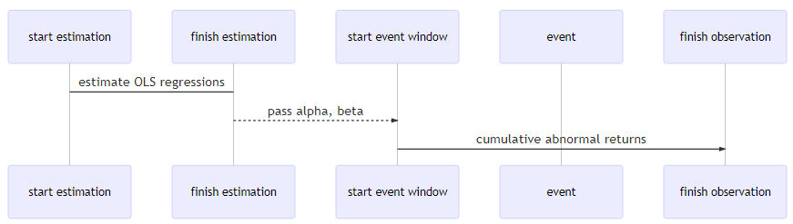
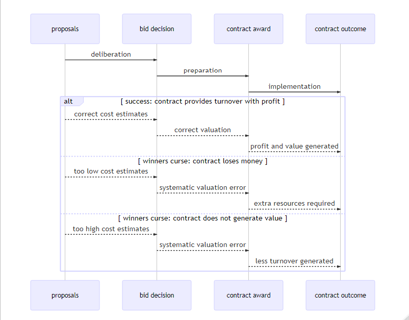

```{r setup, include=FALSE}
knitr::opts_chunk$set(
	echo = FALSE,
	message = FALSE,
	warning = FALSE,
	cache = TRUE
)
# knitr::purl("C:/Users/Christian/OneDrive/Rstudio/third_report/third_report3.rmd")
# definition of operator language for R: https://cran.r-project.org/doc/manuals/r-release/R-lang.pdf
# Detailed explanation of the Tilde: https://stackoverflow.com/questions/8055508/in-r-formulas-why-do-i-have-to-use-the-i-function-on-power-terms-like-y-i/8055683#8055683
#
# Sets the working directory for this script
# setwd(getSrcDirectory(function(x) {x}))
#Returns the working directory of this script
work_dir <- getwd()
# package for statistical tables
library(broom)
# package for Type II and Type III statistical tables
library(car)
# package for converting country names to country codes
library(countrycode)
# package for renaming columns in a data.frame:
library(data.table)
# package needed to draw diagrams
library(DiagrammeR)
# package needed to manipulate classes for the data.frame with mutate()
library(dplyr)
# package to draw nice plots
library(ggplot2)
# package to plot ridges:
library(ggridges)
# package to plot multiple grids (not used)
# !!WARNING: seems to kill LaTeX output of bookdown figure references!!:
library(gridExtra)
# package for single event studies with many methods (not currently used)
library(estudy2)
# package for analysis of event studies: https://rdrr.io/cran/eventstudies/f/inst/doc/eventstudies.pdf
library(eventstudies)
# package for eventstudytools.com
library(EventStudy)
# package for advanced tables
library(kableExtra)
# package for Rmarkdown functions
library(knitr)
# package for executing pipes
library(magrittr)
# package for inverse selections
library(mefa4)
#package to manipulate single values in a data.frame
library(plyr)
# package to perform rowwise operations:
library(purrr)
# package to scrape dates from text:
library(qdapRegex)
# package for loading financial data from Yahoo! finance: https://cran.r-project.org/web/packages/quantmod/quantmod.pdf
library(quantmod)
# library for quantile regressions
library(quantreg)
# package to scrape data from text
library(readtext)
# package to melt and cast data
library(reshape2)
# package required by rnaturalearth
library(rgeos)
# package for plotting world maps
library(rnaturalearth)
# package with data for plotting world maps
library(rnaturalearthdata)
# package to define world coordinates
library(sf)
# package for displaying variable chart data app: https://shiny.rstudio.com/tutorial/written-tutorial/lesson6/
library(shiny)
# package for date_format
library(scales)
# package for everything interesting
library(tidyverse)
# package for adding financial indicators for zig zag lines:
library(TTR)
# package for reading and writing excel files: https://cran.r-project.org/web/packages/xlsx/xlsx.pdf
library(xlsx)
# package for non-sequential time series: https://cran.r-project.org/web/packages/zoo/zoo.pdf
library(zoo)
```

```{r event-data}
# method source: https://rstudio-pubs-static.s3.amazonaws.com/24352_f737954ed8804a3ba8fd5a209f843879.html
# Embedding raw data in an rmarkdown file

# embed all data from .xlsx files here:
# 911 events
# 911 company data
# study events
# study company data
```

\justify

\pagebreak

\listoffigures

\listoftables

\pagebreak

# Abbreviations {-}

ANOVA
:   Analysis of Variance

API
:    Application Programming Interfac

CAR
:   Cumulative Abnormal Return

EMH
:   Efficient Market Hypothesis

EPC
:   Engineering, Procurement, Construction

FX
:   Exchange Rate

GDP
:   Gross Domestic Product

GE
:   General Electric Company

MCAP
:   Market CAPitalization

NA
:   Not Available

NaN
:   Not a Number

NYSE
:   New York Stock Exchange

LM
:   Linear Models (Simple regression method)

LOESS
:   LOcally Estimated Scatterplot Smoothing (Trend line method)

OLS
:   Ordinary Least Squares

OTC
:   Over The Counter

USA
:  United States of America

USD
:  United States Dollars

\newpage

# Introduction

There are increases of 1%-2% in company share values after gaining a large order for manufacturing energy generation infrastructure reported by @Schiereck_2012. This is also reflected in a study of EPC contract awards, which shows that an average of 5% are added to contract award share prices for EPC energy projects, as described by @Choi_2015.

The market model adjustment is used, since this appears to be the most commonly used, simple, and provides comparable results to more complicated methods. The Cumulative Abnormal Returns (CAR) from day 2 after each announcement are used. The regressions are then tested for alternative hypotheses derived off the Cumulative Abnormal Return (CAR) from all individual events of the announcement dates:

- Increased CAR for contract award announcements
- Increased CAR for higher power generation value mentioned,
- and when adjusted for Market Capitalization
- Increased CAR for more recent announcements
- Increased CAR for longer periods between announcements
- Decreased CAR for more clustering of announcements within the event window
- Increased CAR for increased GDP per Capita

Additionally, a couple of relationships are examined:

- Increased CAR by energy generation type
- Increased CAR by company

Daily stock returns are used since monthly would not show any effect and intraday stock returns would be too volatile. Only daily stock returns are both archived over several years and freely available. Ad hoc announcements are only to be sourced directly from the company websites, and not from journals or newspapers, since the announcements there are often delayed by several days and contain different information to that released on the company website. The null hypothesis applied in all cases.

\pagebreak

# Background

Event studies are a popular and integral part of econometrics, with @Kothari_2004 reporting 15 years ago that over 500 event studies had already been published. Event studies became popular with the papers by @Fama_1969 and for monthly prices by @Brown_1980. This was then later applied to daily stock prices by @Brown_1985, which proposed taking market adjusted returns $A_{i,t}$:

\begin{equation}
  A_{i,t} = R_{i,t} - R_{m,t}
  (\#eq:mar)
\end{equation}

Where $R_{i,t}$ is the return of security $i$ at day $t$, and $R_{m,t}$ is the return of index $m$ on day $t$. This expresion is then augmented to the Ordinary Least Squares (OLS) market model:

\begin{equation}
  A_{i,t} = R_{i,t} - \hat{\alpha_{i}} -  \hat{\beta_{i}}R_{m,t}
  (\#eq:olsmm)
\end{equation}

Where $\hat{\alpha_{i}}$ and $\hat{\beta_{i}}$ are OLS values from the estimation period, which is a defined period in the months before the event where the tendency is estimated. Standard deviations would then be taken to disprove the null hypothesis. The null hypothesis calculates what would be the maximum possible change by chance which could be reasonably expected. The observed results would need to show an average change higher than that expected by the null hypothesis, thereby showing that the observed results are most likely not due to chance. No overall change in the share price is observed, resulting in the null hypothesis applying for all regressions.

The more robust modified Rank test as defined by @Corrado_1989 was also looked at, but did not provide conclusive results for the calibration of the models. Therefore it was not used for modelling of the results, and will not be described further.

Press reports for income orders for energy power producers in Germany were investigated by  @Schiereck_2012 and press reports for Engineering, Procurement, Construction (EPC) contractors in the USA investigated by @Choi_2015 have shown significant positive reactions in the daily market prices of securities.

EPC contractors are used to construct large construction projects, which is used for large scale infrastructure projects, noted  by @Silver_1999 as "where certainty of final price, and often of completion date, are of extreme importance". In this case, EPC power plant projects and retrofitting awards are looked at, with project values ranging from approximately 100 million USD to approximately 12 billion USD.

Since announcements on the company website related to energy newbuilds were both relatively rare and diverse in the scope of delivery, with announcements ranging from service agreements and spare parts deliveries to turnkey EPC contracts, contract size varied significantly. Since the price is not often stated, a subjective estimate was made on the basis of the generation type.

This thesis examines events using sliced inputs of individual events examined with the market model in an R by @rlang package *eventstudies* by @eventstudies, with the data imported from Yahoo! Finance by @yahoo_data with the R package quantmod by @quantmod. This refers to the event study methodology review by @Corrado_2010, which describes an event study as an econometric observation of the effect on share price of a single stock-listed company, in this case represented by a single market symbol, and caused by a single event. In this case, with the market model, the abnormal returns of the company stock are looked at, once any market trends have been taken into account. @Daniel_1998 describes the effect of a sudden rise in the share price after the presentation of a significantly positive announcement, followed by a market under reaction until the share price evens out at the new adjusted market price.

It is expected that over time the stock price will be the same as it would have been without the announcement. This is because without any price signals, but with turnover and profit, the company would in the long term be equally attractive to investors. However, since only the early post-event window is looked at, this would most likely not affect the results. @Daniel_1998 describes an increased price for positive information and a negative price for negative information occurring after events, resulting in a positive price increase for a favorable signal from the company, and a negative price increase for an unfavorable signal from the company. This would have a momentum phase, where the price increase builds up over time, before reducing to the increased rational expected value after the event over time. 

Since the company requires contract awards to meet the turnover, it is expected that contract awards are a favorable private signal. The increased rational expected value is found to carry on for a month after the event in post-event drift by @Womack_1996, and thereby stay consistently positive for the cumulative returns. The effects of insider trading are mentioned in the discussion.

The market model was chosen, as this is both the most widely used methodology for event study analysis, and also the easiest to understand from a logical viewpoint. This requires for each company event a listed symbol for the company and a listed market index for a representative market. Since any results must be similar for similar conditions, similar events are looked at for different dates over several years, across different stock listed companies in different continents, and in their respective markets.

Over The Counter (OTC) of foreign traded stocks were not used to substitute foreign stocks traded on foreign market indices due to the high attributed search costs, resulting in low transparency and high asymmetry. Instead, @Issa_2018 describes OTC markets as opaque and disperse. This would violate the Efficient Market Hypothesis (EMH) needed to predict expected returns for event study analysis, since any new information on the market would lead to a resulting adjustment of the stock price, as described by @Werner_2010. Therefore, they would most likely increase interference in the model, rather than decrease it. For this reason, only locally traded stocks were examined against their local market index, but with a multitude of international indices.

The R package *eventstudies* only handles a single market index. Another possibility would be to evaluate all of the indices against a common index which would be representative of all the individual indices, in this case the Dow Jones Industrial Average. However, the Dow Jones Industrial Average varies significantly to the local indices of other companies studied, such as the Nikkei 225 Index in Japan and the Hang Seng Index in Hong Kong.

The resulting Cumulative Abnormal Return (CAR) from the event study is then used in a simple regression with equations adapted from @empirical and @regres. 

The null hypothesis to be rejected is:
\begin{equation}
  H_{0}: \beta_{0} = \beta_{1} = 0
  (\#eq:reg-h0)
\end{equation}
when 
\begin{equation}
  Pr(>|t|) < 0.05
  (\#eq:reg-p)
\end{equation}
Similarly, the alternative hypothesis to be accepted is:
\begin{equation}
  H_{A}: \beta_{0} \neq 0 \vee \beta_{1} \neq 0
  (\#eq:reg-ha)
\end{equation}
for a simple regression 
\begin{equation}
  y = \beta_{0} + \beta_{1}x + u
  (\#eq:regres)
\end{equation}
where

$Pr(>|t|)$ = *p-value*, results are significant if less than 0.05, or 5% chance that the null hypothesis is not rejected. Otherwise the null hypothesis must be applied.

$y$ = Estimate of the dependent variable, Cumulative Abnormal Return (CAR) in %.

$\beta_{0}$ = y-axis intersect, CAR in % where the independent variable on the x-axis is 0.

$\beta_{1}$ = Slope of the regression, the trend for the abnormal return to increase or decrease by increasing values of the independent variable on the x-axis.

$x$ = Independent variable, e.g. Megawatts mentioned, cluster size.

$u$ = error term, not directly visible on plots.

\pagebreak

# Method

The event estimation is split into several different periods as shown in Figure \@ref(fig:z-estimation), namely:

Estimation window,
:   2 months prior to the event window, where OLS regressions are estimated

Pre-event window,
:   3 days preceding the event date

Event date, 
:   day 0

Post-event window, 
:   2 days succeeding the event date

Post event observation window, 
:   8 days succeeding the post-event window

The pre-event estimation window is used to predict the expected return of the traded company security. The Cumulative Abnormal Return, or the difference between the actual return and the expected return, is given in Equation \@ref(eq:olsmm). The cumulative abnormal return is taken 2 days after the event for all events in the study. This is then plotted against different variables in simple regression analyses.

```{r z-estimation, fig.cap="Event sequence", out.width = "\\textwidth"}

```


```{r study-sequence, eval=FALSE, cache=TRUE, include=FALSE}

mermaid("
sequenceDiagram
  participant start estimation
  participant finish estimation
  participant start event window
  participant event
  participant finish observation
  
  start estimation->finish estimation: estimate OLS regressions
  finish estimation-->>start event window: pass alpha, beta
  start event window->>finish observation: cumulative abnormal returns
")

```  

The market model uses the past to predict the future, in that the estimation period ends before the event window starts. The Cumulative Abnormal Returns (CAR) are then calculated for the period to give the result.

\pagebreak

```{r load-data-911}
# Chunk to load data needed for the results
# name source file (File must be in same directory)
source_file <- "z_event_dates_911.xlsx"
# open source file (Important: Date format must be YYYY-MM-DD, 
# column 1 must be "name", column two "when", all in lower case!)
sheets_911 <- getwd() %>% file.path(source_file) %>%  loadWorkbook() %>% getSheets
#loads only first sheet from wb 
{
  sheet_events_911 <- sheets_911 [[1]]
  #loads data from sheet 1 into event_dates
  event_dates_911 <-readColumns(sheet = sheet_events_911, 1, 2, 1, colClasses =c("character","Date"))
  #event_dates<-readColumns(sheet = sheet, 1, 3, 1, colClasses =c("character","Date","character"))
  #converts first column from class Factor to class Character (no reason why it is converted to factor) with the package dplyr)
  event_dates_911 <- event_dates_911 %>% mutate_if(is.factor, as.character) %>% arrange(when, name)
  # loads only the second sheet from wb for calculating market capitalization
  sheet_mcap_911 <- sheets_911 [[2]]
  # loads data from sheet 1 into event_dates
  symbol_mcap_911 <- readColumns(sheet = sheet_mcap_911, 1, 6, 1, colClasses =c(
    "character","Date","character","character","numeric","character"))
  # converts first column from class Factor to class Character 
  # (no reason why it is converted to factor) with the package dplyr)
  symbol_mcap_911 <- symbol_mcap_911 %>% mutate_if(is.factor, as.character)
}
# list all of the stock market symbols, so they can be called from Yahoo!Finance. 
# Please check first that the symbols are correct!
event_symbol_911 <- levels(factor(symbol_mcap_911$name))
# list all of the index symbols, so they can be called from Yahoo!Finance. 
# Please check first that the symbols are correct!
index_symbol_911 <- levels(factor(symbol_mcap_911$index))
# Combine all the symbols to call the symbols from Yahoo! Finance at once:
yahoo_symbol_911 <- c(event_symbol_911,index_symbol_911)
```

```{r setup-dates-911}
# chunk to define the analysis dates
# Define the Event Window Length in days:
event_window_911 <- 7
# Define event lead (days before) to start the event:
event_lead_911 <- 3
# Define display event period ("0" is day of event):
num_days_911 <- c(1:(event_window_911*2))
mid_days_911 <- num_days_911+event_lead_911-event_window_911
# new_days <- sprintf("%+d", mid_days) 
new_days_911 <- mid_days_911
# Define estimation period:
estimation_period_911 = 60
#find minimum date needed for event study and take one year from it for security:
min_date_911 <- min(event_dates_911$when) - event_window_911 - 360
#find maximum date needed for event study and add one year to it for security:
max_date_911 <- max(event_dates_911$when) + event_window_911 + 360

```

```{r get-yahoo-prices-911, eval=FALSE, include=FALSE}
# chunk to download the data needed from Yahoo! Finance---------------------

# download securities data from Yahoo! Finance in a zoo format:
est_securities_911 <- get_prices_from_tickers(event_symbol_911,  start = min_date_911 ,end = max_date_911, quote = "Close", retclass = "zoo")
# melt the securities data with fortify.zoo, so that only three columns are present:
est_firm_data_911 <- fortify.zoo(est_securities_911, names = c("Series", "Index", "Value"), melt = TRUE) %>% .[c("Index", "Series", "Value")]
# save results pulled from Yahoo! Finance as an R data file:
save(est_firm_data_911, file= "est_firm_data_911.rda")
# download indices data from Yahoo! Finance in a zoo format:
est_indices_911 <- get_prices_from_tickers(index_symbol_911, start = min_date_911 , end = max_date_911, quote = "Close", retclass = "zoo")
# melt the indices data with fortify.zoo, so that only three columns are present:
est_market_data_911 <- fortify.zoo(est_indices_911, names = c("Series", "Index", "Value"), melt = TRUE) %>% .[c("Index", "Series", "Value")]
# save results pulled from Yahoo! Finance as an R data file:
save(est_market_data_911, file= "z_est_market_data_911.rda")
# write the information from Yahoo! Finance as the .csv file required:
# securities data:
write.table(est_firm_data_911, file="02_FirmData_911.csv", row.names=FALSE, col.names=FALSE, sep=";", quote = FALSE)
# market data:
write.table(est_market_data_911, file="03_MarketData_911.csv", row.names=FALSE, col.names=FALSE, sep=";", quote = FALSE)
```

```{r eventstudies-yahoo-911, eval=FALSE, include=FALSE}
#call symbols from Yahoo! Finance ------------------------------------------------
#Combine "Symbols" (tickers) with the "lapply" function from the "dplyr" package as given in https://stackoverflow.com/questions/24377590/getsymbols-downloading-data-for-multiple-symbols-and-calculate-returns:
#use lapply to list the different stocks together. Note the argument "auto.assign" must be = FALSE, otherwise results give an error.
#dailyReturn takes the % change in the closing share price. This has only been taken out of convenience.
aggregate_stocks_911 = lapply(yahoo_symbol_911, function(sym) dailyReturn(getSymbols(sym, from = min_date_911, to = max_date_911, auto.assign = FALSE)))
#AggregateStocks is not a usable dataframe (please DON'T try "head(AggregateStocks)")! So we will merge the dataframe to give us a usable dataframe:
symbol_returns_eventstudies_911 <- do.call(merge, aggregate_stocks_911)
#the data frame columns must be renamed to match the symbols. Source is in-built R functionality from http://www.cookbook-r.com/Manipulating_data/Renaming_columns_in_a_data_frame/
#The Columns in  SymbolReturns are not related to the tickers any more.
#
#The Columns in  SymbolReturns are not related to the tickers any more.
#To rename the columns to be the same as the data called up by "yahoo_symbol":
colnames(symbol_returns_eventstudies_911) <- yahoo_symbol_911
# Save the SymbolReturns to a useable data file
save(symbol_returns_eventstudies_911, file= "z_symbol_returns_eventstudies_911.rda")
```

```{r analysis-eventstudies-911}
#Load and condition returns  from Yahoo! Finance ---------------------------------------------
symbol_returns_eventstudies_911 <- NULL
load(file= "z_symbol_returns_eventstudies_911.rda")

symbol_returns_eventstudies_911 <- na.approx(symbol_returns_eventstudies_911)

Res3 <- NULL

#Takes the Event Dates and uses them to calculate the single result
EventCoeff <- function(x)
  {
    eventstudy (
      firm.returns = single_returns,
      # pulls event_dates one row at a time in the loop to calculate single results
      event.list=x,
      # event_window is defined as days before and after the event
      event.window=event_window_911,
      # uses Market Model Method
      type="marketModel",
      to.remap= TRUE, 
      remap = "cumsum", 
      inference = FALSE, 
      inference.strategy = "bootstrap", 
      model.args = list(market.returns = single_market)
    ) %>%

#Extract the results from the list
    extract2(1) %>%

    data.frame %>%
  
    rownames_to_column %>%
    
    gather(var, value, -rowname) %>%
    
    pivot_wider(names_from=rowname, values_from=value) %>%
    
    data.frame %>%
  #deselects the useless "var" column with variable"."
    select(-var) 
}
#Define empty obejects so they can be called within the loop
Res1=data.frame(0)
Res2=data.frame(0)
# Res3 is created by if condition in for loop, therefore is not predefined
for (row in 1:nrow(event_dates_911)) 
{
  # define event data set
  event_instructions <- NULL
  event_instructions <- event_dates_911[row, ]
  # add event lead time
  event_instructions$when <- event_instructions$when+event_lead_911 
  # define the event date
  single_event_date <- NULL
  single_event_date <- event_dates_911[row, "when"]
  # define the start of the estimation period, given by the stock returns
  start_estimation <- single_event_date-event_window_911+event_lead_911-estimation_period_911
  #combine so the stock return dates can be subsetted
  dates_subset <- paste(start_estimation, max_date_911, sep = "/")
  # define the event name
  single_event_name <- NULL
  single_event_name <- event_dates_911[row, "name"]
  # define the market name
  single_market_name <- NULL
  single_market_name <- symbol_mcap_911[symbol_mcap_911$name == event_dates_911[row, "name"], "index"]
  # extract data set for single symbol
  single_returns_xts <- NULL
  single_returns_xts <- 100*symbol_returns_eventstudies_911[, single_event_name]
  single_returns_xts <- single_returns_xts[dates_subset]
  single_returns <- as.zoo(single_returns_xts)
  # extract market returns for market symbol
  single_market_xts <- NULL
  single_market_xts <- 100*symbol_returns_eventstudies_911[, single_market_name]
  single_market_xts <- single_market_xts[dates_subset]
  single_market <- as.zoo(single_market_xts)
  # if result is unsuccessful (because no result was possible) return NA and continue to next row: 
  Res1 <- tryCatch(EventCoeff(event_instructions), error=function(err) NA)
  # combine the input variables from event_dates with the results from the package "eventstudies":
  Res2 <- c(event_dates_911[row, ], Res1)
  # converts Res2 from a list to a data.frame:
  ResZ <- data.frame(Res2)
  # renames ticker name from class factor to class character so that the rbind function still works:
  ResZ$name <- as.character(ResZ$name)
  # renames date from date class to character class, so rbind function still works:
  ResZ$when <- as.character(ResZ$when)
  # Checks if matrix of result doesn't ("!") already exist:
  if (!exists("Res3")) {
    # If doesn't exist, then a new data frame for the result is equal to the new result:
    Res3 <- ResZ
  }
  # If result already exists, then next row is made of previous row with additional new result:
  else {
    # rbind.fill function fills any unfilled values with "NA" 
    # (which also causes a new row "NA." to be created somewhere)
    Res3 <- rbind.fill(Res3, ResZ)
  }
# end if loop to run results
}
# Removes the extra column .NA generated by ~.fill of rbind.fill by declaring it null:
Res3$NA. <- NULL
# Re-indexing of the results by applying an unconditional filter with dpylr,
# rename columns to give days in relation to event
single_results_911 <- Res3 %>% filter() %>% data.table::setnames(c("name","when", as.character(new_days_911)))
# save the results (it has a lot of data!) ------------------------------------------
save(single_results_911, file= "single_results_911.rda")
# save data as .xlsx file using xlsx package:
write.xlsx(single_results_911,"single_results_911.xlsx")
```

```{r plot-ALV-DAX, fig.cap = "Example of security ALV.DE against the index ^GDAXI"}
# define end to estimation period
end_estimation <- start_estimation + estimation_period_911 
# define new dates for subset
dates_subset_ALV_DAX <- paste(start_estimation, end_estimation, sep = "/")

example_ALV_DAX <- symbol_returns_eventstudies_911 %>% 
  .[, c("ALV.DE", "^GDAXI")] %>%
  .[dates_subset_ALV_DAX] %>%
  cumsum

example_ALV_DAX$delta <- example_ALV_DAX$"ALV.DE"-example_ALV_DAX$"^GDAXI"
# plot code from: http://rstudio-pubs-static.s3.amazonaws.com/265813_dab79c8eb62d41e381a7e230465573ab.html  
plot(as.zoo(example_ALV_DAX), screens = 1, lty = c(1,3), 
     col = c("red","blue","green"), xlab = "Date", ylab = "Price")
par(new =TRUE)
# plot(as.zoo(example_ALV_DAX$"ALV.DE"-example_ALV_DAX$"^GDAXI"),screens = 1,lty = 5, 
#      col = "blue",xlab = "",ylab = "", xaxt = "n", yaxt = "n")
axis(4)
mtext("Price", side = 4, line = 3)
legend("topleft", c("ALV.DE (red)", "^GDAXI (blue)", "delta (green)"),
       lty = c(1,3,5), cex = 0.5)
```

Figure \@ref(fig:plot-ALV-DAX) shows the difference given by market adjustment, with red showing the actual share price, and green showing the market adjusted share price after accounting for general market changes. Therefore the CAR for the market adjusted model is much more accurate than that without market adjustment.

During an event study, short-term changes are sought after which do not reflect the estimated returns of the security or the market as given in Equation \@ref(eq:olsmm). These would be negative results for new negative market information, and positive results for new positive market information. In this case, abnormal results are looked for in the form of a positive skewed or positive shifted result, which shows that there are more positive then negative results in the normal distribution.

\pagebreak

The normality of distributions are used as a measure of the statistical validity of the results, since the results must either show normally distributed data, or calculating the number of abnormal returns over the control period, as described in detail by @Corrado_2010.

With skewed distributions, it is very difficult to compute the *mode* (the most common result) of the distribution, since it is difficult to define if there is no one number which occurs more frequently than the others. The numbers would have to be clustered into factors, which is very subjective. The *median* is possible, but also relatively difficult to define. The easiest and default of this is the *mean*. Unfortunately, this is also that which is furthest away from what provides the best indication, the *mode* in a skewed distribution.

Therefore, in contrast to the standard results given by the R packages *eventstudies* and *estudy2* for parametric tests, different summary statistics are used. The mean *smean.sdl* (Summary variables MEAN Standard Deviation lower and upper Gaussian confidence Limits) with limits of 0.05 and 0.95 in red, and the median *smedian.hilow* (Summary variables MEDIAN HIgh LOW) with the default lower quantile of 0.025 and upper quantile of 0.975 in black are used from the R package Hmisc by @Hmisc. For best fit curves, the default R method *loess* (LOcally Estimated Scatterplot Smoothing) is used, which fits a point locally with ratios based on exponentials of their distance, and weighted with the least squares of the values as defined by *loess* for R package *stats*, within the chapter Details of loess by @loess. Regression lines and summary statistics tables use the Linear Methods *lm* from the R package *stats*.

\pagebreak

## Different model evaluation

It is difficult to know what exactly the estimation models do, since the implementations are very broad but are not explained in detail. The packages *eventstudies* and *estudy2* have fundamental differences to the package *EventStudyTools.com*, which is why a comparison is given for all three models.

A non-parametric rank test according to @Corrado_1992 perform better for Asian markets, whilst presenting no disadvantages within the U.S. markets and is implemented with the package *estudy2* by @estudy2.

To evaluate the three different models, first a simple example of insurance companies adversely affected by the 9/11 terrorist attacks where taken from two different models, the R package *eventstudies* and the R wrapper *EventStudy* for *EventStudyTools.com*. The securities and indices used are given below in Table \@ref(tab:showsymbols-911). The index suffix "^" is used by Yahoo! Finance to indicate an index.

```{r showsymbols-911}
symbol_list_911 <- symbol_mcap_911 %>%
  select(name, index, company) %>%
  dplyr::rename(security = name) %>%
  str_trunc(40, "right", ellipsis = "")
  
knitr::kable(
  symbol_list_911, 
  booktabs = TRUE,
  caption = "Properties of securities for model evaluation") %>%
kableExtra::kable_styling(latex_options = "hold_position")
```

\pagebreak

The model takes securities defined by the 9/11 example used by the R package *estudy2*. A difference is that separate indices closest to the symbols used are used for the adjusted market model. This allows the calibration model to better represent the actual results used at a later date. This example was taken, since it is visually easy to identify and uses a similar number of securities (8) compared to the securities examined for this study (7). Furthermore, both numbers are slightly higher than the maximum of 6 numbers for subsetted variables defined for visual modelling in the R package *ggplot*. 

```{r showdates-911}
show_event_911 <- event_dates_911[1, "when"]
show_eve_start = event_dates_911[1, "when"] + min(new_days_911)
show_eve_end = event_dates_911[1, "when"] + max(new_days_911)

show_dates_eve <- seq(show_eve_start, show_eve_end, "day") %>%
  tibble::enframe(name = NULL) %>%
  cbind(new_days_911) %>%
  dplyr::rename("date"="value","days"="new_days_911") %>%
  as.data.table
  
show_dates_eve <- cbind(show_dates_eve[1:7], show_dates_eve[8:14])


knitr::kable(
  show_dates_eve,
  booktabs = TRUE,
  caption = "Check for correct event dates used") %>%
kableExtra::kable_styling(latex_options = "hold_position")
```

Table \@ref(tab:showdates-911) shows the calibration of the days of the observation window, where the event date (in this case 2001-09-11) should be on day 0. This is particularly important to be calibrated, since due to the combination of any event date with any security, there is no other way to ensure that the correct date is calculated in the results. These dates are then used to collect the event study data from Yahoo! Finance, and redistributed to the R package which calculates the event study, with a comparison of the results, as shown in Figure \@ref(fig:diagram-911) on the following page. This example also allows the data to be calibrated due to the sudden stock changes caused by the event, which is known in advance and verifiable against the results. This is imperative, since the actual study does not show any correlations, and so cannot be verified any other way.

\pagebreak

```{r diagram-911, fig.cap="Evaluation proceedure"}
grViz("digraph {
  
graph [layout = dot]

node [shape = rectangle]

a [label = 'Estudy2 example with 9/11 insurance companies']
c [label = 'Event dates']
d [label = 'Security symbols']
d1 [label = 'Security prices']
e [label = 'Market index symbols']
f1 [label = 'Market indices']
x [label = 'Event study']
h [label = 'R package Eventstudies']
h1 [label = 'Cumulative Abnormal Return (CAR)']
h3 [label = 'Distribution functions']
i [label = 'R wrapper for EventStudyTools.com']
i1 [label = 'Cumulative Abnormal Return (CAR)']
i3 [label = 'Distribution functions']
j [label = 'Absolute CAR difference']

a -> d -> e
d -> d1
e -> f1
a -> c
# event study
c -> x -> h -> h1 -> j
d1 -> x
f1 -> x
h1 -> h3
x -> i -> i1 -> j
i1 -> i3


}",
height = 900)
```

\pagebreak

```{r est-preparation-911}

# loop for writing data frame to load to EventStudyTools-----------------------------

# define constants

z4 <- grouping_variable_911 <- "Addition"
z5 <- start_event_window_911 <- min(new_days_911)
z6 <- end_event_window_911 <- max(new_days_911)
# Take off two weeks since the pre-event window is often extended
z7 <- end_estimation_window_911 <- start_event_window_911-14
z8 <- estimation_window_length_911 <- estimation_period_911

x_col_911 <- NULL
i_col_911 <- NULL

for (row in 1:nrow(event_dates_911)) 
{
  
  # defines inputs as required by tool
  # define variables
  z0 <- event_id <- 10000+row
  z1 <- firm_id_911 <- event_dates_911[row, "name"]
  z2 <- market_id_911 <- symbol_mcap_911[symbol_mcap_911$name == event_dates_911[row, "name"], "index"]
  z3 <- eventdate_911 <- event_dates_911[row, "when"]
  
  i_col_911 <- data.frame(z0, z1, z2, z3, z4, z5, z6, z7, z8)
  
  if (!exists("x_col_911")) {
    # If doesn't exist, then a new data frame for the result is equal to the new result:
    x_col_911 <- i_col_911
  }
  # If result already exists, then next row is made of previous row with additional new result:
  else {
    # rbind.fill function fills any unfilled values with "NA" 
    # (which also causes a new row "NA." to be created somewhere)
    x_col_911 <- rbind(x_col_911, i_col_911)
  }
}

df_request_911 <- x_col_911

# write data to a .csv file to upload:
write.table(df_request_911, file="01_RequestFile_911.csv", row.names=FALSE, col.names=FALSE, sep=";", quote = FALSE)
```

```{r est-analysis-911, eval=FALSE, include=FALSE}
#set apiKey for EventStudies
apiKey <- "573e58c665fcc08cc6e5a660beaad0cb"
# The URL is already set by default
options(EventStudy.KEY = apiKey)
# initialize object
estSetup <- EventStudyAPI$new()
# set Event Study parameters
estType <- "arc"
dataFiles <- c("request_file" = "01_RequestFile_911.csv",
               "firm_data" = "02_firmData_911.csv",
               "market_data" = "03_MarketData_911.csv")
resultPath <- getwd()
# Perform Event Study
estResult <- estSetup$performDefaultEventStudy(estType = estType,
                                               dataFiles = dataFiles,
                                               destDir = resultPath)
# read abnormal returns from csv file
ar_results_911 <- read.csv("AR_results.csv", sep = ";")
# save the data in a normal data format
save(ar_results_911, file= "z_ar_results_911.rda")
# write the results to a unique .csv so that the information is still available after downloading the other results
write.csv(ar_results_911, "AR_results_911.csv", sep = ";")
```

```{r plot-est-results-911, fig.cap="Results of EventStudyTools.com"}
# reload results
load(file = "z_ar_results_911.rda")
# modify the event_dates source
est_event_dates_911 <- event_dates_911 %>% unite(when, c("name", "when"))
# rename events in results with names and dates of events
ar_results_911$Event.ID <- est_event_dates_911$when
   
#condition results:------------------------------------------------
# Select raw abnormal returns
est_sum_ar_911 <- ar_results_911 %>% 
  select("Event.ID":"AR.10.") %>%
  data.table::setnames(c("Event.ID", as.character(new_days_911)))
# cumulate results and convert from absolute to %
est_sum_ar_911[, 2:ncol(est_sum_ar_911)] <- 100*t(apply(est_sum_ar_911[, -1], 1, function(x)cumsum(x))) 
# save results
save(est_sum_ar_911, file= "z_est_sum_ar_911.rda")
# melt cumulated results
est_melted_ar_911 <- melt(est_sum_ar_911, id.vars = "Event.ID")

# plot results with ggplot---------------------
print(ggplot(est_melted_ar_911, aes(x = variable, y = value))
      + ylim(-100,+50)
      + geom_line(aes(color = Event.ID, group = Event.ID))
      + geom_rect(aes(xmin = 0, xmax = 2.5, ymin = -Inf, ymax = Inf), fill = "white", alpha = 1)
      + geom_rect(aes(xmin = 7.5, xmax = 9.5, ymin = -Inf, ymax = Inf), fill = "white", alpha = 1)
      + geom_smooth(group = "Event.ID")
      + stat_summary(fun.data = "mean_sdl", colour = "red", size = 1.5)
      + stat_summary(fun.data = "median_hilow", colour = "blue", size = 1)
      + theme(legend.position="none")
      + geom_vline(xintercept = 4)
      + geom_hline(yintercept = 0)
      + labs(x = "day", y = "% Cumulative Abnormal Return (CAR)", caption = "Red = Mean with limits of 0.05 and 0.95, source = own computation\nBlue = median with lower quantile limit of 0.025 and upper quantile limit of 0.975"))
```

The results from *EventStudyTools.com* are used as the benchmark, since this is the recommended implementation, as shown in Figure \@ref(fig:plot-est-results-911). The abnormal returns at the start of the results do not start at zero and also start on the weekend, where there are no returns for the security. This is because the analysis is set to extend the study when days of the study fall on days without any security returns. Additionally, the median (in blue) is less negative than the mean (in red), suggesting a negative skew.

\pagebreak

```{r plot-distribution-results-911, fig.cap="Distribution of EventStudyTools.com"}
est_distr_ar_911 <- est_sum_ar_911 %>% select("Event.ID","0":"3")
melted_results2_911 = melt(est_distr_ar_911, id.vars = "Event.ID")
print(ggplot(melted_results2_911, aes(x=value, colour=variable)) 
      + geom_density(size=2) 
      + ylim(-0, 0.1) 
      + xlim(-60, +20)
      + geom_vline(xintercept = 0)
      +labs(colour="day", caption = "source is own computation")
      +xlab("% Cumulative Abnormal Return (CAR)"))
```

The negative skew suggested by the more negative mean than the median in Figure \@ref(fig:plot-distribution-results-911) compared to the previous Figure \@ref(fig:plot-est-results-911) is more apparent here, with kurtosis decreasing and the skew becoming more negative as the days of the event progress. The result on day 0 the event day, is attributed to the 9/11 terrorist attacks occurring in the morning when the European stock markets were still open, so the closing price of the securities could show a reaction to the event on the same day. However, since the time of the events analysed in this study are not known, they may not be taken into account on the same day. So day 0 cannot be used. Day 3 shows much skew, with day 2 showing the most normal distribution. Therefore, day 2 will be used for regressions in the event study. This results in an asymmetrical event study, since the first day is -3 and the day taken for the abnormal returns is +2, referred to as (-3, +2). This is different to the majority of event studies, where symmetrical event windows are taken, i.e. (-3, +3) or (-2, +2).

```{r confidence-results-911, eval=FALSE, include=FALSE}
print(ggplot(est_melted_ar_911, aes(x = variable, y = value))
      + stat_summary(fun.data = "mean_sd", colour = "blue", size = 1)
      + stat_summary(fun.data = "mean_cl_boot", colour = "red", size = 1)
      + geom_vline(xintercept = 4)
      + geom_hline(yintercept = 0)
      + labs(x = "day", y = "interval 2 sigma / 95% confidence"))
```

\pagebreak

```{r plot-eventstudies-911, fig.cap="Results of R package eventstudies"}
# Extract cumulated line data from results for plotting graphs, Remove NA results 
Res4 <- single_results_911 %>%
  na.omit %>%
  unite(when, c("name", "when"))

melted_results = melt(Res4, id.vars = 'when')

# calculate mean
Res5 <- Res4
Res5$when <- NULL
mean_res <- data.frame(apply(Res5, 2, mean))
# mean_res <- setnames(mean_res, as.character(new_days))

# plot results abe label axis
# draw seperate lines for seperate dates
# Hide legend
print(ggplot(melted_results, aes(x = variable, y = value))
      + ylim(-100,+50)
      + geom_line(aes(color = when, group = when))
      + geom_rect(aes(xmin = 0, xmax = 2.5, ymin = -Inf, ymax = Inf), fill = "white", alpha = 1)
      + geom_rect(aes(xmin = 7.5, xmax = 9.5, ymin = -Inf, ymax = Inf), fill = "white", alpha = 1)
      + stat_summary(fun.data = "mean_sdl", colour = "red", size = 1.5)
      + stat_summary(fun.data = "median_hilow", colour = "blue", size = 1)
      + theme(legend.position="none")
      + geom_vline(xintercept = 4)
      + geom_hline(yintercept = 0)
      + labs(x = "day", y = "% Cumulative Abnormal Return (CAR)", caption = "Red = Mean with limits of 0.05 and 0.95, source = own computation\nBlue = median with lower quantile limit of 0.025 and upper quantile limit of 0.975"))
```


Figure \@ref(fig:plot-eventstudies-911) shows the results from the R package *eventstudies*. Here both the mean and the median are closer to zero, suggesting that the results of the R package *eventstudies* results are of a lesser magnitude than those of the R wrapper *EventStudyTools.com*.

Likewise the results start on the weekend, where there are no returns for the security, but in this case they remain neutral until the day of the event. This suggests that the results are based on the returns from before the weekend, but are adjusted to be zero on the first day of the observation window.

\pagebreak

```{r estudy2-prepare-911}

# Preparing the financial data for use in the 911 test:
estudy2_symbol_returns <- symbol_returns_eventstudies_911

# Pipe to prepare a tibble which contains all of the information needed to calculate the results:
# Take the list with indices for companies
symbol_mcap_911 %>%
  # convert to tibble before piping with Tidyverse "tidying":
  as_tibble() %>%
  # select only the names and indices
  select("name", "index") %>%
  # add additional column with the index for each company
  inner_join(event_dates_911, by = "name") %>%
  # only select securities, dates and indices (data does not need to be rearranged)
  select("name", when, "index") %>%
  # add column with date of end of event window
  mutate(eve_end = when + max(new_days_911)) %>%
  # add column with date of beginning of event window
  mutate(eve_start = when + min(new_days_911)) %>%
  # add column with date of start of estimation window  
  mutate(estim_end = eve_start - 14) %>%
  # add column with date of end of estimation window 
  mutate(estim_start = estim_end - estimation_period_911) ->
  # return result as 
  input_estudy2_911

```

```{r estudy2-para-func}
# Function to calculate the results from the prepared data set
estudy2_car <- function(x, output)
{
  # directly return single security data on row x. no zoo class required.
  estudy2_symbol_returns %>%
  .[, x["name"]] %>%
  # duplicate security data, so that the mean result can be given by doubling and then halving the results. Package estudy2 only functions with average results taken from a nonsingular selection of securities.
  merge(., .) ->
  security_returns_estudy2
  # directly return single index data on row x. no zoo class required.
estudy2_symbol_returns %>%
  .[, x["index"]] ->
  index_returns_estudy2 
# functions from estudy2:
    security_returns_estudy2 %>%
# calculate the alpha and beta values needed for the market model
  estudy2::apply_market_model(regressor = index_returns_estudy2,
                      # this must be true for only one index.
                       same_regressor_for_all = TRUE,
                      # market adjusted takes alpha and beta into account
                       market_model = "mrkt_adj",
                      # start of estimation period
                       estimation_start = as.Date(x["estim_start"]),
                      # end of estimation period
                       estimation_end = as.Date(x["estim_end"])) %>%
      # function to calculate non-parametric tests, start of observation window
    estudy2::parametric_tests(event_start = as.Date(x["eve_start"]),
                    # end of observation window
                     event_end = as.Date(x["eve_end"])) ->
  # returns results from the package to be manipulated
  return_results
    
    
  # preparation so observation period always remains the same size by converting to calendar days:-----
  # fill missing time solutions from Github:
  # https://gist.github.com/ateucher/e2e5bd0b592f3efd6d56  
  # Calculate the actual number of days passed, to determine the event date:
  event_passed_days <- seq(as.Date(x["eve_start"]), 
                           as.Date(x["eve_end"]), 
                           # list all calendar days
                           "day") %>%
  # convert to a data frame to can be merged with another data frame and assigns it to the column "date" (otherwise it is just a vector)
  data.frame(date = .)
  
    
# manipulate results to only those required for plotting before returning outside of function:------
  return_results2 <- return_results %>%
  # only the date and rank according to corrado are required
  select("date","mean")
    
    
  # cumulated values calculated for the mean column,
  # then multiplied from absolute to percent.
  # Only works in base R so pipe cannot be used.
  return_results2$mean <- cumsum(return_results2$mean)*100
  
  
  # the actual dates cannot be used 
  # because they only take working days and not calendar days into account, 
  # so the event would not take place at the same point in the event window any more
  # fill missing time solutions from Github https://gist.github.com/ateucher/e2e5bd0b592f3efd6d56
  # fill missing values (NA) from day sequence of same time period with interpolated values:
  return_results2 <- return_results2 %>%
  # add the NA values where required:
    merge(event_passed_days, ., by = "date", all.x = TRUE) %>%
  # transpose from a vertical list to a horizontal vector
  t %>%
  # select only results, drop the dates, 
  # since only vectors can be returned without nesting:
  .[-1, ]
    
    
  # end of function
    }
```

```{r estudy2-para-results-911}
# combines the rowwise results for individual securies with the original data frame:
  car_results_estudy2 <- input_estudy2_911 %>%
    # apply function to call estudy2 package rowwise:
    apply(., 1, estudy2_car) %>%
    # transposes results in columns to results in rows
    t %>%
    # convert results from list class to numeric class
    apply(2, as.numeric) %>%
    # fill in the missing days with estimated values
    apply(1, na.approx, na.rm = FALSE) %>%
    # transposes the results in columns into rows
    t %>%
    # converts results to a data frame
    as.data.frame() %>%
    # renames columns accordin to day of observation period
    data.table::setnames(as.character(new_days_911)) %>%
    # converts to a tibble
    as_tibble() %>%
    # appends new columns onto the original file
    cbind(input_estudy2_911, .)
    
```

```{r estudy2-para-plot-911, fig.cap="Parametric adjusted market model results of the estudy2 package"}
# prepares results for plotting:-------
plot_car_estudy_911 <- car_results_estudy2 %>%
    # combine the name and when so the results are unique
    unite(when, c("name", "when")) %>%
    # removed unwanted information
    select(when, "-3":"10") %>%
    # rename results
    dplyr::rename("Event.ID" = "when")
    # melt results (gives warning that variables are dropped: this is fine, they are NAs anyway)
  
plot_car_estudy_911_melt <- plot_car_estudy_911 %>%
    reshape2::melt(id.vars = "Event.ID")

# plots results     
# plot results with ggplot---------------------

print(ggplot(plot_car_estudy_911_melt, aes(x = variable, y = value))
      + ylim(-100,+50)
      + geom_line(aes(color = Event.ID, group = Event.ID))
      + geom_rect(aes(xmin = 0, xmax = 2.5, ymin = -Inf, ymax = Inf), fill = "white", alpha = 1)
      + geom_rect(aes(xmin = 7.5, xmax = 9.5, ymin = -Inf, ymax = Inf), fill = "white", alpha = 1)
      + stat_summary(fun.data = "mean_sdl", colour = "red", size = 1.5)
      + stat_summary(fun.data = "median_hilow", colour = "blue", size = 1)
      + theme(legend.position="none")
      + geom_vline(xintercept = 4)
      + geom_hline(yintercept = 0)
      + labs(x = "day", y = "% Cumulative Abnormal Return (CAR)", caption = "Red = Mean with limits of 0.05 and 0.95, source = own computation\nBlue = median with lower quantile limit of 0.025 and upper quantile limit of 0.975"))

```

The package *estudy2* is also looked at, since it provides the same functionality as the r wrapper *EventStudyTools.com*, but without needing to interact with an external internet server via an Application Programming Interface (API), and also providing open source code. As with the other packages, events are studied individually. Due to the form of the required inputs and outputs, which only give the averages for sets with multiple security returns \(n \geq 2\), the single security returns are duplicated from a list to an array of two identical columns before looping through *estudy2*. The results in Figure \@ref(fig:estudy2-para-plot-911) show a delayed trend when compared to the previous packages, with no values (*NA*) being presented for the start of the observation window, which was on a weekend. This could be extended to previous days before importing the data into the program if required, however this was not performed, as it would involve inputting a modified data set to this model, resulting in different initial parameters.

\pagebreak

```{r ridge-comparison-911, fig.cap="Ridgeline plot comparison of the different calibration methods"}
#prepare data
est_ridge_911 <- est_melted_ar_911
est_ridge_911$Event.ID <- "EventStudyTools.com"

eventstudies_ridge_911 <- melted_results %>%
dplyr::rename("Event.ID" = "when")
eventstudies_ridge_911$Event.ID <- "eventstudies"

estudy2_ridge_911 <- plot_car_estudy_911_melt
estudy2_ridge_911$Event.ID <- "estudy2"

melted_ridge_911 <- estudy2_ridge_911 %>%
  bind_rows(eventstudies_ridge_911, est_ridge_911)

# plot ridges
 ggplot(melted_ridge_911, aes(x = value, y = variable,
                              fill = Event.ID)) +
  geom_density_ridges() +
  scale_y_discrete(expand = c(0, 0), name = "day") +
  scale_x_continuous(expand = c(0, 0), name = "% Cumulative Abnormal Return") +
  scale_fill_manual(values = c("green", "blue", "red"),
                    labels = c("R estudy 2", "R eventstudies", "EventStudy\nTools.com")) +
  scale_color_manual(values = c("green", "blue", "red"), guide = "none") +
  theme_ridges(center = TRUE) +
  labs(caption = "source is own computation")
 
```

Even though the results from the R package *eventstudies* and the R wrapper *EventStudyTools.com* look very similar, there is an absolute difference of several percent, with the R wrapper *EventStudyTools.com* providing a more negative, and therefore stronger, result. Figure \@ref(fig:ridge-comparison-911) shows that before even considering misspecification as discussed in detail by @Brown_1985 and @Corrado_1989, there is significant event-date excess-returns variance present merely by selecting different means of taking days without stock market returns into account. Another possible factor is that the observation windows for the R packages are symmetrical. Therefore, the R program calculates with an observation window from -6 days to +7 days, and a +3 day lead is imposed on the event date. This then gives results for -3 days to +10 days. This, and forcing the programs to give single results which are defined as average results, may be causing the differences noticed between *EventStudyTools.com* and the R package *estudy2*.

\pagebreak

```{r estudy2-nonpara-func}
# Function to calculate the results from the prepared data set
estudy2_rank <- function(x, output)
{
  # directly return single security data on row x. no zoo class required.
  estudy2_symbol_returns %>%
  .[, x["name"]] %>%
  # duplicate security data, so that the mean result can be given by doubling and then halving the results. Package estudy2 only functions with average results taken from a nonsingular selection of securities.
  merge(., .) ->
  security_returns_estudy2
  # directly return single index data on row x. no zoo class required.
estudy2_symbol_returns %>%
  .[, x["index"]] ->
  index_returns_estudy2 
# functions from estudy2:
    security_returns_estudy2 %>%
# calculate the alpha and beta values needed for the market model
  estudy2::apply_market_model(regressor = index_returns_estudy2,
                      # this must be true for only one index.
                       same_regressor_for_all = TRUE,
                      # market adjusted takes alpha and beta into account
                       market_model = "sim",
                      # uses ordinary least squares to calculate alpha and beta
                      estimation_method = "ols",
                      # start of estimation period
                       estimation_start = as.Date(x["estim_start"]),
                      # end of estimation period
                       estimation_end = as.Date(x["estim_end"])) %>%
      # function to calculate non-parametric tests, start of observation window
    estudy2::nonparametric_tests(event_start = as.Date(x["eve_start"]),
                    # end of observation window
                     event_end = as.Date(x["eve_end"])) ->
  # returns results from the package to be manipulated
  return_results
    
    
  # preparation so observation period always remains the same size by converting to calendar days:-----
  # fill missing time solutions from Github:
  # https://gist.github.com/ateucher/e2e5bd0b592f3efd6d56  
  # Calculate the actual number of days passed, to determine the event date:
  event_passed_days <- seq(as.Date(x["eve_start"]), 
                           as.Date(x["eve_end"]), 
                           # list all calendar days
                           "day") %>%
  # convert to a data frame to can be merged with another data frame and assigns it to the column "date" (otherwise it is just a vector)
  data.frame(date = .)
  
    
# manipulate results to only those required for plotting before returning outside of function:------
  return_results2 <- return_results %>%
  # only the date and rank according to corrado are required
  select("date","mrank_stat") %>%
  # the actual dates cannot be used because they only take working days and not calendar days into account, so the event would not take place at the same point in the event window any more
  # fill missing time solutions from Github https://gist.github.com/ateucher/e2e5bd0b592f3efd6d56
  # fill missing values (NA) from day sequence of same time period with interpolated values:
  merge(event_passed_days, ., by = "date", all.x = TRUE) %>%
  # NOTE: na.approx() %>% could be used here in the pipe if interpolated values are needed
  # transpose from a vertical list to a horizontal vector
  t %>%
  # select only results, drop the dates, since only vectors can be returned without nesting:
    .[-1, ]
    
    
  # end of function
    }
```

```{r estudy2-nonpara-results-911}
# combines the rowwise results for individual securies with the original data frame:
  rank_results_estudy2 <- input_estudy2_911 %>%
    # apply function to call estudy2 package rowwise:
    apply(., 1, estudy2_rank) %>%
    # transposes results in columns to results in rows
    t %>%
    # converts results to a data frame
    as.data.frame() %>%
    # renames columns accordin to day of observation period
    data.table::setnames(as.character(new_days_911)) %>%
    # converts to a tibble
    as_tibble() %>%
    # convert results from list class to numeric class
    apply(2, as.numeric) %>%
    # appends new columns onto the original file
    cbind(input_estudy2_911, .)
    
```


```{r estudy2-nonpara-plot-911, fig.cap="Nonparametric Corrado rank test results of the estudy2 package"}
# prepares results for plotting:-------
plot_rank_estudy_911 <- rank_results_estudy2 %>%
    # combine the name and when so the results are unique
    unite(when, c("name", "when")) %>%
    # removed unwanted information
    select(when, "-3":"10") %>%
    # rename results
    dplyr::rename("Event.ID" = "when") %>%
    # melt results (gives warning that variables are dropped: this is fine, they are NAs anyway)
    reshape2::melt(id.vars = "Event.ID")

# plots results     
# plot results with ggplot---------------------
print(ggplot(plot_rank_estudy_911, aes(x = variable, y = value))
      + geom_boxplot()
      + geom_point(aes(color = Event.ID, group = Event.ID))
      + theme(legend.position="none")
      + geom_vline(xintercept = 4)
      + geom_rect(aes(xmin = 0, xmax = 2.5, ymin = -Inf, ymax = Inf), fill = "white", alpha = 1)
      + geom_rect(aes(xmin = 7.5, xmax = 9.5, ymin = -Inf, ymax = Inf), fill = "white", alpha = 1)
      + geom_hline(yintercept = 0)
      + labs(x = "day", y = "rank significance", caption = "source is own computation"))
```

The more robust Corrado rank test as defined by @Corrado_1989 was also looked at with the R package *estudy2*. The results would also be available directly from the results of the wrapper *EventStudyTools.com*.

However, the results shown in Figure \@ref(fig:estudy2-nonpara-plot-911) do not appear too consistent when compared to the results of the parametric event study shown in Figure \@ref(fig:estudy2-para-plot-911). There is no reason why day 2 would be positive without day 1 or 3 being negative, or vice versa. Therefore the rank test is not suitable for a large sample of independent events for different securities, markets and event dates.

\pagebreak

```{r plot-comparison-all-911, fig.cap="Comparison of all three R packages"}
# Calculate median of EventStudyTools.com
median_est_911 <- est_sum_ar_911 %>%
  summarize_all(median)
median_est_911$Event.ID <- "EventStudyTools"
# Calculate median of R eventstudies
median_eventstudies_911 <- Res4 %>%
  summarise_all(median)
median_eventstudies_911$Event.ID <- "R eventstudies"
# Calculate median of R estudy2
median_car_estudy_911 <- plot_car_estudy_911 %>%
  summarize_all(median)
median_car_estudy_911$Event.ID <- "R estudy2"

plot_comparison_all_911 <- median_est_911 %>%
  bind_rows(median_eventstudies_911, median_car_estudy_911) %>%
  select(-when) %>%
  melt(id.vars = 'Event.ID')

print(ggplot(plot_comparison_all_911, aes(x = variable, y = value))
      + geom_line(aes(color = Event.ID, group = Event.ID))
      + geom_point(aes(color = Event.ID, group = Event.ID))
      # + geom_rect(aes(xmin = 0, xmax = 2.5, ymin = -Inf, ymax = Inf), fill = "white", alpha = 0.1)
      # + geom_rect(aes(xmin = 7.5, xmax = 9.5, ymin = -Inf, ymax = Inf), fill = "white", alpha = 0.1)
      + geom_vline(xintercept = 4)
      + geom_hline(yintercept = 0)
      + labs(x = "day", y = "Median % Cumulative Abnormal Return (CAR)", caption = "source = own computation"))
```

It must be relatively clear which day to use for the abnormal returns to ensure that the results provide enough consistency to identify any regressions. As can be seen in Figure \@ref(fig:plot-comparison-all-911), *EventStudyTools.com* shows the clearest signals of the different packages and methods. Therefore, the Cumulative Abnormal Return (CAR) of the R wrapper *EventStudyTools.com* on day 2 will be used for the results of this study.

\pagebreak

## Regressions

```{r plot-911-regression, fig.cap="Regression of abnormal return and observation window"}
print(ggplot(plot_comparison_all_911, aes(x = variable, y = value)) 
      + geom_smooth(aes(color = Event.ID, group = Event.ID), method = "lm",
                    se = FALSE)
      + geom_point(aes(color = Event.ID, group = Event.ID))
      + labs(x = "day", y = "% Cumulative Abnormal Return", caption = "source is own computation"))

```

Regressions will be shown for subsets as shown in Figure \@ref(fig:plot-911-regression), allowing more information to be shown than if only providing the linear regression for all data. The best representation of the regression such as that given in Figure \@ref(fig:plot-911-regression) is a summary of a linear regression showing statistics for the intercepts and variables as shown in Table \@ref(tab:lm-911). The *p value* in the right hand column should be less than 0.05 (5%) for the regression to be statistically significant. The other values (especially the standard error) are useful for determining further criteria for assessing the relevance of individual points. Table \@ref(tab:lm-911) has the additional advantage of being able to display the correlation on the use log10 on only the x axis where the distribution is, unlike Figure \@ref(fig:plot-911-regression), asymmetrical, i.e. where the mean varies greatly from the geometric mean. a log-log scale cannot be used for regressions, since the abnormal return in the y-axis takes both positive and negative values.

\pagebreak

Note that a summary of all of the observations is shown in Table \@ref(tab:lm-911) and in Table \@ref(tab:anova-911), but not in Figure \@ref(fig:plot-911-regression). This is because although the summary for all observations is important, this would confuse by adding more regressions than groups to Figure \@ref(fig:plot-911-regression).

```{r lm-911}
# calculate regression stats
# assign results to a new object
fit_res <- plot_comparison_all_911 %>%
  dplyr::rename(slope = variable)
# assign results to the summary data
fit_all <- fit_res
# rename to all
fit_all$Event.ID <- "All packages"
# calculate statistics
fit <- fit_res %>%
  # add summary data
  bind_rows(fit_all) %>%
  # converts the factors (days) to numbers
  mutate_if(is.factor, as.numeric) %>%
  # group by regression name
  group_by(Event.ID) %>%
  # create linear method table
  do(tidy(lm(value ~ slope, data = .))) %>%
  # replace NA with -
  na.fill("-")
# write table
knitr::kable(
  fit,
  digits = 3,
  booktabs = TRUE,
  caption = "Linear regression table of abnormal return with observation window") %>%
kableExtra::kable_styling(latex_options = "hold_position") %>%
add_footnote("source is own computation", notation = "symbol")
```

Analysis of Variance (ANOVA) shows the same information as the linear regression in Table \@ref(tab:lm-911) but in a different way, with the fit rather than the difference used as the indicated measure. ANOVA, as shown in Table \@ref(tab:anova-911), also shows the number of observations, which is an important factor in determining the *p value*.

```{r anova-911}
# calculate regression stats
# assign results to a new object
fit_res <- plot_comparison_all_911
# assign results to the summary data
fit_all <- fit_res
# rename to all
fit_all$Event.ID <- "All packages"
# calculate statistics
fit <- fit_res %>%
  # add summary data
  bind_rows(fit_all) %>%
  # converts the factors (days) to numbers
  mutate_if(is.factor, as.numeric) %>%
  # group by regression name
  group_by(Event.ID) %>%
  # create ANOVA table
  do(tidy(anova(lm(value ~ variable, data = .)))) %>%
  # replace NA with -
  na.fill("-")
# write table
knitr::kable(
  fit,
  digits = 3,
  booktabs = TRUE,
  caption = "ANOVA of abnormal return with observation window") %>%
kableExtra::kable_styling(latex_options = "hold_position") %>%
add_footnote("source is own computation", notation = "symbol")
```

The tabulation of the linear regression as shown in Table \@ref(tab:lm-911) will be used for the results, since this better represents both the information shown in the regression, such as in \@ref(fig:plot-911-regression), and the a summary of the same information used to define the regression line therein. ANOVA will not be used for assessing box plots to avoid describing different methods.

\pagebreak

## Study procedure

```{r z-event-proceedure, fig.cap="Study proceedure", out.width = "\\textwidth"}
knitr::include_graphics("z_event_proceedure.png")
```


```{r diagram, eval=FALSE, fig.cap="Study proceedure", include=FALSE}
grViz("digraph {
  
graph [layout = dot]

node [shape = rectangle]

a [label = 'Define companies and event types']
b [label = 'Find press releases']
b1[label = 'Discover more companies']
c [label = 'Event dates']
c1 [label = 'Event periodicity']
c2 [label = 'Event periodicity regression']
c3 [label = 'Event frequency']
d [label = 'Security symbols']
d1 [label = 'Security prices']
e [label = 'Market index symbols']
f1 [label = 'Market indices']
f2 [label = 'Market currency']
f3 [label = 'Exchange rate']
f4 [label = 'Financial Statements']
f5 [label = 'Market capitalizations (MCAP)']
f6 [label = 'Date']
g [label = 'Historical MCAP in USD']
g1 [label = 'MCAP / watt regression']
h [label = 'Event study']
h1 [label = 'Cumulative Abnormal Return (CAR)']
h2 [label = 'CAR two days after event']
h3 [label = 'Distribution functions']

a -> b -> c
b -> d -> e
d -> f4 -> f5 -> g
f4 -> f6 -> g
d -> d1
b -> b1 -> a
e -> f1
e -> f2 -> f3
c -> g
d1 -> g
f3 -> g -> g1
c -> c1 -> c2
c1 -> c3
# event study
c -> h -> h1 -> h2
d1 -> h
f1 -> h
h1 -> h3
h2 -> c2
h2 -> g1

}")
```

Figure \@ref(fig:z-event-proceedure) shows an example for the calculation of a regression used to find relationships between the abnormal return and the power mentioned in the respective announcement. It was decided to only call up the data as needed, rather than first combine all of the data together, and then only extract the data as needed. Many different data manipulation operations are required for each individual regression. The proceedure is so defined that it can easily be extended, with the results calculated within each chapter as needed. Each statistical table for regressions is based on the same calculations as the regressions drawn in the plots. As can be seen in Figure \@ref(fig:z-event-proceedure), the data passes through many different combinations before resulting in the points used for the regressions, so consistency in the method is important.

\pagebreak

## Watt per historical MCAP regression

It is assumed that the magnitude of share price change would be related to the ratio of relative value of contract award compared to market capitalization. It is assumed that larger contract orders are associated with higher security price increases. Most frequently the announcements describe the power of the object in question in Megawatts rather than the contract award value. Furthermore, a certain contract would be much more valuable to a small company with limited turnover than to a large corporation with many diverse activities. To reflect this expected relationship on the magnitude of the effect on the share price, the power mentioned in the award announcement is adjusted to the scalar proportion of the security's estimated MCAP, $MCAP_{historical}$, on the event date $t$ for security $i$ by adapting Equation \@ref(eq:olsmm) from the chapter [Background]:

\begin{equation}
  A_{i,t+2} \propto \frac {Watt_{i, t, announcement}} {MCAP_{i, t, historical}}
  (\#eq:reg-mcap)
\end{equation}

The historical MCAP is calculated from the MCAP given by Yahoo! Finance, $MCAP_{financials}$. This is preferably taken from the last end of year financial statement, but in any case from a fixed given date, $date_{financials}$. If the markets were closed on this date, such as around new year, the date three days before is taken. This is then related to the security price at this date, $price_{financials}$. It is assumed that the number of outstanding shares of the security does not change over time. Therefore the historical MCAP on the date of the event $date_{event}$ is assumed to be proportional to $MCAP_{financials}$ at $date_{financials}$. This is given by the ratio of $price_{financials}/price_{event}$. This is then converted from the local currency of the security to USD with the exchange rate ("FX") $FX_{financials}$ at $date_{financials}$ to give the assumed historical MCAP:

\begin{equation}
  MCAP_{historical}\, \Big|_{date_{financials}}^{date_{event}} \ = MCAP_{financials} \times FX_{financials} \times \frac {price_{event}} {price_{financials}}
    (\#eq:mcap)
\end{equation}

\pagebreak

## Mean periodicity regression

Here the rolling mean time between the previous ten events and the current event were calculated. Hence, the rolling mean between ten dates is taken. Two independent events are on the same day, when two separate contract award announcements related to the same security occur on the same day, for example Siemens on 2019-07-09 with separate contracts in Mexico and Iraq and Marubeni on 2016-04-19 with two separate awards in Bangladesh and the USA. Two dependent events are on the same day, when the same contract is awarded to two different companies, with the EPC build contract split between Marubeni and General Electric. The contract awards were then announced on both websites on 2019-02-21 and on 2017-07-19. It would not make sense to remove dependent announcements, since the event study is based on announcements on the security website and not the signing of EPC contracts themselves. The event study must be based on the announcement to meet the Efficient Market Hypothesis (EMH), which stipulates that the public share price will reflect publicly available information at that point in time. To satisfy the EMH, only the mean of past event and not of past and future events is taken. Additionally, the cyclical nature of power generation newbuilds and the use of estimation periods and event windows which also contain many other events would not make it reasonable to subset for multiple events for the same security on the same day, but not to subset for multiple events in the same event window, estimation period, month or year.

\pagebreak

## Clustering

To highlight the significant clustering issues with looking at select announcements for prominent market securities, all of the announcements are taken off the securities' websites. These announcements are then listed and the number of announcements which fall within the event window of the individual event investigated. Whilst the list of the announcements investigated involves a detailed examination of the announcements, a list of all of the announcements on the company website are "scraped", the process where key data, in this case announcement dates, are extracted. This is either by web scraping in JavaScript by @Haddad or via text scraping with text copied from the website pages and the R package qdapRegex by @qdapRegex.

## GDP per capita

In this study regressions are investigated for relationships between GDP per capita and abnormal return, with subsetting by continent. This is looked at since @Choi_2015 reported significant differences between different continents, with, for example, Africa showing an increase of 10% CAR and South America showing a decrease of -7% CAR over a span between 3 days before the event and 3 days after. GDP, population, country and continent data is from the R package *rnaturaleathdata* by @rnaturalearthdata.

\pagebreak

# Software implementation

This thesis is written in RStudio by @rstudio with *bookdown* and *Pandoc's markdown for R* by @rlang, and converted to Portable Document Format (*PDF*) via *knitr* by @knitr, *BibLaTeX* and LaTex, as described in the R markdown manual by @rmarkdown. The full code is also written into the document using *chunks*. For this reason, the Keep It Simple, Stupid (KISS) technique is used to improve compatibility and the R code within the R markdown *chunks* are heavily commented. Plots are with ggplot2 by @ggplot2, which builds part of the extensively used *Tidyverse* by @tidyverse. Diagrams are via *DiagrammeR* by @diagrammer using *grViz* and *Mermaid*. As time progressed, more advanced methods were learnt. A Graphical User Interface (GUI) was not used.

## Structure

The size of the code, with thousands of operations, hundreds of different data objects (*R-Objects*) and dozens of source files, combined with writing and modifying code, causes rapid cluttering of the *Global Environment*. This leads to failures and unsolvable errors. Additionally, the process of *knitting* to *PDF* populates the *working directory* with hundreds of residual files. To allow a new *environment* to be created, all files required to run the thesis start with the character *"z"*. These can then be copied into a new directory. Rmarkdown builds the document within a unique environment, with the code automatically setting the directory with the *.rmd* document as the *working directory* for running the code and knitting to Pandoc. *Chunks* which require sending Application Programming Interface (API) queries and loading external files are present, but disabled. The results of these *chunks* are written within the same chunk as R data files (*.rda*) to the working directory. These are loaded by the other *chunks* automatically as required.

## Coding

The code is written according to the tidyverse style guide by @styleguide. The chapter starts with a quote from Phil Karlton: *There are only two hard things in Computer Science: cache invalidation and naming things.* Ideally, object names are normally made of between two and four words, connected with an underscore "_", and only made of lower case letters and numbers. e.g. *object_name_derivative5*. This makes objects easy to distinguish from functions and operators.

## Piping

*Piping*, the process by which results from one operation are passed on to the next operation through *pipe operators* without explicitly storing the *R-Objects*, like a "hot potato", are used wherever practical to limit the number of *R-Objects*. This means the code was first written as many simple operations, and then consolidated into *pipes* from the *tidyverse* for linear sequential operations without combining *R-Objects*. Nevertheless, the amount of memory used is less than 1 GB, which can be called with the function *pryr::mem_used()* by @pryr, or much less than a billion integers. Too much memory use is to be avoided, since memory would be freed up with an automatic memory dumping process called *garbage collection*, information called up by *gcinfo(TRUE)*. Significant *garbage collection* still occurs within *functions* wrapped in *pipes*. It does not seem to affect the results.

## Functions

Where reasonable, *Functions*, blocks of code which provide outputs to any input by performing specialized tasks, are mostly used in combination with the *apply* family to substitute for row wise looping operations with outputs to *data frames* within *pipes*. The advantage of using *functions* within *pipes* is that the complex operations of the *function* do not cause any *R-Objects* to be created. The exception is when working with *data frames* embedded in *lists*, since the vectorization of the *apply* family causes errors in the *pipes* used to cycle the *apply* loops. *Lists* have only been used for announcements for clustering. In retrospect the use of a *list* could have been avoided by *grouping* the securities.

## Transposing data structures

Many *functions*, such as *lapply()* and vector operations, will transpose data within the data structure, such as a *data.array*, *zoo* object, or *tibble*. This then requires transposing back into the original format with variables and observations as columns. To allow multiple transpositions, it is assumed that the mathematical principle of involution for a function \(f(x)\) always holds for the transpose of a matrix transpose \(A^T\):

\begin{equation}
  f(f(x) = x \rightarrow (A^T)^T=A \rightarrow \left( \begin{pmatrix}
    a &b \\
    c &d \\
    e &f
  \end{pmatrix}^T \right) ^T = \begin{pmatrix}
    a &c &e\\
    b &d &f
  \end{pmatrix}^T = \begin{pmatrix}
    a &b \\
    c &d \\
    e &f
  \end{pmatrix}
  (\#eq:transpose)
\end{equation}

## Sorting data and duplicates

To avoid false sorting of data, the same column sorting function *dplyr::arrange(name, when)* is applied to all arrays in the *pipe* before combining data, where *name* is the security and *when* is the announcement date. Contrary to Microsoft Excel *filter* function, which only displays the same data differently but maintains the original index, R the function *dplyr::arrange()* will order the data, re-indexing the results.

There are two duplicates in the data, where two announcements have occurred to the same security on the same date. This does not effect the results, since the abnormal return has been so defined to be a function of only the security and the announcement date.

## Computational loops

Computational loops (*for loops*) from base R are used extensively instead of the *tidyverse* apply functions from the R package *dplyr* by @dplyr due to values requested as *data tables* and not as *vectors*, since *apply* loops can only work with *vectors*. Most likely it would be possible to circumvent this issue with more advanced R skills. Also working code written at the beginning of the study has not been rewritten according to the proverb "never change a running system". Theoretically there is no reason to use *for* loops instead of the *apply* family of functions and wrapped functions within the R package *purrr* by @purrr, and the use of *for* loops from *base R *should be avoided to implement the functional programming philosophy of *tidyverse* as described in "R for Data Science" by @datascience.

## Various time series

*Date* class variables from base R, S3 Infrastructure for Regular and Irregular Time Series (Z's Ordered Observations) (*zoo*) by @zoo, Extensible Time Series (*xts*) by @xts and *lubridate* within the *Tidyverse* are all used interchangeably and where most convenient in the code. This is because data manipulation and plotting is easiest in the *Date* class, which has the simplest data structure, but R packages for event studies based on data from the R package *Quantmod* require both *zoo* and *xts* data to interpolate missing data.

\pagebreak

## Plots

For clarity, the R plotting package *ggplot2* only allows for 6 different shapes representing variables to be shown for a grouping. However 7 securities are investigated. With two of the securities, there are insufficient results to calculate estimates for trends based on the statistical algorithms used. Therefore the plots are very code heavy, with 15 lines of code required for each plot instead of the standard 4, and with separate legends for lines and shapes. 

World plots are with the R package *rnaturalearth* by @rnaturalearth, using the other R packages *countrycode* by @countrycode, *rgeos* by @rgeos, *sf* by @sf, *viridis* by @viridis and the *Lambert Azimuthal Equal Area* projection coordinate system, as shown on a tutorial by @beautifulmaps on *r-spatial.org*.

Boxplots are according to @Tukey_1978, with the width of the box and notch proportional to the square root of the number of observations. The notches on the end of the whiskers are at 1.5* the Inter-Quartile Range (IQR) of the hinge (edge of the box in the boxplot) by @geomboxplot. The median is in the middle of the hinge, with the upper quartile as the top of the hinge and the lower quartile as the bottom of the hinge by @boxplotstats. Distribution ridge plots are with the R package *ggridges* by @ggridges.

## Diagrams

*DiagrammeR* diagrams with grViz above a certain complexity shrink in size as to be ineligible. Mermaid diagrams do not appear in the PDF. This seems to be an issue with the R package *Webshot* by @webshot when Pandoc *markdown* by @markdown exports to LaTex. Therefore the diagrams are plotted in Rstudio, saved as an image, and then inserted as a figure where issues occur. Tables used *kableExtra* by @kableExtra.

\pagebreak

## Disappearing operators and functions

The thesis calls functions from approximately 100 packages, as shown by *sessionInfo()* in the console. Approximately 20 packages are explicitly called. All packages are exclusively and alphabetically loaded into the session library immediately after the *YAML* by @yaml header in the global chunk *{r setup}*. There are over 100 conflicts for functions from packages in the R session library, which can shown by *conflicts()* in the console. The operator *%notin%* (inverted *%in%*) from the R package *mefa4* by @mefa4, functions from the R package dplyr and the function *setnames()* from the R package *data.table* by @datatable have a tendency to disappear from the R library, for this reason they must be explicitally installed and called both in the library and the packages are accessed directly when calling the functions in the format *package::function*, i.e. *mefa4::%notin%*, *dplyr::rename()*, *dplyr::summarize*, and *data.table::setnames()*.

\pagebreak

# Results

This section describes the data collected, subsetting off the data, the results of the event studies and the regressions drawn from the results.

## Collected data

```{r load-tibble}
# Chunk to load data needed for the results
# name source file (File must be in same directory)
# Import csv file from xls file, defining column classes, and sort by 1st date and 2nd name:
z_event_dates <- read.csv("z_event_dates.csv", header = TRUE, colClasses = c("character", "Date", "character", "character", "character", "character", "character", "numeric", "character", "numeric", "numeric", "numeric", "numeric", "character", "character", "character")) %>%
  mutate_if(is.factor, as.character) %>%
  arrange(when, name)

event_dates_long <- z_event_dates

event_dates <- event_dates_long %>%
  select("name","when")

symbol_mcap <- read.csv("z_securities.CSV", header = TRUE, colClasses =c("character","Date","character","character","numeric","character","character"))

# names(symbol_mcap[1]) <- "name"

# list all of the stock market symbols, so they can be called from Yahoo!Finance. 
# Please check first that the symbols are correct!
event_symbol <- levels(factor(symbol_mcap$name))
# list all of the index symbols, so they can be called from Yahoo!Finance. 
# Please check first that the symbols are correct!
index_symbol <- levels(factor(symbol_mcap$index))
# Add curency symbols to calculate MCAP of foreign companies:
currency_symbol <- levels(factor(symbol_mcap$currency))
# Combine all the symbols to call the symbols from Yahoo! Finance at once:
yahoo_symbol <- c(event_symbol,index_symbol,currency_symbol)
```


All of the ad-hoc announcements for power plant contracts were looked at for several different companies on their websites. A list of the collected data can be found in \@ref(tab:observations) in the appendix. Since only a limited number of articles were posted, part deliveries of the contracts were also included. Hence, the announcements show all contracts available for power generation, as listed in Table \@ref(tab:listofdata):


```{r listofdata}

data_summary_1 <- z_event_dates %>%
  left_join(symbol_mcap, by = "name", suffix = c("", "_mcap")) %>%
      dplyr::rename(complete = company) %>%
    dplyr::rename(company = nickname)

data_summary_2 <- data_summary_1
data_summary_2$company <- "All (110)*"
data_summary_2$complete <- "-"
data_summary_2$name <- "-"

data_summary <- data_summary_1 %>%
  bind_rows(data_summary_2) %>%
  group_by(company) %>%
  dplyr::summarise(
    "data" = n(),
    "complete name" = min(complete),
    from = min(when),
    to = max(when)
  ) %>%
  dplyr::rename("company (n)" = company)

knitr::kable(
    data_summary,
    booktabs = TRUE,
    caption = "Summary of collected data") %>%
  kableExtra::kable_styling(latex_options = "hold_position") %>%
  add_footnote("Excluded anomaly, missing values", notation = "symbol")
```

It is important to note here that the statistical significance depends partly on the group size. As can be seen in Table \@ref(tab:listofdata), whilst GE, Mitsubishi and Siemens have enough observations to have a reasonable chance of being statistically significant, Marubeni and especially Ansaldo, Samsung and Vpower have a very low number of observations, leading to very high variability and very low statistical significance.

\pagebreak

All of the symbols for securities, indices and currencies were combined to call at the same time from Yahoo! Finance, as shown below in Table \@ref(tab:listofsecurities). The index suffix "^" is used by Yahoo! Finance to indicate an index. The currency suffix "=X" indicates the exchange rate is to USD. Since there is no exchange rate for USD to USD, "USD" pulls the share price for the security "USD". All USD values in the results are then converted to unity (1) so that the calculations function. This is much simpler than the alternative of removing USD from the request symbols, and then inserting a new column called "USD" in the results with all rows as unity (1).

```{r listofsecurities}

symbol_list <- symbol_mcap %>%
  dplyr::rename(security = name) %>%
  dplyr::rename("date MCAP" = when) %>%
  dplyr::rename(MCAP = mcap) %>%
  select(-nickname) %>%
  stringr::str_trunc(18, "right", ellipsis = "")
  
knitr::kable(
  symbol_list, 
  booktabs = TRUE,
  caption = "Properties of securities examined") %>%
kableExtra::kable_styling(latex_options = "hold_position")
```

Definition of the observation window used, with the event occurring on day 0:

```{r analysis-dates}
# chunk to define the analysis dates
# Define the Event Window Length in days:
event_window <- 7
# Define event lead (days before) to start the event:
event_lead <- 3
# Define display event period ("0" is day of event):
num_days <- c(1:(event_window*2))
mid_days <- num_days+event_lead-event_window
# new_days <- sprintf("%+d", mid_days) 
new_days <- mid_days
cat("the observation window covers from day", min(new_days), "to day", max(new_days), 
    ",") 
cat("i.e. x-axis of <", new_days, ">")
# Define estimation period:
estimation_period = 60
#find minimum date needed for event study and take one year from it for security:
min_date <- min(event_dates$when) - event_window - 360
#find maximum date needed for event study and add one year to it for security:
max_date <- max(event_dates$when) + event_window + 360

```

The event window would be -3 days to +3 days, however this is irrelevant, since only the % abnormal return on day +2 is used for the regression, as specified in the chapter [Different model evaluation]. A much longer observation window has been chosen to better see how the results change over time, and to allow for adjustment if the day taken for the abnormal return if seen to be advantageous.

\pagebreak

```{r get-yahoo-prices, eval=FALSE, warning=FALSE, include=FALSE}
# chunk to download the data needed from Yahoo! Finance---------------------

# download securities data from Yahoo! Finance in a zoo format:
est_securities <- get_prices_from_tickers(event_symbol,  start = min_date ,end = max_date, quote = "Close", retclass = "zoo")
# melt the securities data with fortify.zoo, so that only three columns are present:
est_firm_data <- fortify.zoo(est_securities, names = c("Series", "Index", "Value"), melt = TRUE) %>% .[c("Index", "Series", "Value")]
# save results pulled from Yahoo! Finance as an R data file:
save(est_firm_data, file= "est_firm_data.rda")
# download indices data from Yahoo! Finance in a zoo format:
est_indices <- get_prices_from_tickers(index_symbol, start = min_date , end = max_date, quote = "Close", retclass = "zoo")
# melt the indices data with fortify.zoo, so that only three columns are present:
est_market_data <- fortify.zoo(est_indices, names = c("Series", "Index", "Value"), melt = TRUE) %>% .[c("Index", "Series", "Value")]
# save results pulled from Yahoo! Finance as an R data file:
save(est_market_data, file= "z_est_market_data.rda")
```

## Cumulative Abnormal Return (CAR)

```{r est-preparation, eval=FALSE, include=FALSE}
# write the information from Yahoo! Finance as the .csv file required:
# securities data:
write.table(est_firm_data, file="02_FirmData.csv", row.names=FALSE, col.names=FALSE, sep=";", quote = FALSE)
# market data:
write.table(est_market_data, file="03_MarketData.csv", row.names=FALSE, col.names=FALSE, sep=";", quote = FALSE)

# loop for writing data frame to load to EventStudyTools-----------------------------

# define constants

z4 <- grouping_variable <- "Addition"
z5 <- start_event_window <- min(new_days)
z6 <- end_event_window <- max(new_days)
# Take off two weeks since the pre-event window is often extended
z7 <- end_estimation_window <- start_event_window-14
z8 <- estimation_window_length <- estimation_period

x_col <- NULL
i_col <- NULL

for (row in 1:nrow(event_dates)) 
{
  
  # defines inputs as required by tool
  # define variables
  z0 <- event_id <- 10000+row
  z1 <- firm_id <- event_dates[row, "name"]
  z2 <- market_id <- symbol_mcap[symbol_mcap$name == event_dates[row, "name"], "index"]
  z3 <- eventdate <- event_dates[row, "when"]
  
  i_col <- data.frame(z0, z1, z2, z3, z4, z5, z6, z7, z8)
  
  if (!exists("x_col")) {
    # If doesn't exist, then a new data frame for the result is equal to the new result:
    x_col <- i_col
  }
  # If result already exists, then next row is made of previous row with additional new result:
  else {
    # rbind.fill function fills any unfilled values with "NA" 
    # (which also causes a new row "NA." to be created somewhere)
    x_col <- rbind(x_col, i_col)
  }
}

df_request <- x_col

# write data to a .csv file to upload:
write.table(df_request, file="01_RequestFile.csv", row.names=FALSE, col.names=FALSE, sep=";", quote = FALSE)
```

```{r est-analysis, eval=FALSE, include=FALSE}
#set apiKey for EventStudies
apiKey <- "573e58c665fcc08cc6e5a660beaad0cb"
# The URL is already set by default
options(EventStudy.KEY = apiKey)
# initialize object
estSetup <- EventStudyAPI$new()
# set Event Study parameters
estType <- "arc"
dataFiles <- c("request_file" = "01_RequestFile.csv",
               "firm_data" = "02_firmData.csv",
               "market_data" = "03_MarketData.csv")
resultPath <- getwd()
# Perform Event Study
estResult <- estSetup$performDefaultEventStudy(estType = estType,
                                               dataFiles = dataFiles,
                                               destDir = resultPath)
# read abnormal returns from csv file
ar_results <- read.csv("AR_results.csv", sep = ";")
# save the data in a normal data format
save(ar_results, file= "z_ar_results.rda")
```

```{r plot-est-results, fig.cap="Cumulative Abnormal Return of all announcements"}
# load results from R data format
load(file= "z_ar_results.rda")
# modify the event_dates source
est_event_dates <- event_dates %>% unite(when, c("name", "when"))
# rename events in results with names and dates of events
ar_results$Event.ID <- est_event_dates$when
   
#condition results:------------------------------------------------
# Select raw abnormal returns
est_sum_ar <- ar_results %>% 
select("Event.ID":"AR.10.") %>%
data.table::setnames(c("Event.ID", as.character(new_days)))
# cumulate results and convert from absolute to %
est_sum_ar[, 2:ncol(est_sum_ar)] <- 100*t(apply(est_sum_ar[, -1], 1, function(x)cumsum(x)))
# save results
save(est_sum_ar, file= "est_sum_ar.rda")
# melt cumulated results
est_melted_ar <- melt(est_sum_ar, id.vars = "Event.ID")

cuts <- data.frame(Ref = c("start\nevent\nwindow\nobserv.\nwindow", "Event\ndate", "\n\nabnormal\nreturn", "end event\nwindow", "end\nobserv.\nwindow"),
                   vals = c(1, 4, 6, 7, 14),
                   stringsAsFactors = FALSE)

# plot results with ggplot---------------------
print(ggplot(est_melted_ar, aes(x = variable, y = value)) 
      + geom_line(aes(color = Event.ID, group = Event.ID))
      + ylim(-40,20)
      + stat_summary(fun.data = "median_hilow", colour = "blue", size = 2)
      + stat_summary(fun.data = "mean_sdl", colour = "red", size = 1)
      + theme(legend.position="none")
      # + geom_vline(xintercept = 4)
      # + geom_hline(yintercept = 0)
      # + geom_density(mapping = aes(x = variable), data = est_melted_ar)
      + geom_vline(mapping = aes(xintercept = vals,
                           colour = Ref),
             data = cuts,
             show.legend = FALSE)
      + geom_text(mapping = aes(x = vals,
                          y = -Inf,
                          label = Ref,
                          vjust = -1),
            data = cuts)
      + labs(x = "day", y = "% Cumulative Abnormal Return (CAR)", caption = "Red = Mean with limits of 0.05 and 0.95, source is own computation\nBlue = median with lower quantile limit of 0.025 and upper quantile limit of 0.975"))
```

When looking at an observation window of (from -3 to +7, i.e. 10 days) the results in Figure \@ref(fig:plot-est-results) do not show any tendency for positive or negative results. Both the median and the mean show similar, symmetric expansion about the axis for zero change, suggesting a random, normal distribution, with only one noticeable outlier. The end of the event window is day +3, with the results for the regressions taken from the results on day +2, since no other day seems to show a differing tendency for the mean or median.

\pagebreak

```{r plot-est-anomaly, fig.cap="Excluded anomaly"}

#select anomaly
est_anomaly <- est_melted_ar %>%
  filter(Event.ID == "028260.KS_2020-02-19") 

est_anomaly_white <- est_anomaly %>%
  mutate_if(is.factor, as.numeric)

cuts <- data.frame(Ref = c("start\nevent\nwindow\nobserv.\nwindow", "Event\ndate", "\n\nabnormal\nreturn", "end event\nwindow", "end\nobserv.\nwindow\n\n"),
                   vals = c(1, 4, 6, 7, 14),
                   stringsAsFactors = FALSE)

# plot results with ggplot---------------------
print(ggplot(est_anomaly, aes(x = variable, y = value))
      + geom_point()
      + geom_rect(data = est_anomaly_white, aes(xmin = -Inf, xmax = 1.5, ymin = -Inf, ymax = Inf),
                  fill = "white", alpha = 1)
      + geom_rect(data = est_anomaly_white, aes(xmin = 8.5, xmax = 10.5, ymin = -Inf, ymax = Inf),
                  fill = "white", alpha = 1)
      + geom_line(aes(color = Event.ID, group = Event.ID))
      + geom_hline(yintercept = 0)
      + geom_vline(mapping = aes(xintercept = vals,
                           colour = Ref),
             data = cuts,
             show.legend = FALSE)
      + geom_text(mapping = aes(x = vals,
                          y = -Inf,
                          label = Ref,
                          vjust = -1),
            data = cuts)
      + theme(legend.position="none")
      + labs(x = "day", y = "% Cumulative Abnormal Return (CAR)", 
             caption = "Samsung announcement from 2020-02-19\nsource = own computation"))
```

The one anomaly seen in Figure \@ref(fig:plot-est-results) is shown in more detail in Figure \@ref(fig:plot-est-anomaly). The event on the 19th February 2020, during a week initiating a sudden fall in the share price of Samsung C&T. This was in the same week that the ex-president of South Korea and former president of Hyundai Engineering and Construction, Lee Myung-bak, was sentenced to jail as part of the scandal to aid the president of Samsung C&T and heir to the Samsung Corporation, Lee Jae-yong, to succeed. This anomaly has been excluded from all subsequent analysis. The white spaces are the weekends, days on which shares are not traded, so the share price is approximated by interpolation.

\pagebreak

```{r plot-est-ridges, fig.cap="Daily distributions of events", fig.height=4}
# plot results with ggplot---------------------
est_corrected_ar <- est_melted_ar %>%
  filter(Event.ID != "028260.KS_2020-02-19") 

print(ggplot(est_corrected_ar, aes(x = value, y = variable, fill = 0.5 - abs(0.5 - stat(ecdf)))) +
  stat_density_ridges(geom = "density_ridges_gradient", calc_ecdf = TRUE) +
  scale_fill_viridis_c(name = "Tail \nprobability", direction = -1)
      + xlim(-10,10)
      + geom_vline(xintercept = 0)
      + labs(x = "% Cumulative Abnormal Return (CAR)", y = "day", caption = "source is own computation"))
```

Once the anomaly is excluded, the normality of the results are more evident by looking at the tail probabilities of the individual distributions for each day in Figure \@ref(fig:plot-est-ridges). Day 2 does show a slightly negative skew compared to the other days, however this will still be used, as it allows data from after the weekend to be used in most cases. Even if the event date (day 0) and day 1 were on the weekend, day 2 would be on a weekday and can be allocated a closing share price which accounts for investor reaction. If day 2 is on a weekend, a good approximation is possible by interpolating with day 0 before the weekend, where investor reaction on the event day would likely also be present.

\pagebreak

```{r plot-distribution-results, fig.cap="Distribution of all announcements"}
est_distr_ar <- est_sum_ar  %>%
  filter(Event.ID != "028260.KS_2020-02-19") %>% 
  select("Event.ID","0":"3")

melted_results2 = melt(est_distr_ar, id.vars = "Event.ID")

print(ggplot(melted_results2, aes(x=value, colour=variable)) 
      + geom_density(size=2) 
      + ylim(-0, 0.2) 
      + xlim(-10, +10)
      + geom_vline(xintercept = 0)
      +labs(colour="day", caption = "source is own computation")
      +xlab("% Cumulative Abnormal Return (CAR)"))
```

For the days immediately after the events, from day 0 to day 3, in Figure \@ref(fig:plot-distribution-results), the distribution by day shows that the results are not greatly skewed, but there are several outliers on the positive side. As is seen in the ridge plot in Figure \@ref(fig:plot-est-ridges), the day 2 is slightly negatively skewed. This negative skew is not present on any of the other days. Additionally, kurtosis decreases as the results become more distributed on the days succeeding the event. This can be seen as the density moves outwards from the centreline as the days progress. There is not perfect symmetry between the positive and negative sides of the distribution, however this is most likely just due to the small sample size of 110 announcements. It may have been advantageous to see how the regressions manifested at different days, based on the different forms the distribution takes for different days. However, the program does not allow for alternate selection of a different day for the regressions, which in this case is taken to be two days after the event.

\pagebreak

```{r double-mcap}
  event_dates_mcap <- z_event_dates %>% 
  as.data.frame()

# event_dates_mcap <- event_dates_long %>% mutate_if(is.factor, as.character) %>% arrange(when, name)
  # # loads only the second sheet from wb for calculating market capitalization
  # sheet_mcap <- sheets[[2]]
  # # loads data from sheet 1 into event_dates
  # symbol_mcap <- readColumns(sheet = sheet_mcap, 1, 6, 1, colClasses =c(
  #   "character","Date","character","character","numeric","character"))
  # # converts first column from class Factor to class Character 
  # # (no reason why it is converted to factor) with the package dplyr)
  # symbol_mcap <- symbol_mcap %>% mutate_if(is.factor, as.character)

# list all of the stock market symbols, so they can be called from Yahoo!Finance. 
# Please check first that the symbols are correct!
event_symbol <- levels(factor(symbol_mcap$name))
# list all of the index symbols, so they can be called from Yahoo!Finance. 
# Please check first that the symbols are correct!
index_symbol <- levels(factor(symbol_mcap$index))
# Add MarketSymbol (Ticker for Market Method)
currency_symbol <- levels(factor(symbol_mcap$currency))
# Add MarketSymbol (Ticker for Market Method)
yahoo_symbol <- c(event_symbol,index_symbol,currency_symbol)
# Define the Event Window Length in days:
event_window <- 5
{
  # find minimum date needed for event study and take two months from it,
  # to allow for the normal returns estimation:
  min_date_event <- min(event_dates_mcap$when) - event_window - 60
  # find minimum MCAP date needed to gain financial results, 
  # with two weeks more in case old data is called:
  min_date_mcap <- min(symbol_mcap$when) - 14
  # take the minimum date of the two:
  min_date <- min(min_date_event, min_date_mcap)
}
{
  # find maximum date needed for event study and add a week to it for security:
  max_date_event <- max(event_dates_mcap$when) + event_window + 60
  # find maximum MCAP date needed to gain financial results, 
  # with two weeks more in case old data is called:
  max_date_mcap <- max(symbol_mcap$when) + 14
  #take the maximum date of the two:
  max_date <- max(max_date_event, max_date_mcap)
}
```

```{r get-yahoo-mcap, eval=FALSE, include=FALSE}
# function to gain results from tickers ------------------------------------------
# Combine "Symbols" (tickers) with the "lapply" function from the "dplyr" package as given in https://stackoverflow.com/questions/24377590/getsymbols-downloading-data-for-multiple-symbols-and-calculate-returns:
# use lapply to list the different stocks together. Note the argument "auto.assign" must be = FALSE, otherwise results give an error.
# "(Ad" takes only the adjusted share price price at the end of the trading day. This has only been taken out of convenience.
AggregateStocksMCAP = lapply(yahoo_symbol, function(sym) (Ad(getSymbols(sym, from = min_date, to = max_date, auto.assign = FALSE))))
# symbol_returns_mcap = getSymbols(yahoo_symbolols, from = min_date, to = max_date)
# AggregateStocks is not a usable dataframe (please DON'T try "head(AggregateStocks)")! So we will merge the dataframe to give us a usable dataframe:
symbol_returns_mcap <- do.call(merge, AggregateStocksMCAP)
# The Columns in  SymbolReturns are not related to the tickers any more.
# To rename the columns to be the same as the data called up by "yahoo_symbolols":
colnames(symbol_returns_mcap) <- yahoo_symbol
# "USD" pulled the ticker USD and not dollar currency, which in this case sould be unity (USD/USD=1). Changing all values for USD to 1:
symbol_returns_mcap$USD <- 1
#show the type of file and first entries of SymbolReturns:
print(str(symbol_returns_mcap))
print(head(symbol_returns_mcap))
# save the file (it has a lot of data!)
save(symbol_returns_mcap, file= "z_symbol_returns_mcap.rda")
# and to load the file again:
# load(file = "symbol_returns_mcap.rda")
```

```{r prepare-mcap-regression}
load(file = "z_symbol_returns_mcap.rda")
# Interpolate missing values with "NA" to ensure that no valuesa are missing for the MCAP estimation:
symbol_returns_mcap <- na.approx(symbol_returns_mcap)
# loop to calculate factors ----------------------------------------------
# Define variables so they can be called in the R loop:
delt0 = 0
delt1 = data.frame(0)
delt2 = data.frame(0)
fx_rate = 0
currency = 0
for (row in 1:nrow(event_dates_mcap))
  {
      {  
        # Calculates the date at which the Yahoo! Finacne MCAP was calculated from the ticker. 
        # Make sure there are prices for this day! 
        # 2019-12-30 had to be used instead of 2019-12-31, 
        # since there were no prices available on the 2019-12-31:
        mcap_date <-  symbol_mcap[symbol_mcap$name == event_dates_mcap[row,"name"], "when"]
        # Fetches the date of the last MCAP estimation from Yahoo!Finance
        yahoo_mcap <- as.numeric(symbol_mcap[symbol_mcap$name == event_dates_mcap[row,"name"],"mcap"])
            {   
                # Fetches the corresponding currency symbol for the event ticker
                currency <-  symbol_mcap[symbol_mcap$name == event_dates_mcap[row,"name"], "currency"]
                # Fetches the exchange rate three days earlier, 
                # so that a price is still taken when the stock market is closed on event day:
                fx_rate_old  <- as.numeric(symbol_returns_mcap[event_dates_mcap[row,"when"]-3,currency])
                # Fetches the exchange rate on the day of the event
                fx_rate_day  <- as.numeric(symbol_returns_mcap[event_dates_mcap[row,"when"],currency])
            } 
            # Takes the first result of the vector, i.e. takes the event day if a price is given, 
            # otherwise takes the price 3 days before:
            fx_rate <- c(fx_rate_day, fx_rate_old) [1]
            {
                #Then fetch the share price three days earlier, 
                # so that a price is still taken when the stock market is closed on event day:
                price_event_old <- as.numeric(
                  symbol_returns_mcap[event_dates_mcap[row,"when"]-3,event_dates_mcap[row,"name"]])
                # Fetch the share price on the date of the event:
                price_event_day <- as.numeric(
                  symbol_returns_mcap[event_dates_mcap[row,"when"],event_dates_mcap[row,"name"]])
            } 
            # Takes the first result of the vector, i.e. takes the event day if a price is given, 
            # otherwise takes the price 3 days before:
            price_event <- c(price_event_day, price_event_old) [1]
        # Function to calculate the change in share price of the stocks, 
        # since the date of the given MCAP value:
        price_financial_statement <- as.numeric(symbol_returns_mcap[mcap_date,event_dates_mcap[row,"name"]])
        # Calculates the MCAP of the company in USD on the day of the event, 
        # assuming the number of outstanding shares stays constant;
        est_mcap_x <- (yahoo_mcap*fx_rate)*(price_event/price_financial_statement)
        
        } 
      # a vector of length two is built, and only the first value is returned;
      # If the first value does not exist, the second value "NA" will be returned;    
      # Thereby either an answer or "NA" is given, and not the empty value numeric(0):
      est_mcap <- c(est_mcap_x, NA) [1]
      # calculate the coefficient used of W (converted from MW) built per dollar MCAP, 
      # and give NA if not possible:
      res_watt_mcap <- tryCatch(
        1000000*as.numeric(event_dates_mcap[row,"power_used"])/est_mcap, error=function(err) NA) 
      # combine the input variables from event_dates_mcap with the results from the package "eventstudies":
      delt0 <- as.vector(c(event_dates_mcap[row,], est_mcap, res_watt_mcap))
      # converts Res2 from a list to a data.frame:
      delt1 <- data.frame(delt0)
      # renames ticker name from class factor to class character, 
      # so that the rbind function still works:
      delt1$name <- as.character(delt1$name)
      # renames date from date class to character class, so rbind function still works:
      delt1$when <- as.character(delt1$when)
      # rename the new (last) column so result is always added to the same column by rbind;
      # This is by giving the column number as the same as the total number of columns:
      names(delt1)[ncol(delt1)-1]<-"mcap"
      names(delt1)[ncol(delt1)]<-"watt_mcap"
      
  if (!exists("delt2")) {
        # If doesn't exist, then a new data frame for the result is equal to the new result:
        delt2 <- delt1
      }
      # If result already exists, then next row is made of previous row with additional new result:
      else {
        # rbind.fill function fills any unfilled values with "NA"
        # (which also causes a new row "NA." to be created somewhere)
        delt2 <- rbind.fill(delt2, delt1)
      }
    # end if loop to run results
}
    # clean the results after for loop ------------------------------------
    #Removes the extra column .NA generated by ~.fill of rbind.fill by declaring it null:
    delt2$X0 <- NULL
    #Removes the first (empty) row of the data frame by deselecting the first row and rewriting:
    delt2 <- delt2 [-1,]
    # Rename result as as relative stock price:
    mcap_events <- delt2
    # Re-indexing of the results by applying an unconditional filter with dpylr:
    mcap_events <- mcap_events %>% 
      filter() %>%
      arrange(when, name)

# save the results (it has a lot of data!) ------------------------------------------
save(mcap_events, file = "mcap_events.rda")
# Filters the results to only show those of gas turbines:
# mcap_events_gt <- mcap_events %>% select(name, when, Type, mcap, watt_mcap) %>% filter(Type == "GasTurbine")

```

```{r plot-watt-regression, fig.cap="Regression of abnormal return and Megawatt"}
# load data required for regression
# load factor for mcap to W
load(file = "mcap_events.rda")
# tidy data to only have what is needed
mcap_data <- mcap_events
event_data <- est_sum_ar %>% select ("2")
# merge data
regression <- cbind(mcap_data, event_data)
regression2 <- regression %>%
  filter(when != "2020-02-19") %>%
  mutate(type = dplyr::recode(type,
                                "GasTurbine" = "Turbine (85)*",
                                "Coal" = "Coal (8)",
                                "WasteEnergy" = "Waste (3)",
                                "Solar" = "Solar (3)",
                                "Energy" = "Energy (1)*",
                                "CombEngine" = "Engine (3)",
                                "Geothermal" = "Geotherm (2)",
                                "Nuclear" = "Nuclear (0)*",
                                "Biomass" = "Biomass (1)"))

regression_watt <- regression2 %>% 
  select(name, type, power_used, "2") %>% 
  data.table::setnames(c("name", "type", "power_used", "abnormal_returns")) %>% 
  na.omit

print(ggplot(regression_watt, aes(x = power_used, y = abnormal_returns)) 
      + geom_smooth(aes(color = type, group = type), method = "lm",
                    se = FALSE)
      + geom_point(aes(color = type, group = type))
      + labs(x = "log10 Megawatt", y = "% Cumulative Abnormal Return", caption = "source is own computation *excluded missing values, anomaly")
      + scale_x_log10())
```

```{r count-group-mcap, eval=FALSE, include=FALSE}
regression2 %>% type.convert() %>% group_by(type) %>% drop_na(watt_mcap) %>% dplyr::summarise(count = n())
```

Thereby, larger contract orders would be associated with higher security price increases. However, few of the announcements describe the contract value, rather the power produced of the object to be built, repaired or augmented. This power is of a certain magnitude, but is not necessarily related to the contract award price. To prevent subjective evaluation of the contract award announcements, the power mentioned was noted as the scalar for the variable, irrespective if it was to, for example, construct a turnkey power plant for just to augment a small part of the total contract. Observing Figure \@ref(fig:plot-watt-regression), combustion engines show a strong positive gradient between abnormal returns and Megawatt mentioned in the announcement, however only 3 results were available in this category. Turbines and Coal show positive gradients for this relationship. Solar shows a negative relationship, again without significance due to the small group size of 3. Note the logarithmic horizontal axis of Figure \@ref(fig:plot-watt-regression).

\pagebreak

```{r fit-watt-regression}
# calculate regression stats
# assign results to a new object
fit_res <- regression_watt  %>%
  dplyr::rename(slope = power_used)
# assign results to the summary data
fit_all <- fit_res
# rename to all
fit_all$type <- "All (106)*"
# calculate statistics
fit <- fit_res %>%
  # add summary data
  bind_rows(fit_all) %>%
  # group by regression name
  group_by(type) %>%
  # create ANOVA table
  do(tidy(lm(abnormal_returns ~ slope, data = .))) %>%
  # replace NA with -
  na.fill("-") %>%
  as.tibble() %>%
  dplyr::rename("type (n)" = type)
# write table
knitr::kable(
    fit,
    digits = 3,
    booktabs = TRUE,
    caption = "Megawatt linear regression summary") %>%
  kableExtra::kable_styling(latex_options = "hold_position")%>%
  add_footnote("*excluded missing values, anomaly", notation = "symbol")
```

The results shown in Figure \@ref(fig:plot-watt-regression) are reflected in Table \@ref(tab:fit-watt-regression), with the positive regression for coal almost reaching significance, with the 7% close to the 5% required to assume that the intercept is significant. This would assume that a contract must have a value above 1 Gigawatt (1000 Megawatts) to provide an abnormal return and so be advantageous to publicize in an announcement. Turbines show a slope with a *p-value* of 0.09, showing there may be a tendency for the abnormal return to increase by 0.5% per Gigawatt announced. None of the other results reach a *p-value* of 0.1. This is also true for all types together. 4 announcements did not mention produced power, and one anomaly was excluded. The groups where these have been excluded are indicated with an asterisk. 

\pagebreak

```{r plot-mcap-regression, fig.cap="Regression of abnormal return with MCAP"}
# # load data required for regression
# # load factor for mcap to W
# load(file = "mcap_events.rda")
# # tidy data to only have what is needed
# mcap_data <- mcap_events
# event_data <- est_sum_ar %>% select ("2")
# # merge data
# regression <- cbind(mcap_data, event_data)
# regression2 <- regression # %>% filter(type == "GasTurbine")
# # calculate regression trend
# # fit <- predict(lm(watt_mcap~regression2, col="blue")
# # # plot data
regression3 <- regression2 %>% 
  select(name, type, watt_mcap, "2") %>% 
  data.table::setnames(c("name", "type", "watt_mcap", "abnormal_returns")) %>% 
  na.omit

# print(ggplot(data = regression3, aes(x = watt_mcap, y = abnormal_returns)) 
#       + geom_point() 
#       + geom_quantile())
# table(regression3$name)

print(ggplot(regression3, aes(x = watt_mcap, y = abnormal_returns)) 
      + geom_smooth(aes(color = type, group = type), method = "lm",
                    se = FALSE)
      + geom_point(aes(color = type, group = type))
      + labs(x = "log10 Watt per MCAP", y = "% Cumulative Abnormal Return", caption = "source is own computation * excluded missing values, anomaly")
      + scale_x_log10())

```

The results in Figure \@ref(fig:plot-mcap-regression) show the regression defined in Equation \@ref(eq:reg-mcap) of the Chapter [Watt per historical MCAP regression]. There are obvious similarities when comparing the results of the Figure \@ref(fig:plot-watt-regression) with the Figure \@ref(fig:plot-mcap-regression), which is due to the denominator, the security Market Capitalization (MCAP) as given in Equation \@ref(eq:reg-mcap), remaining relatively consistent for most securities. One major difference is the intercept of the combustion engine group is shifted by a large distance to the right in Figure \@ref(fig:plot-mcap-regression) due to the high relative order size compared to the MCAP of the particular security, Vpower. Additionally, the scope of the turbine generation type has flattened out in Figure \@ref(fig:plot-mcap-regression), whereas there was a noticeable slope in Figure \@ref(fig:plot-watt-regression). This may just be due to the weightings of large companies such as GE and Siemens, which have large MCAPs, diversified businesses, and strong involvement in the turbine generation type, leveling out the regressions. Note the logarithmic horizontal axis of Figure \@ref(fig:plot-mcap-regression).
\pagebreak

```{r fit-mcap-regression}
# calculate regression stats
# assign results to a new object
fit_res <- regression3 %>%
  dplyr::rename(slope = watt_mcap)
# assign results to the summary data
fit_all <- fit_res
# rename to all
fit_all$type <- "All (106)*"
# calculate statistics
fit <- fit_res %>%
  # add summary data
  bind_rows(fit_all) %>%
  # group by regression name
  group_by(type) %>%
  # create linear regression summary table
  do(tidy(lm(abnormal_returns ~ slope, data = .))) %>%
  # replace NA with -
  na.fill("-") %>%
  as.tibble() %>%
  dplyr::rename("(n) type" = type)

# write table
knitr::kable(
  fit,
  digits = 3,
  booktabs = TRUE,
  caption = "Megawatt per MCAP linear regression summary") %>%
kableExtra::kable_styling(latex_options = "hold_position") %>%
  add_footnote("Excluded missing values, anomaly", notation = "symbol")
```

The *p-values* in Table \@ref(tab:fit-mcap-regression) show one major difference to Table \@ref(tab:fit-watt-regression), namely that the type turbines have changed from showing the trend in the Figure \@ref(fig:plot-watt-regression) to not showing any in Figure \@ref(fig:plot-mcap-regression). This can be seen by the *p-value* of the turbine slope changing from 0.09 to 0.3, indicating that the points are much more spread out. This suggests that in the case of turbine announcements, if there is any relationship, only the size of the announce contract award is considered, not the relative size of the announced contract award to the security MCAP. This is unfortunate, since the turbine type group is  the only group which is suitably large in size. This indicates the necessity of ensuring either more homogeneous group sizes or a much larger sample size to gain significant results. Coal generation type shows the same trends and *p-values* in Table \@ref(tab:fit-mcap-regression) as in Table \@ref(tab:fit-watt-regression).

\pagebreak

## Comparison of companies and generation types

```{r plot-generation, fig.cap="Abnormal return for generation types"}
# add results to event_dates:
historical_res <- z_event_dates  %>%
  cbind(event_data) %>%
  left_join(symbol_mcap, by = "name", suffix = c("", "_mcap")) %>%
  filter(when != "2020-02-19") %>%
  select(nickname, type, when, "2") %>% 
  data.table::setnames(c("company", "type", "when", "abnormal_return")) %>%
    mutate(type = dplyr::recode(type,
                                "GasTurbine" = "Turbine (86)*",
                                "Coal" = "Coal (8)",
                                "WasteEnergy" = "Waste (3)",
                                "Solar" = "Solar (3)",
                                "Energy" = "Energy (3)",
                                "CombEngine" = "Engine (3)",
                                "Geothermal" = "Geotherm (2)",
                                "Nuclear" = "Nuclear (1)",
                                "Biomass" = "Biomass (1)"))

    # plot results:
  print(ggplot(historical_res, aes(x = type, y = abnormal_return))
        + geom_point(aes(colour = company, group = company), size = 5)
        + geom_boxplot(varwidth = TRUE, notchwidth = 1)
        + labs(x = "type", y = "abnormal return", caption = "Width of box ~ sqrt n obs. Whiskers until 1.5x Inter-Quartile Range of hinge.\nSource is own computation *Excluded missing values, anomaly")
        + theme(axis.text.x = element_text(angle = 90, hjust = 1)))
```

```{r count-group-historical-res, eval=FALSE, include=FALSE}
historical_res %>% group_by(type) %>% dplyr::summarise(count = n())
```

Figure \@ref(fig:plot-generation) shows that the largest group by far is the gas turbine type, which also shows a fairly normal distribution for abnormal returns. This group also contains announcements from many companies, and the largest outliers of +13% and -13%. excluding the anomaly from Samsung C&T. The next largest group, of the coal energy generation type, shows only results from the company Mitsubishi. This group shows a skew towards negative results. The other groups are too small to be meaningful. Interesting is that the 2 announcements from Vpower are associated with high abnormal returns of 7%. The single announcement of a nuclear project by GE can be associated with the strong negative abnormal return of -7%.

\pagebreak 

```{r plot-generation-alt, fig.cap="Abnormal return for companies"}
    # plot results:
  print(ggplot(historical_res, aes(x = company, y = abnormal_return))
        + geom_point(aes(colour = type, group = type), size = 5)
        + geom_boxplot(varwidth = TRUE, notchwidth = 1)
        + labs(x = "company", y = "abnormal return", caption = "Width of box ~ sqrt n obs. Whiskers until 1.5x Inter-Quartile Range of hinge.\nSource is own computation *Excluded anomaly")
        + theme(axis.text.x = element_text(angle = 90, vjust = 0.5, hjust=1)))
```

Figure \@ref(fig:plot-generation-alt) shows that all companies with the exception of Vpower are involved in the turbine generation type. All of the companies seem to have, on average, neutral returns, with the exception of Vpower, which has very strong returns with an average of 7%. However, with only two relevant announcements, it cannot be stated that announcements on the website of Vpower necessarily result in strong positive abnormal returns. One reason that Ansaldo Energia might show neutral returns is its trading as part of the security of the parent company, Shanghai Electric, which is a Chinese owned multinational corporation. The results of Samsung would show a strong negative skew if the outlier with an abnormal return on day two of -35%, as shown in Figure \@ref(fig:plot-est-anomaly), had been included. As previously discussed with Figure \@ref(fig:plot-mcap-regression) and Figure \@ref(fig:plot-generation), most of the groups, with the exception of Mitsubishi, Siemens and GE, are too small to be meaningful.

\pagebreak

## Historical results

```{r plot-historical, fig.cap="Historical returns"}
  # plot results:
  print(ggplot(historical_res, aes(x = when, y = abnormal_return))
        # use "lm" method to fit linear models for regression
        + geom_smooth(aes(color = company, group = company), method = "lm",
                      se = FALSE)
        + geom_point(aes(color = company, group = company))
        + labs(x = "date", y = "abnormal return", caption = "source is own computation * Excluded anomaly"))
```

Figure \@ref(fig:plot-historical) shows that Mitsubishi has no trend for changing abnormal returns over time, with Siemens showing a trend to increase over time. Due to many of the news websites limiting the time for which announcements are published, the results of many companies are from the near future. Many announcements from Mitsubishi can be found on their website dating back to before 2014, with available announcements from Marubeni, General Electric and Siemens dating from 2017. Ansaldo Energia and Samsung C&T publish announcements since 2018. Vpower only display a couple of announcements from late 2019 onwards. The data shows more spread towards the present, which can be attributed to the large spread in the data from General Electric announcements, possibly caused by the turbulence of the security price over the past years. Historical snapshots of websites may be observed to gain a more complete picture.

\pagebreak

```{r fit-historical}
# calculate regression stats
# assign results to a new object
fit_res <- historical_res %>%
  dplyr::rename(slope = when)
# assign results to the summary data
fit_all <- fit_res
# rename to all
fit_all$company <- "All (110)*"
# calculate statistics
fit <- fit_res %>%
  # add summary data
  bind_rows(fit_all) %>%
  # group by regression name
  group_by(company) %>%
  # create ANOVA table
  do(tidy(lm(abnormal_return ~ slope, data = .))) %>%
  # replace NA with -
  na.fill("-") %>%
  as.tibble() %>%
  dplyr::rename("(n) company" = company)

# write table
knitr::kable(
  fit,
  digits = 3,
  booktabs = TRUE,
  caption = "Historical returns linear regression summary") %>%
kableExtra::kable_styling(latex_options = "hold_position") %>%
  add_footnote("Excluded anomaly, missing values", notation = "symbol")
```

With *p-values* of 11-12%, Siemens shows a possible trend for increasing abnormal returns of 1% a year and positive abnormal returns from 2019 onwards in Table \@ref(tab:fit-historical) , suggesting that Siemens publishing announcements on their website show an ever more positive effect. If this was shown for all announcements, it could indicate that shares trading is ever more based on automated web scraping for web announcements as triggers for purchasing shares. However, there is no general trend which is probable for other securities, making this reasoning unlikely. Although Marubeni also shows a weak trend, Mitsubishi, another large company, shows none whatsoever. The large spread, as already seen in Figure \@ref(fig:plot-est-ridges) for day 2, leads to the large *p-value* approaching 1 for all of the results combined. This large spread is also present for Mitsubishi and GE. Ansaldo Energia, Samsung and Vpower have too few results to provide any useful indication. Both in the case of Mitsubishi and all the companies considered as a whole,  there does not seem to be any indication of a relationship due to the relatively large group size, long elapsed period of observed announcements, and weak *p-value*.

\pagebreak

## Cyclical nature of power generation newbuilds

```{r calc-periodicity}
event_duplicates <- event_dates %>%
  cbind(duplicated(.))

df <- event_dates$when
r1 <-  lag(df, 0) - lag(df, 1)
r2 <-  lag(df, 0) - lag(df, 2)
r3 <-  lag(df, 0) - lag(df, 3)
r4 <-  lag(df, 0) - lag(df, 4)
r5 <-  lag(df, 0) - lag(df, 5)
r6 <-  lag(df, 0) - lag(df, 6)
r7 <-  lag(df, 0) - lag(df, 7)
r8 <-  lag(df, 0) - lag(df, 8)
r9 <-  lag(df, 0) - lag(df, 9)
r10 <-  lag(df, 0) - lag(df, 10)
# from data frames with all lags
test_res <- cbind(r1, r2, r3, r4, r5, r6, r7, r8, r9, r10)
# calculate mean lag
mean_res <- apply(test_res, 1, mean)
week_mean <- mean_res / 70
# o1 <- tail(mean_res, -2)
date <- event_dates$when
mean_period <- cbind.data.frame(date, week_mean)
```

```{r plot-seasonal, fig.cap="Distribution of announcements"}
# makes a new data frame called EventCount
EventCount <- event_dates
# Adds a column to the data frame which categorises the events by month
EventCount$month<-as.Date(cut(EventCount$when, breaks = "month"))
# Lists events as they occur per month
print(ggplot(data = EventCount, aes(month, 1)) 
      + stat_summary(fun.y = sum, geom = "bar") 
      + geom_line(data = mean_period, aes(x = date, y = week_mean), size = 4, colour = "white")
      + geom_line(data = mean_period, aes(x = date, y = week_mean), size = 2)
      + scale_x_date (labels = date_format("%Y"), breaks = "1 year") 
      + labs(x = "date", y = "occurrences per month and rolling mean in weeks (line)", caption = "source is own computation"))
```

Figure \@ref(fig:plot-seasonal) shows there were very few contract awards announcements collected from currently available lists on the respective websites from before 2019, but many in 2019 onwards. This goes part way in explaining the increasing spread with time seen in the Figure \@ref(fig:plot-historical). Assuming that there were less contract awards in the past, and not just that many of old announcements were removed from the websites, investor sentiment is assumed with the mean periodocity, which shows in Figure \@ref(fig:plot-seasonal) at any date the mean time in weeks past over the last ten announcements. This is a lagged inverse of occurrences, since only past frequencies of events can be considered in the rolling mean to ensure that the EMH is obeyed. It may only be a recent trend for securities to publish announcements on their own websites, or they may pull down past announcements. In this case, the frequency and rolling mean would not provide a representation of the past.

\pagebreak

```{r plot-period-regression, fig.cap="Regression of abnormal return with interval of last announcements", fig.height=5}
# period_data <- mean_period
event_data <- est_sum_ar %>% select ("2")

# merge data
regression_period <- cbind(mean_period, event_data, z_event_dates)
regression_period_2 <- regression_period

# # plot data
regression_period_3 <- regression_period_2 %>%
  left_join(symbol_mcap, by = "name", suffix = c("", "_mcap")) %>%
  filter(when != "2020-02-19") %>%
  select(nickname, type, week_mean,"2") %>% 
  data.table::setnames(c("company", "type", "mean_period", "abnormal_returns")) %>% 
  na.omit

print(ggplot(regression_period_3, aes(x = mean_period, y = abnormal_returns))
      # use "lm" method to fit linear models for regression
      + geom_smooth(aes(color = company, group = company), method = "lm", se = FALSE)
      + geom_point(aes(color = company, group = company))
      + labs(x = "mean period between announcements in weeks", y = "% Cumulative Abnormal Return", caption = "source is own computation * Excluded anomaly"))
```

In Figure \@ref(fig:plot-period-regression), the rolling mean period in weeks between announcements is correlated against the returns. The groups are according to company, so any announcements on the company websites are in relation to themselves and not to others. This assumes, as mentioned for Figure \@ref(fig:plot-seasonal), that past announcements are not pulled from the company website. As can be expected, the smaller the mean period, the more events which occur, hence the increased spread in abnormal returns due to the greater relative observation density. GE shows a trend of increasing abnormal return for announcements with an increasing period between announcements, whereas Siemens shows a tendency for decreasing abnormal return with an increasing period between announcements. Mitsubishi does not show any tendency, and other companies, such as Ansaldo, Samsung or Vpower, do not have enough observations to warrant consideration of the trends.

\pagebreak

```{r fit-mean-period-regression}
# calculate regression stats
# assign results to a new object
fit_res <- regression_period_3 %>%
  dplyr::rename(slope = mean_period)
# assign results to the summary data
fit_all <- fit_res
# rename to all
fit_all$company <- "All (110)*"
# calculate statistics
fit <- fit_res %>%
  # add summary data
  bind_rows(fit_all) %>%
  # group by regression name
  group_by(company) %>%
  # create ANOVA table
  do(tidy(lm(abnormal_returns ~ slope, data = .))) %>%
  # replace NA with -
  na.fill("-") %>%
  as.tibble() %>%
  dplyr::rename("(n) company" = company)

# write table
knitr::kable(
  fit,
  digits = 3,
  booktabs = TRUE,
  caption = "Mean period linear regression summary") %>%
kableExtra::kable_styling(latex_options = "hold_position") %>%
  add_footnote("Excluded anomaly, missing values", notation = "symbol")
```

Table \@ref(tab:fit-mean-period-regression) shows Siemen's intercept for declining abnormal returns by increasing mean period in weeks, with a positive return for announcements on any of all company websites more often than every week, and a negative return for less often than every two weeks as shown in Figure \@ref(fig:plot-period-regression), is the only trend which approaches any significance. This has a corresponding *p-value* of 0.12. The slope of Siemen's trend could be worth further investigation with a *p-value* of 0.23. Even though Samsung shows a very steep slope, the small group size of 3 detracts from the significance. Furthermore, it must be considered that the anomaly from Samsung of -35% abnormal return would exert a massive influence on the summary statistic. The intercept of approximately two weeks between any announcement on any of the websites for General Electric as shown in Figure \@ref(fig:plot-period-regression) with a *p-value* of 0.22 would also merit further investigation. With a very high *p-value* of 0.8, there is no general trend for either an intercept or a slope across all companies.

\pagebreak

## Clustering

```{r compute-clustering, eval=FALSE, include=FALSE}
# Loading of raw data for date results -----------------

# Samsung

"samsung_announ" <- strsplit("Apr 23, 2020;Mar 20, 2020;Feb 27, 2020;Feb 26, 2020;Jan 22, 2020;Jan 08, 2020;Dec 16, 2019;Nov 05, 2019;Nov 05, 2019;Oct 25, 2019;Oct 23, 2019;Sep 23, 2019;Aug 23, 2019;Jul 24, 2019;Jun 05, 2019;May 08, 2019;Apr 25, 2019;Jan 24, 2019;Jan 11, 2019;Dec 31, 2018;Dec 27, 2018;Oct 24, 2018;Oct 19, 2018;Oct 05, 2018;Sep 17, 2018;Aug 31, 2018;Aug 10, 2018;Jul 25, 2018;Apr 30, 2018;Apr 26, 2018;Mar 22, 2018;Feb 28, 2018;Jan 09, 2018;Jan 08, 2018;Jan 03, 2018;Dec 29, 2017;Dec 26, 2017;Nov 27, 2017;Oct 27, 2017;Oct 23, 2017;Sep 26, 2017;Sep 05, 2017;Jul 18, 2017;Jul 17, 2017;Jul 13, 2017;Jun 28, 2017;Jun 21, 2017;Jun 02, 2017;May 30, 2017;May 10, 2017;Apr 28, 2017;Apr 27, 2017;Apr 18, 2017;Apr 07, 2017;Mar 24, 2017;Feb 21, 2017;Feb 15, 2017;Feb 09, 2017;Feb 07, 2017;Feb 07, 2017;Feb 01, 2017;Jan 09, 2017;Jan 05, 2017;Jan 04, 2017;Dec 29, 2016;Dec 14, 2016;Dec 07, 2016;Dec 01, 2016;Nov 30, 2016;Nov 21, 2016;Nov 02, 2016;Oct 04, 2016;Sep 29, 2016;Sep 26, 2016;Sep 20, 2016;Aug 19, 2016;Aug 12, 2016;Aug 08, 2016;Aug 02, 2016;Jun 28, 2016;Jun 23, 2016;Jun 09, 2016;May 30, 2016;May 29, 2016;May 29, 2016", ";") %>%
  as.data.frame() %>%
  dplyr::rename(date = 1) %>%
  mutate(date=as.Date(date, format = "%b %d, %Y")) %>%
  arrange(date)

#GE

"GE_2020" <- strsplit("May 27, 2020;May 22, 2020;May 21, 2020;May 27, 2020;May 22, 2020;May 21, 2020;May 20, 2020;May 19, 2020;May 18, 2020;May 15, 2020;May 14, 2020;May 13, 2020;May 13, 2020;May 07, 2020;May 07, 2020;May 06, 2020;May 06, 2020;May 06, 2020;May 04, 2020;April 29, 2020;April 23, 2020;April 23, 2020;April 22, 2020;April 21, 2020;April 20, 2020;April 17, 2020;April 16, 2020;April 15, 2020;April 15, 2020;April 14, 2020;April 13, 2020;April 13, 2020;April 09, 2020;April 09, 2020;April 06, 2020;March 31, 2020;March 30, 2020;March 24, 2020;March 23, 2020;March 19, 2020;March 19, 2020;March 09, 2020;March 04, 2020;March 04, 2020;March 04, 2020;March 03, 2020;March 03, 2020;March 02, 2020;March 02, 2020;March 02, 2020;March 02, 2020;February 28, 2020;February 26, 2020;February 26, 2020;February 26, 2020;February 26, 2020;February 20, 2020;February 19, 2020;February 18, 2020;February 18, 2020;February 14, 2020;February 13, 2020;February 12, 2020;February 10, 2020;February 06, 2020;February 06, 2020;February 05, 2020;February 04, 2020;February 04, 2020;February 03, 2020;January 31, 2020;January 30, 2020;January 29, 2020;January 29, 2020;January 28, 2020;January 22, 2020;January 21, 2020;January 21, 2020;January 16, 2020;January 15, 2020;January 14, 2020;January 14, 2020;January 08, 2020", ";") %>%
as.data.frame() %>%
  dplyr::rename(date = 1)
                 
"GE_2019_S2" <- strsplit("December 23, 2019;December 18, 2019;December 18, 2019;December 17, 2019;December 17, 2019;December 16, 2019;December 12, 2019;December 12, 2019;December 12, 2019;December 11, 2019;December 08, 2019;December 06, 2019;December 04, 2019;December 04, 2019;December 04, 2019;December 03, 2019;December 02, 2019;December 02, 2019;December 01, 2019;December 01, 2019;November 30, 2019;November 26, 2019;November 25, 2019;November 21, 2019;November 20, 2019;November 19, 2019;November 19, 2019;November 18, 2019;November 18, 2019;November 17, 2019;November 17, 2019;November 13, 2019;November 12, 2019;November 12, 2019;November 08, 2019;November 07, 2019;November 07, 2019;November 07, 2019;November 07, 2019;November 06, 2019;November 06, 2019;November 06, 2019;November 05, 2019;November 04, 2019;November 04, 2019;November 02, 2019;October 30, 2019;October 28, 2019;October 24, 2019;October 24, 2019;October 23, 2019;October 23, 2019;October 22, 2019;October 21, 2019;October 17, 2019;October 16, 2019;October 16, 2019;October 10, 2019;October 09, 2019;October 08, 2019;October 07, 2019;October 07, 2019;October 07, 2019;October 02, 2019;October 02, 2019;October 02, 2019;October 01, 2019;September 30, 2019;September 30, 2019;September 30, 2019;September 27, 2019;September 26, 2019;September 26, 2019;September 26, 2019;September 26, 2019;September 25, 2019;September 24, 2019;September 24, 2019;September 24, 2019;September 24, 2019;September 24, 2019;September 19, 2019;September 19, 2019;September 19, 2019;September 18, 2019;September 15, 2019;September 12, 2019;September 12, 2019;September 11, 2019;September 11, 2019;September 11, 2019;September 11, 2019;September 11, 2019;September 10, 2019;September 09, 2019;September 06, 2019;September 05, 2019;August 29, 2019;August 27, 2019;August 27, 2019;August 15, 2019;August 13, 2019;August 13, 2019;August 12, 2019;August 11, 2019;August 08, 2019;August 06, 2019;July 31, 2019;July 31, 2019;July 31, 2019;July 31, 2019;July 25, 2019;July 25, 2019;July 24, 2019;July 24, 2019;July 23, 2019;July 22, 2019;July 17, 2019;July 17, 2019;July 12, 2019;July 12, 2019;July 11, 2019;July 11, 2019;July 10, 2019;July 10, 2019;July 10, 2019;July 10, 2019;July 10, 2019;July 10, 2019;July 10, 2019", ";") %>%
  as.data.frame() %>%
  dplyr::rename(date = 1)

"GE_2019_S1" <- strsplit("June 27, 2019;June 27, 2019;June 26, 2019;June 25, 2019;June 25, 2019;June 24, 2019;June 24, 2019;June 21, 2019;June 19, 2019;June 19, 2019;June 18, 2019;June 18, 2019;June 18, 2019;June 17, 2019;June 17, 2019;June 14, 2019;June 13, 2019;June 13, 2019;June 13, 2019;June 13, 2019;June 12, 2019;June 11, 2019;June 11, 2019;June 10, 2019;June 10, 2019;June 07, 2019;June 07, 2019;June 07, 2019;June 07, 2019;June 05, 2019;June 04, 2019;June 04, 2019;June 03, 2019;May 29, 2019;May 28, 2019;May 28, 2019;May 27, 2019;May 22, 2019;May 22, 2019;May 22, 2019;May 21, 2019;May 21, 2019;May 21, 2019;May 21, 2019;May 20, 2019;May 20, 2019;May 19, 2019;May 15, 2019;May 15, 2019;May 15, 2019;May 14, 2019;May 14, 2019;May 14, 2019;May 14, 2019;May 13, 2019;May 13, 2019;May 13, 2019;May 09, 2019;May 09, 2019;May 06, 2019;May 02, 2019;May 02, 2019;May 01, 2019;April 30, 2019;April 25, 2019;April 24, 2019;April 24, 2019;April 18, 2019;April 17, 2019;April 16, 2019;April 16, 2019;April 15, 2019;April 15, 2019;April 15, 2019;April 15, 2019;April 15, 2019;April 12, 2019;April 12, 2019;April 11, 2019;April 11, 2019;April 11, 2019;April 10, 2019;April 10, 2019;April 09, 2019;April 09, 2019;April 08, 2019;April 04, 2019;April 04, 2019;April 03, 2019;April 03, 2019;April 03, 2019;April 03, 2019;April 03, 2019;April 02, 2019;April 02, 2019;April 01, 2019;March 28, 2019;March 28, 2019;March 27, 2019;March 27, 2019;March 25, 2019;March 22, 2019;March 22, 2019;March 18, 2019;March 18, 2019;March 15, 2019;March 14, 2019;March 13, 2019;March 13, 2019;March 13, 2019;March 12, 2019;March 11, 2019;March 11, 2019;March 11, 2019;March 07, 2019;March 07, 2019;March 06, 2019;March 06, 2019;March 06, 2019;March 05, 2019;March 04, 2019;March 02, 2019;March 01, 2019;February 27, 2019;February 26, 2019;February 26, 2019;February 25, 2019;February 25, 2019;February 21, 2019;February 21, 2019;February 21, 2019;February 20, 2019;February 20, 2019;February 20, 2019;February 19, 2019;February 19, 2019;February 19, 2019;February 18, 2019;February 15, 2019;February 15, 2019;February 14, 2019;February 14, 2019;February 12, 2019;February 11, 2019;February 11, 2019;February 11, 2019;February 07, 2019;February 06, 2019;February 06, 2019;February 05, 2019;February 05, 2019;February 04, 2019;February 04, 2019;February 04, 2019;January 31, 2019;January 31, 2019;January 30, 2019;January 30, 2019;January 30, 2019;January 29, 2019;January 28, 2019;January 25, 2019;January 25, 2019;January 24, 2019;January 24, 2019;January 23, 2019;January 23, 2019;January 21, 2019;January 16, 2019;January 16, 2019;January 14, 2019;January 10, 2019;January 06, 2019;January 04, 2019", ";") %>%
  as.data.frame() %>%
  dplyr::rename(date = 1)

"GE_2018_S2" <- strsplit("December 21, 2018;December 20, 2018;December 19, 2018;December 19, 2018;December 19, 2018;December 18, 2018;December 18, 2018;December 18, 2018;December 17, 2018;December 17, 2018;December 14, 2018;December 13, 2018;December 12, 2018;December 12, 2018;December 11, 2018;December 10, 2018;December 10, 2018;December 10, 2018;December 10, 2018;December 10, 2018;December 07, 2018;December 07, 2018;December 06, 2018;December 06, 2018;December 05, 2018;December 05, 2018;December 05, 2018;December 04, 2018;December 04, 2018;December 03, 2018;November 30, 2018;November 29, 2018;November 29, 2018;November 28, 2018;November 27, 2018;November 27, 2018;November 27, 2018;November 26, 2018;November 25, 2018;November 25, 2018;November 24, 2018;November 24, 2018;November 22, 2018;November 21, 2018;November 21, 2018;November 20, 2018;November 20, 2018;November 20, 2018;November 20, 2018;November 19, 2018;November 16, 2018;November 15, 2018;November 15, 2018;November 15, 2018;November 14, 2018;November 13, 2018;November 13, 2018;November 13, 2018;November 13, 2018;November 13, 2018;November 11, 2018;November 09, 2018;November 08, 2018;November 07, 2018;November 07, 2018;November 06, 2018;November 06, 2018;November 06, 2018;November 05, 2018;November 05, 2018;November 01, 2018;November 01, 2018;October 31, 2018;October 30, 2018;October 26, 2018;October 25, 2018;October 25, 2018;October 25, 2018;October 23, 2018;October 21, 2018;October 18, 2018;October 17, 2018;October 16, 2018;October 12, 2018;October 12, 2018;October 11, 2018;October 11, 2018;October 11, 2018;October 11, 2018;October 11, 2018;October 09, 2018;October 09, 2018;October 09, 2018;October 09, 2018;October 08, 2018;October 07, 2018;October 04, 2018;October 04, 2018;October 04, 2018;October 03, 2018;October 02, 2018;October 02, 2018;October 02, 2018;October 01, 2018;October 01, 2018;October 01, 2018;October 01, 2018;September 28, 2018;September 28, 2018;September 27, 2018;September 26, 2018;September 24, 2018;September 21, 2018;September 20, 2018;September 20, 2018;September 19, 2018;September 17, 2018;September 14, 2018;September 14, 2018;September 12, 2018;September 11, 2018;September 10, 2018;September 07, 2018;September 06, 2018;September 06, 2018;September 05, 2018;August 30, 2018;August 30, 2018;August 28, 2018;August 28, 2018;August 28, 2018;August 28, 2018;August 27, 2018;August 24, 2018;August 21, 2018;August 21, 2018;August 14, 2018;August 09, 2018;August 08, 2018;July 31, 2018;July 30, 2018;July 25, 2018;July 20, 2018;July 19, 2018;July 19, 2018;July 18, 2018;July 18, 2018;July 17, 2018;July 17, 2018;July 16, 2018;July 16, 2018;July 16, 2018;July 16, 2018;July 16, 2018;July 12, 2018;July 12, 2018;July 12, 2018;July 11, 2018;July 10, 2018;July 09, 2018;July 05, 2018;July 04, 2018;July 03, 2018", ";") %>%
  as.data.frame() %>%
  dplyr::rename(date = 1)

"GE_2018_S1" <- strsplit("June 29, 2018;June 28, 2018;June 28, 2018;June 28, 2018;June 28, 2018;June 28, 2018;June 27, 2018;June 27, 2018;June 26, 2018;June 26, 2018;June 25, 2018;June 24, 2018;June 20, 2018;June 20, 2018;June 19, 2018;June 19, 2018;June 19, 2018;June 19, 2018;June 14, 2018;June 14, 2018;June 12, 2018;June 11, 2018;June 11, 2018;June 11, 2018;June 08, 2018;June 07, 2018;June 07, 2018;June 06, 2018;June 05, 2018;June 04, 2018;June 01, 2018;June 01, 2018;May 31, 2018;May 30, 2018;May 30, 2018;May 22, 2018;May 21, 2018;May 21, 2018;May 21, 2018;May 17, 2018;May 16, 2018;May 15, 2018;May 15, 2018;May 10, 2018;May 09, 2018;May 09, 2018;May 09, 2018;May 08, 2018;May 08, 2018;May 08, 2018;May 08, 2018;May 03, 2018;May 02, 2018;May 01, 2018;April 30, 2018;April 26, 2018;April 26, 2018;April 25, 2018;April 24, 2018;April 24, 2018;April 24, 2018;April 20, 2018;April 20, 2018;April 20, 2018;April 16, 2018;April 16, 2018;April 16, 2018;April 16, 2018;April 13, 2018;April 12, 2018;April 11, 2018;April 11, 2018;April 11, 2018;April 11, 2018;April 11, 2018;April 09, 2018;April 08, 2018;April 05, 2018;April 04, 2018;April 04, 2018;April 04, 2018;April 03, 2018;April 02, 2018;April 02, 2018;March 27, 2018;March 27, 2018;March 26, 2018;March 22, 2018;March 21, 2018;March 21, 2018;March 20, 2018;March 19, 2018;March 14, 2018;March 14, 2018;March 12, 2018;March 08, 2018;March 08, 2018;March 07, 2018;March 07, 2018;March 07, 2018;March 04, 2018;March 01, 2018;March 01, 2018;February 28, 2018;February 27, 2018;February 26, 2018;February 23, 2018;February 22, 2018;February 22, 2018;February 21, 2018;February 20, 2018;February 14, 2018;February 14, 2018;February 14, 2018;February 14, 2018;February 13, 2018;February 13, 2018;February 12, 2018;February 09, 2018;February 07, 2018;February 07, 2018;February 07, 2018;February 07, 2018;February 07, 2018;February 05, 2018;February 05, 2018;February 04, 2018;February 01, 2018;January 31, 2018;January 30, 2018;January 30, 2018;January 30, 2018;January 29, 2018;January 28, 2018;January 25, 2018;January 24, 2018;January 22, 2018;January 22, 2018;January 18, 2018;January 18, 2018;January 17, 2018;January 17, 2018;January 16, 2018;January 16, 2018;January 16, 2018;January 12, 2018;January 11, 2018;January 11, 2018;January 10, 2018;January 09, 2018;January 08, 2018;January 08, 2018", ";") %>%
  as.data.frame() %>%
  dplyr::rename(date = 1)

"GE_2017_S2" <- strsplit("December 22, 2017;December 20, 2017;December 20, 2017;December 18, 2017;December 18, 2017;December 13, 2017;December 13, 2017;December 13, 2017;December 12, 2017;December 12, 2017;December 12, 2017;December 12, 2017;December 11, 2017;December 08, 2017;December 07, 2017;December 07, 2017;December 07, 2017;December 07, 2017;December 06, 2017;December 05, 2017;December 05, 2017;December 04, 2017;November 30, 2017;November 30, 2017;November 30, 2017;November 29, 2017;November 29, 2017;November 29, 2017;November 29, 2017;November 29, 2017;November 28, 2017;November 28, 2017;November 28, 2017;November 28, 2017;November 24, 2017;November 23, 2017;November 23, 2017;November 23, 2017;November 22, 2017;November 22, 2017;November 21, 2017;November 15, 2017;November 15, 2017;November 14, 2017;November 14, 2017;November 13, 2017;November 08, 2017;November 07, 2017;November 01, 2017;November 01, 2017;October 31, 2017;October 30, 2017;October 29, 2017;October 26, 2017;October 26, 2017;October 26, 2017;October 26, 2017;October 25, 2017;October 25, 2017;October 25, 2017;October 25, 2017;October 24, 2017;October 23, 2017;October 23, 2017;October 19, 2017;October 18, 2017;October 18, 2017;October 16, 2017;October 16, 2017;October 12, 2017;October 12, 2017;October 11, 2017;October 11, 2017;October 11, 2017;October 09, 2017;October 09, 2017;October 09, 2017;October 09, 2017;October 09, 2017;October 06, 2017;October 06, 2017;October 06, 2017;October 05, 2017;October 04, 2017;October 03, 2017;October 03, 2017;October 03, 2017;October 03, 2017;October 02, 2017;October 02, 2017;October 02, 2017;October 02, 2017;September 28, 2017;September 26, 2017;September 25, 2017;September 25, 2017;September 22, 2017;September 21, 2017;September 20, 2017;September 19, 2017;September 19, 2017;September 19, 2017;September 18, 2017;September 14, 2017;September 14, 2017;September 13, 2017;September 13, 2017;September 13, 2017;September 12, 2017;September 11, 2017;September 09, 2017;September 08, 2017;September 07, 2017;September 07, 2017;September 07, 2017;September 06, 2017;September 06, 2017;September 05, 2017;September 05, 2017;August 31, 2017;August 30, 2017;August 30, 2017;August 29, 2017;August 29, 2017;August 28, 2017;August 28, 2017;August 28, 2017;August 24, 2017;August 24, 2017;August 23, 2017;August 17, 2017;August 17, 2017;August 16, 2017;August 15, 2017;August 10, 2017;August 08, 2017;August 08, 2017;August 05, 2017;August 04, 2017;August 04, 2017;August 04, 2017;August 03, 2017;August 01, 2017;July 31, 2017;July 31, 2017;July 27, 2017;July 27, 2017;July 27, 2017;July 26, 2017;July 25, 2017;July 19, 2017;July 19, 2017;July 19, 2017;July 19, 2017;July 19, 2017;July 19, 2017;July 18, 2017;July 18, 2017;July 18, 2017;July 17, 2017;July 17, 2017;July 12, 2017;July 12, 2017;July 10, 2017;July 09, 2017;July 07, 2017;July 07, 2017;July 06, 2017;July 05, 2017;July 05, 2017;July 05, 2017;July 05, 2017;July 04, 2017;July 03, 2017;July 03, 2017;July 03, 2017", ";") %>%
  as.data.frame() %>%
  dplyr::rename(date = 1)

"GE_2017_S1" <- strsplit("June 30, 2017;June 29, 2017;June 29, 2017;June 29, 2017;June 29, 2017;June 28, 2017;June 28, 2017;June 28, 2017;June 28, 2017;June 27, 2017;June 27, 2017;June 27, 2017;June 27, 2017;June 27, 2017;June 26, 2017;June 22, 2017;June 21, 2017;June 21, 2017;June 21, 2017;June 20, 2017;June 20, 2017;June 20, 2017;June 20, 2017;June 19, 2017;June 19, 2017;June 19, 2017;June 19, 2017;June 18, 2017;June 14, 2017;June 14, 2017;June 14, 2017;June 13, 2017;June 13, 2017;June 12, 2017;June 12, 2017;June 12, 2017;June 12, 2017;June 11, 2017;June 09, 2017;June 09, 2017;June 09, 2017;June 08, 2017;June 08, 2017;June 07, 2017;June 07, 2017;June 06, 2017;June 06, 2017;June 06, 2017;June 06, 2017;June 05, 2017;June 02, 2017;June 01, 2017;June 01, 2017;May 31, 2017;May 31, 2017;May 31, 2017;May 31, 2017;May 31, 2017;May 31, 2017;May 30, 2017;May 29, 2017;May 29, 2017;May 24, 2017;May 24, 2017;May 24, 2017;May 23, 2017;May 23, 2017;May 23, 2017;May 23, 2017;May 23, 2017;May 23, 2017;May 20, 2017;May 18, 2017;May 18, 2017;May 17, 2017;May 17, 2017;May 17, 2017;May 17, 2017;May 16, 2017;May 16, 2017;May 16, 2017;May 16, 2017;May 11, 2017;May 10, 2017;May 10, 2017;May 09, 2017;May 09, 2017;May 09, 2017;May 08, 2017;May 08, 2017;May 08, 2017;May 08, 2017;May 05, 2017;May 05, 2017;May 04, 2017;May 04, 2017;May 02, 2017;May 02, 2017;May 02, 2017;May 01, 2017;April 28, 2017;April 27, 2017;April 27, 2017;April 27, 2017;April 27, 2017;April 26, 2017;April 26, 2017;April 25, 2017;April 25, 2017;April 25, 2017;April 25, 2017;April 24, 2017;April 24, 2017;April 24, 2017;April 24, 2017;April 24, 2017;April 21, 2017;April 20, 2017;April 19, 2017;April 19, 2017;April 18, 2017;April 17, 2017;April 17, 2017;April 17, 2017;April 17, 2017;April 12, 2017;April 12, 2017;April 12, 2017;April 11, 2017;April 10, 2017;April 10, 2017;April 10, 2017;April 06, 2017;April 06, 2017;April 05, 2017;April 05, 2017;April 05, 2017;April 04, 2017;April 03, 2017;April 03, 2017;April 03, 2017;March 30, 2017;March 30, 2017;March 30, 2017;March 29, 2017;March 28, 2017;March 28, 2017;March 28, 2017;March 27, 2017;March 27, 2017;March 27, 2017;March 27, 2017;March 26, 2017;March 26, 2017;March 24, 2017;March 23, 2017;March 22, 2017;March 22, 2017;March 22, 2017;March 22, 2017;March 22, 2017;March 22, 2017;March 20, 2017;March 16, 2017;March 16, 2017;March 16, 2017;March 14, 2017;March 14, 2017;March 13, 2017;March 13, 2017;March 13, 2017;March 10, 2017;March 08, 2017;March 08, 2017;March 06, 2017;March 06, 2017;March 03, 2017;March 02, 2017;March 02, 2017;March 01, 2017;March 01, 2017;February 28, 2017;February 22, 2017;February 22, 2017;February 21, 2017;February 16, 2017;February 16, 2017;February 16, 2017;February 14, 2017;February 14, 2017;February 14, 2017;February 13, 2017;February 10, 2017;February 09, 2017;February 09, 2017;February 08, 2017;February 07, 2017;February 07, 2017;February 07, 2017;February 07, 2017;February 07, 2017;February 06, 2017;February 05, 2017;February 02, 2017;February 02, 2017;February 01, 2017;January 31, 2017;January 31, 2017;January 30, 2017;January 27, 2017;January 26, 2017;January 26, 2017;January 26, 2017;January 26, 2017;January 25, 2017;January 25, 2017;January 23, 2017;January 23, 2017;January 20, 2017;January 19, 2017;January 18, 2017;January 18, 2017;January 17, 2017;January 17, 2017;January 16, 2017;January 13, 2017;January 11, 2017;January 11, 2017;January 11, 2017;January 11, 2017;January 10, 2017;January 04, 2017;January 03, 2017;January 03, 2017;December 22, 2016;December 20, 2016;December 19, 2016;December 19, 2016;December 19, 2016;December 15, 2016;December 14, 2016;December 13, 2016;December 13, 2016;December 13, 2016;December 12, 2016;December 09, 2016;December 09, 2016;December 08, 2016;December 08, 2016;December 07, 2016;December 06, 2016;December 06, 2016;December 05, 2016;December 05, 2016;December 05, 2016;December 01, 2016;December 01, 2016", ";") %>%
  as.data.frame() %>%
  dplyr::rename(date = 1)

ge_announ <- rbind(GE_2017_S1,GE_2017_S2,GE_2018_S1,GE_2018_S2,GE_2019_S1,GE_2019_S2,GE_2020) %>%
  mutate(date=as.Date(date, format = "%b %d, %Y")) %>%
  arrange(date)

# Marubeni

"marubeni_2020" <- strsplit("May 27. 2020;May 20. 2020;May 18. 2020;May 15. 2020;May 15. 2020;May 15. 2020;May 07. 2020;May 07. 2020;May 07. 2020;Apr 24. 2020;Apr 22. 2020;Apr 16. 2020;Apr 14. 2020;Apr 09. 2020;Apr 03. 2020;Mar 31. 2020;Mar 31. 2020;Mar 30. 2020;Mar 30. 2020;Mar 27. 2020;Mar 27. 2020;Mar 26. 2020;Mar 25. 2020;Mar 25. 2020;Mar 25. 2020;Mar 25. 2020;Mar 25. 2020;Mar 24. 2020;Mar 05. 2020;Feb 28. 2020;Feb 27. 2020;Feb 27. 2020;Feb 25. 2020;Feb 25. 2020;Feb 21. 2020;Feb 21. 2020;Feb 20. 2020;Feb 17. 2020;Feb 12. 2020;Feb 06. 2020;Feb 06. 2020;Feb 05. 2020;Feb 04. 2020;Feb 03. 2020;Jan 30. 2020;Jan 29. 2020;Jan 29. 2020;Jan 24. 2020;Jan 22. 2020;Jan 20. 2020;Jan 20. 2020;Jan 09. 2020;Jan 06. 2020", ";") %>%
  as.data.frame() %>%
  dplyr::rename(date = 1)

"marubeni_2019" <- strsplit("Dec 17. 2019;Dec 13. 2019;Dec 12. 2019;Dec 10. 2019;Dec 09. 2019;Dec 05. 2019;Dec 05. 2019;Dec 04. 2019;Nov 25. 2019;Nov 25. 2019;Nov 13. 2019;Nov 12. 2019;Nov 12. 2019;Nov 11. 2019;Nov 11. 2019;Nov 07. 2019;Nov 07. 2019;Nov 05. 2019;Oct 25. 2019;Oct 23. 2019;Oct 07. 2019;Oct 07. 2019;Oct 04. 2019;Oct 04. 2019;Oct 01. 2019;Sep 24. 2019;Sep 20. 2019;Sep 18. 2019;Sep 03. 2019;Aug 30. 2019;Aug 29. 2019;Aug 26. 2019;Aug 21. 2019;Aug 08. 2019;Aug 02. 2019;Jul 26. 2019;Jul 26. 2019;Jul 09. 2019;Jul 09. 2019;Jul 05. 2019;Jul 01. 2019;Jun 26. 2019;Jun 25. 2019;Jun 25. 2019;Jun 21. 2019;Jun 21. 2019;Jun 21. 2019;Jun 19. 2019;Jun 07. 2019;Jun 06. 2019;Jun 03. 2019;May 30. 2019;May 27. 2019;May 24. 2019;May 22. 2019;May 17. 2019;May 17. 2019;May 15. 2019;May 15. 2019;May 09. 2019;May 09. 2019;May 09. 2019;May 09. 2019;May 08. 2019;May 07. 2019;Apr 26. 2019;Apr 18. 2019;Apr 16. 2019;Apr 16. 2019;Apr 10. 2019;Apr 09. 2019;Apr 04. 2019;Mar 29. 2019;Mar 29. 2019;Mar 28. 2019;Mar 27. 2019;Mar 27. 2019;Mar 18. 2019;Mar 12. 2019;Mar 07. 2019;Mar 01. 2019;Feb 26. 2019;Feb 22. 2019;Feb 21. 2019;Feb 20. 2019;Feb 19. 2019;Feb 07. 2019;Feb 07. 2019;Feb 05. 2019;Jan 30. 2019;Jan 30. 2019;Jan 25. 2019;Jan 25. 2019;Jan 25. 2019;Jan 24. 2019;Jan 23. 2019;Jan 15. 2019;Jan 15. 2019;Jan 07. 2019;Jan 07. 2019;Jan 07. 2019", ";") %>%
  as.data.frame() %>%
  dplyr::rename(date = 1)

"marubeni_2018" <- strsplit("Dec 25. 2018;Dec 20. 2018;Dec 11. 2018;Dec 07. 2018;Dec 07. 2018;Dec 07. 2018;Nov 22. 2018;Nov 15. 2018;Nov 09. 2018;Nov 06. 2018;Nov 05. 2018;Nov 02. 2018;Oct 31. 2018;Oct 29. 2018;Oct 29. 2018;Oct 24. 2018;Oct 19. 2018;Oct 12. 2018;Oct 09. 2018;Oct 04. 2018;Oct 02. 2018;Oct 02. 2018;Sep 26. 2018;Sep 25. 2018;Sep 20. 2018;Sep 18. 2018;Sep 18. 2018;Sep 14. 2018;Sep 14. 2018;Aug 31. 2018;Aug 28. 2018;Aug 24. 2018;Aug 23. 2018;Aug 09. 2018;Aug 06. 2018;Aug 03. 2018;Aug 02. 2018;Jul 31. 2018;Jul 11. 2018;Jul 09. 2018;Jul 02. 2018;Jun 26. 2018;Jun 26. 2018;Jun 26. 2018;Jun 25. 2018;Jun 22. 2018;Jun 22. 2018;Jun 06. 2018;Jun 04. 2018;May 30. 2018;May 16. 2018;May 15. 2018;May 15. 2018;May 11. 2018;May 08. 2018;May 08. 2018;May 08. 2018;May 07. 2018;May 07. 2018;May 07. 2018;Apr 26. 2018;Apr 25. 2018;Apr 20. 2018;Mar 27. 2018;Mar 26. 2018;Mar 26. 2018;Mar 16. 2018;Mar 06. 2018;Mar 01. 2018;Feb 26. 2018;Feb 21. 2018;Feb 16. 2018;Feb 09. 2018;Feb 06. 2018;Feb 06. 2018;Feb 06. 2018;Jan 24. 2018;Jan 09. 2018;Jan 05. 2018", ";") %>%
  as.data.frame() %>%
  dplyr::rename(date = 1)

"marubeni_2017" <- strsplit("Dec 27. 2017;Dec 27. 2017;Dec 26. 2017;Dec 12. 2017;Nov 30. 2017;Nov 28. 2017;Nov 21. 2017;Nov 06. 2017;Nov 02. 2017;Oct 27. 2017;Oct 19. 2017;Sep 29. 2017;Sep 28. 2017;Sep 28. 2017;Sep 26. 2017;Sep 22. 2017;Sep 11. 2017;Sep 07. 2017;Sep 06. 2017;Aug 30. 2017;Aug 04. 2017;Aug 03. 2017;Aug 02. 2017;Aug 01. 2017;Jul 21. 2017;Jul 20. 2017;Jul 19. 2017;Jul 11. 2017;Jul 10. 2017;Jul 10. 2017;Jul 07. 2017;Jul 06. 2017;Jun 23. 2017;Jun 15. 2017;Jun 09. 2017;Jun 07. 2017;May 29. 2017;May 29. 2017;May 22. 2017;May 19. 2017;May 17. 2017;May 12. 2017;May 09. 2017;May 09. 2017;May 09. 2017;Apr 25. 2017;Apr 20. 2017;Apr 10. 2017;Apr 05. 2017;Mar 27. 2017;Mar 24. 2017;Mar 24. 2017;Mar 22. 2017;Mar 06. 2017;Mar 02. 2017;Mar 01. 2017;Feb 28. 2017;Feb 24. 2017;Feb 23. 2017;Feb 06. 2017;Feb 06. 2017;Feb 06. 2017;Feb 06. 2017;Jan 31. 2017;Jan 27. 2017;Jan 25. 2017;Jan 20. 2017;Jan 13. 2017", ";") %>%
  as.data.frame() %>%
  dplyr::rename(date = 1)

"marubeni_2016" <- strsplit("Dec 27. 2016;Dec 26. 2016;Dec 26. 2016;Dec 26. 2016;Dec 20. 2016;Dec 16. 2016;Dec 16. 2016;Dec 01. 2016;Nov 18. 2016;Nov 04. 2016;Oct 24. 2016;Oct 21. 2016;Oct 18. 2016;Sep 30. 2016;Sep 26. 2016;Sep 14. 2016;Sep 12. 2016;Aug 30. 2016;Aug 29. 2016;Aug 16. 2016;Aug 08. 2016;Aug 05. 2016;Aug 05. 2016;Jul 29. 2016;Jul 27. 2016;Jul 21. 2016;Jul 19. 2016;Jul 15. 2016;Jul 11. 2016;Jul 08. 2016;Jul 07. 2016;Jun 24. 2016;Jun 24. 2016;Jun 23. 2016;Jun 16. 2016;Jun 16. 2016;Jun 10. 2016;May 27. 2016;May 24. 2016;May 17. 2016;May 13. 2016;May 10. 2016;May 02. 2016;Apr 18. 2016;Apr 18. 2016;Apr 18. 2016;Apr 05. 2016;Apr 01. 2016;Mar 31. 2016;Mar 15. 2016;Mar 04. 2016;Mar 02. 2016;Mar 01. 2016;Feb 26. 2016;Feb 24. 2016;Feb 15. 2016;Feb 05. 2016;Feb 05. 2016;Jan 27. 2016;Jan 26. 2016;Jan 19. 2016;Jan 15. 2016;Jan 14. 2016", ";") %>%
  as.data.frame() %>%
  dplyr::rename(date = 1)

marubeni_announ <- rbind(marubeni_2016,marubeni_2017,marubeni_2018,marubeni_2019,marubeni_2020) %>%
  mutate(date=as.Date(date, format = "%b %d. %Y")) %>%
  arrange(date)

# Siemens AG

siemens_raw <- readtext("za_siemens_press.txt")
siemens_announ <- qdapRegex::ex_between(siemens_raw$text, "Press Release | ", " |")[[1]] %>%
  as.data.frame() %>%
  dplyr::rename(date = 1) %>%
  mutate(date=as.Date(date, format = "%d. %b %Y")) %>%
  arrange(date)

# Mitsubishi Heavy Industries

mitsubishi_raw <- readtext("za_mitsubishi.txt")
mitsubishi_announ <- qdapRegex::ex_date(mitsubishi_raw$text, pattern = "@rm_date3")[[1]] %>%
  as.data.frame() %>%
  dplyr::rename(date = 1) %>%
  mutate(date=as.Date(date)) %>%
  arrange(date)

# Shanghai electric

shanghai_announ <- read.csv2("za_shanghai.txt") %>% 
  .$date %>%
  as.data.frame() %>%
  dplyr::rename(date = 1) %>%
  mutate(date=as.Date(date, format = "%b%d,%Y")) %>%
  arrange(date)

# vpower

vpower_announ <- read.csv("za_vpower.txt") %>% 
  .$date %>%
  as.data.frame() %>%
  dplyr::rename(date = 1) %>%
  mutate(date=as.Date(date, format = "%d.%m.%Y")) %>%
  arrange(date)

# saving the results to a data file
save(mitsubishi_announ, vpower_announ, marubeni_announ, samsung_announ, siemens_announ, ge_announ, shanghai_announ, file = "za_sec_announ.rda")
```

```{r calc-announcements}
# function to prepare months----------------------------

# calling the saved announcement dates
load(file = "za_sec_announ.rda")

annou_prep <- function(annou_dates) {
  annou_sum <- annou_dates %>%
    mutate(month = as.Date(cut(.$date, breaks = "month"))) %>%
    group_by(month) %>%
    dplyr::summarize(count = n()) %>%
    mutate(company = "noname") %>%
    select(company, month, count)
}

# calculate monthly sums
mitsubishi_month <- annou_prep(mitsubishi_announ) %>%
  mutate(company = "Mitsubishi")

vpower_month <- annou_prep(vpower_announ) %>%
  mutate(company = "Vpower")

marubeni_month <- annou_prep(marubeni_announ) %>%
  mutate(company = "Marubeni")

samsung_month <- annou_prep(samsung_announ) %>%
  mutate(company = "Samsung")

siemens_month <- annou_prep(siemens_announ) %>%
  mutate(company = "Siemens")

ge_month <- annou_prep(ge_announ) %>%
  mutate(company = "GE")

shanghai_month <- annou_prep(shanghai_announ) %>%
  mutate(company = "Ansaldo")

melted_annou <- rbind(mitsubishi_month, vpower_month, marubeni_month, samsung_month, siemens_month, ge_month, shanghai_month)
```

```{r plot-announcements, fig.cap="Frequency of security announcements on company websites", fig.height=3}
# plot frequency of announcements ---------------------------
print(ggplot(melted_annou, aes(x = month, y = count))
      # LOESS method used to show the rough trend
      + geom_smooth(aes(color = company, group = company), method = "loess", 
                    se = FALSE)
      + geom_point(aes(color = company, group = company))
      + labs(x = "date", y = "announcements per month", caption = "source is own computation"))  
```

```{r calc-clustering}
# function to determine clusters in events
# create a list containing lists of all the announcements
all_annou <- list(mitsubishi_announ, vpower_announ, marubeni_announ, samsung_announ, siemens_announ, ge_announ, shanghai_announ)
# name lists according to symbols
names(all_annou) = c("7011.T", "1608.HK", "8002.T", "028260.KS", "SIE.DE", "GE", "2727.HK")
# function to calcualte cluster. "x" is the row as a character
  cluster_calc <- function(x, output)
  {
  # define name of event to select list
  cluster_symbol <- x["name"]
  # fetch date of event
  cluster_date <- as.Date(x["when"])
  # define start of event window
  cluster_start <- cluster_date+min(new_days)
  # define end of event window
  cluster_end <- cluster_date+3
  # draw list of all of the events in this window from this company
  cluster_list <- all_annou[[as.character(cluster_symbol)]]
  # subset the dates in this list to those in the cluster
  cluster_short <- cluster_list %>% 
    .[.$date >= cluster_start,] %>%
    as.data.frame() %>%
    data.table::setnames("date") %>%
    .[.$date <= cluster_end,] %>%
    as.data.frame() %>%
    data.table::setnames("date")
    # count number of events for each event in the cluster
    cluster_n <- as.numeric(nrow(cluster_short))
}
  # function to calculate clustering
  cluster_res <- event_dates %>% mutate(cluster = apply(., 1, cluster_calc))
```

The results from web scraping announcements of the company website in Figure \@ref(fig:plot-announcements) and in Table \@ref(tab:clustering-overview) show much clustering, especially in the case of General Electric and Siemens, with approximately 7 announcements occurring within the event window for each event, i.e. from day -3 to day 3 of the event date. Thereby, it is assumed that an announcement on day 3 could still affect the abnormal return of day 2, which is used in the regressions, due to anticipation or interpolation of the announcement.

```{r list-clustering}
  # function to plot clustering
  cluster_res2 <- cluster_res  %>%
  left_join(symbol_mcap, by = "name", suffix = c("", "_mcap")) %>%
  filter(when != "2020-02-19") %>%
  select(nickname, when, cluster) %>% 
  data.table::setnames(c("company", "when", "cluster"))  

# function to list clustering
  cluster_tally <- cluster_res2 %>%
    group_by(company) %>% 
    dplyr::summarise(
      clusters = sum(cluster), 
      average = round(mean(cluster),1)
      ) %>%
  as.data.frame() %>%
  dplyr::rename("(n) company" = company)
```

```{r clustering-overview}
  # plot table
  knitr::kable(
    cluster_tally, 
    booktabs = TRUE,
    caption = "Overview of clustering occurances") %>%
kableExtra::kable_styling(latex_options = "hold_position") %>%
  add_footnote("Excluded anomaly, missing values", notation = "symbol")
```

\pagebreak

```{r plot-clustering-regression, fig.cap="Regression of clustering with abnormal return", fig.height=5}
  # select only the results and names from cluster_res and bind them with the results of day 2 from the results of the CAR model of EventStudyTools.com
  regression_cluster <- cluster_res %>% 
    cbind(event_data) %>%
    left_join(symbol_mcap, by = "name", suffix = c("", "_mcap")) %>%
      select(nickname, when, cluster, "2") %>% 
    data.table::setnames(c("company", "when", "cluster", "abnormal_returns")) %>%
  filter(when != "2020-02-19") %>%
    group_by(company)

  # plot:
  print(ggplot(regression_cluster, 
               aes(x = cluster, y = abnormal_returns))
        # use "lm" method to fit linear models for regression
        + geom_smooth(aes(color = company, group = company), 
                      method = "lm",
                      se = FALSE)
        + geom_point(aes(color = company, group = company))
        + labs(x = "Size of cluster per event", y = "Abnormal returns", caption = "source is own computation * Excluded anomaly, missing value"))
```

In Figure \@ref(fig:plot-clustering-regression), Mitsubishi is the only company which displays the expected attribute of a declining positive abnormal return with an increasing size of cluster per event, otherwise given as an increasing number of announcements by the same company on their website within the event window. Siemens shows a trend of an increasing abnormal return with size of cluster, possibly suggesting that the company tends to release announcements in relation to their momentary success. This could cause a correlation with an increase in share price compared to the estimation period. General Electric follows a similar tendency to Mitsubishi, with a trend for negative abnormal returns to occur for increasing cluster sizes. This could be caused by a strategy to release more announcements when improved investor communications is deemed necessary to prop up the share price.

\pagebreak

```{r fit-clustering-regression}
# calculate regression stats
# assign results to a new object
fit_res <- regression_cluster %>%
  dplyr::rename(slope = cluster)
# assign results to the summary data
fit_all <- fit_res
# rename to all
fit_all$company <- "All (110)*"
# calculate statistics
fit <- fit_res %>%
  # add summary data
  bind_rows(fit_all) %>%
  # group by regression company
  group_by(company) %>%
  # create lm table
  do(tidy(lm(abnormal_returns ~ slope, data = .))) %>%
  # replace NA with -
  na.fill("-") %>%
  as_tibble() %>%
  dplyr::rename("(n) company" = company)

# write table
knitr::kable(
  fit,
  digits = 3,
  booktabs = TRUE,
  caption = "Clustering linear regression summary") %>%
kableExtra::kable_styling(latex_options = "hold_position") %>%
  add_footnote("Excluded missing values", notation = "symbol")
```

Table \@ref(tab:fit-clustering-regression) shows over all companies a large spread without a general tendency, as can be seen by the lack of slope and the weak *p-value* for all companies. However, it is worth noting that the *p-values* over all companies are the least weak for the regression against clustering when compared to all other regressions drawn in this study. There does not seem to be an overall tendency for larger companies, with great numbers of announcements per month as given in Figure \@ref(fig:plot-announcements), to show more consistent results in the form of stronger *p-values*. Mitsubishi shows a tendency for zero abnormal returns with a cluster size of seven, which however is without meaning, due to the weak *p-value* of 0.2 for the slope. Siemens shows the possibility of a trend for increasing abnormal returns with cluster size, which might warrant further investigation. Due to the very weak *p-values* of all of the other results, none of them warrant further investigation. The weak *p-values* in Table \@ref(tab:fit-clustering-regression) show that most of the slopes in Figure \@ref(fig:plot-clustering-regression) provide no useful indication of trends, and show that the observations posses a large dispersion. The abnormal returns of all of the other published announcements may be required to be able to define any relationships regarding clustering.

\pagebreak

## GDP per capita

```{r load-country-data}
# build world map
world <- ne_countries(scale = "medium", returnclass = "sf")
# build coordinates
world_points <- st_centroid(world)
world_points <- cbind(world, st_coordinates(st_centroid(world$geometry)))
# convert countries to iso3c country class with countrycode package and bind them with the results of day 2 from the results of the CAR model of EventStudyTools.com:
country_events <- z_event_dates %>%
  mutate(
    iso_a3 = countrycode(z_event_dates$country_col, "country.name", "iso3c")
    ) %>%
  cbind(event_data) %>%
  dplyr::rename("abnormal_returns" = "2") %>%
  filter(when != "2020-02-19")
# sort so that each country only turns up once with each 
country_results <- country_events %>%
  select(country_col, iso_a3, abnormal_returns) %>%
  group_by(iso_a3) %>%
  dplyr::summarize(abnormal_returns = mean(abnormal_returns), n_events =n())
  
# bind results with world data from worldpoints for map:
world_results <-  world_points %>%
  group_by(iso_a3) %>%
  inner_join(country_results, by = "iso_a3")

# remove geometry attributes for list
world_results_list <- world_results %>%
  ungroup() %>%
  st_drop_geometry() %>%
  select(continent, n_events, gdp_md_est, pop_est, abnormal_returns) %>%
    mutate(continent = dplyr::recode(continent,
                                "Africa" = "Africa (6)",
                                "Asia" = "Asia (68)*",
                                "Europe" = "Europe (12)",
                                "North America" = "North America (19)",
                                "Oceania" = "Oceania (1)",
                                "South America" = "South America (4)"))
```

```{r group-tally-continent, eval=FALSE, include=FALSE}
world_results_list %>% group_by(continent) %>% tally(n_events)
```

```{r plot-world-map-returns, fig.cap="Abnormal returns by country", fig.height=4}
# plot results----------------
ggplot(data = world) +
  geom_sf() +
  coord_sf(crs = "+proj=laea +lat_0=52 +lon_0=10 +x_0=4321000 +y_0=3210000 +ellps=GRS80 +units=m +no_defs ") +
  xlab("") + ylab("") +
  geom_sf(data = world_results, aes(fill = abnormal_returns)) +
    coord_sf(crs = "+proj=laea +lat_0=52 +lon_0=10 +x_0=4321000 +y_0=3210000 +ellps=GRS80 +units=m +no_defs ") +
  scale_fill_viridis_c(option = "viridis", name = "Abnormal\nreturn (%)") +
  labs(caption = "source is own computation")
```

```{r list-world-data}
world_gdp_per_cap <- world_results_list %>%
  mutate(gdp_per_cap = 1000000*gdp_md_est/pop_est)

  # function to list clustering
fit_all <- world_gdp_per_cap

fit_all$continent <- ".All (110)*"
# calculate statistics
fit <- world_gdp_per_cap %>%
  # add summary data
  bind_rows(fit_all) %>%
  # I'm not sure but it seems important
  select(continent, n_events, gdp_per_cap, abnormal_returns) %>%
  # group by regression name
  group_by(continent) %>%
  # write summary table
  dplyr::summarise(
    # typed into text with dplyr::recode()
    # "events" = sum(n_events),
    "countries" = n(), 
    "GDP per capita (TUSD)" = round(mean(gdp_per_cap)/1000,1),
    "abnormal return %" = round(mean(abnormal_returns),1)
    ) %>%
  dplyr::rename("continent (n)" = continent)

  # plot table
  knitr::kable(
    fit, 
    booktabs = TRUE,
    caption = "Overview of world information") %>%
kableExtra::kable_styling(latex_options = "hold_position")  %>%
  add_footnote("Excluded anomaly GDP = Gross Domestic Product", notation = "symbol")
```

Figure \@ref(fig:plot-world-map-returns) provides an overview of abnormal returns by country. It shows that even within continents, there can be large variations in abnormal return between individual countries, such as the most positive returns in South Korea and the most negative returns in China. Nevertheless, groupings are according to continent as per Table \@ref(tab:list-world-data).

\pagebreak

```{r plot-GDP-regression, fig.cap="Regression of abnormal returns and GDP per capita"}
# plot regressions of countries
print(ggplot(data = world_gdp_per_cap, 
             aes(x = gdp_per_cap, y = abnormal_returns))
      # use "lm" method to fit linear models for regression
      + geom_smooth(aes(color = continent, group = continent), 
                    method = "lm",
                    se = FALSE, 
                    span = 1)
      + scale_x_log10()
      + geom_point(aes(color = continent, group = continent))
      + labs(x = "log10 GDP per capita", y = "Abnormal returns", caption = "source is own computation * Excluded anomaly"))
```

Figure \@ref(fig:plot-GDP-regression) shows a tendency in Asia for decreasing abnormal returns for increasing GDP per capita, with all other continents showing a tendency for increasing abnormal returns for increasing GDP per capita. This marginal positive trend is only worth noting for North America and Europe, since the other continents, namely Oceania, South America and Africa, do not consist of a large enough group size to be able to display relevance. Two thirds of the total results are in Asia. The different continents are evenly distributed between companies, despite most of the companies being based in Asia. This may be due to a over proportional expansion in energy use in Asia The noticeable length of the regression for Asia is given by the high differences in GDP present in the continent combined with results for 25 different countries in the continent, as given in Table \@ref(tab:list-world-data). None of the other continents have results from as many countries as Asia, and GDP per capita is calculated per country. Note the log10 scale of GDP per capita.

\pagebreak

```{r fit-GDP-regression}
# calculate regression stats
# assign results to a new object
fit_res <- world_gdp_per_cap %>%
  dplyr::rename(slope = gdp_per_cap)
# assign results to the summary data
fit_all <- fit_res
# rename to all
fit_all$continent <- ".All (110)*"
# calculate statistics
fit <- fit_res %>%
  # add summary data
  bind_rows(fit_all) %>%
  # group by regression name
  group_by(continent) %>%
  # create lm table
  do(tidy(lm(abnormal_returns ~ slope, data = .))) %>%
  # shorten numbers to account for long continent names
  mutate_if(is.numeric, format, digits=4,nsmall = 0) %>%
  # replace NA with -
  na.fill("-") %>%
  # throws an error if not a data frame
  as.data.frame() %>%
  dplyr::rename("continent (n)" = continent)  

# write table
knitr::kable(
  fit,
  digits = 3,
  booktabs = TRUE,
  caption = "GDP linear regression summary") %>%
kableExtra::kable_styling(latex_options = "hold_position") %>%
  add_footnote("Excluded anomaly", notation = "symbol")
```

The *p-values* of Table \@ref(tab:fit-GDP-regression) indicates that none of the results show any notable significance. There is no overall trend or significance over all results, with a negligible intercept and slope, showing there is no correlation between GDP per capita and abnormal return. Africa may warrant further investigation, since the continent possesses the best *p-values* out of all of the continents despite a limited group size of 6. A similar logic can be applied to warrant an additional study of the South American continent. Africa showed very strong positive Cumulative Abnormal Returns (CAR) +10% over an event window of (-3, +3) and South America showed very strong negative Cumulative Abnormal Returns (CAR) of 7% over an event window of (-3, +3) in the study by @Choi_2015, further justifying an argument for further observation collection for Africa and South America. North America and Europe do not show any meaning despite a fair number of observations for each continent, shown by the weak *p-values*. NaN is Not a Number, since no statistics are possible for a single observation in the continent of Oceania. This is despite only 1 announcement in Australia and 9 announcements in Indonesia, due to Indonesia being considered part of the continent Asia and not Oceania.

\pagebreak

## Hypotheses

The alternative hypotheses were rejected, and the null hypothesis applied, for all regressions drawn against the Cumulative Abnormal Return (CAR) from all individual events of the announcement dates:

- Increased CAR for contract award announcements
- Increased CAR for higher power generation value mentioned
- Increased CAR for higher power generation value mentioned when adjusted for Market Capitalization
- Increased CAR for more recent announcements
- Increased CAR for longer periods between announcements
- Decreased CAR for more clustering of announcements within the event window
- Increased CAR for increased GDP per Capita

Since the *p-value* was never less than 0.05. Therefore, the chance that the null hypothesis applies is always greater than 5%.

\pagebreak
# Discussion

No control periods are used in the model. First and foremost, the results do not accept any of the alternative hypotheses. Therefore the difference between the control periods and the event window would have no relevance. Also, control periods would render any small expected price changes insignificant, since the chance of a higher or lower abnormal return within the control period of one year is very high when compared to the short event windows of approximately 6 days, given that control periods of 1 trading year are suggested to estimate the statistical significance, as argued by @Corrado_2010. The combination across multiple events and companies would require use of some form of the Patell T-test, which summarizes the individual student-t variables of individual results, as stipulated by @Patell_1976. Instead, simple regressions were drawn against independent variables, with *p-values* calculated by the program R. As a result, the null hypothesis was always found to apply.

According to the Efficient Market Hypothesis (EMH), the security price represents all information available at that time. Since EPC bidding for projects are complex processes, a decision is made both for awarding a contract and by the bidding company in if they wish to participate in the bidding process. The process is influenced by many internal and external factors. Even though companies may suffer from the winner's curse and lose money by accepting an uneconomical contract, in a similar study by @Choi_2015 a strong positive reaction to contract awards was found.

It could also be that insider knowledge of big contracts caused by an oligopoly market for EPC contracts in the energy sector leads to buying of shares prior to the announcement and sale of the shares post announcement, annulling the gains.

\pagebreak
## Security price uncertainties

The event study test assumes that the security price would have continued with the same trend in the event window as in the estimation period if the event did not occur. By the Random Walk Hypothesis, it is unknown where the security price will travel. Therefore it is not possible to eliminate the random element of the security price. The individual trends of the estimation periods were not examined, with the same estimation periods relative to the event date used for all events. Therefore, not only the most recent trend in the estimation period is used, but instead the average trend over the whole estimation period. If there are trend breaks in the estimation period, especially in the most recent proportion of the estimation period, the trend from the estimation period will not reflect that of the securities' price in the event window. Unique estimation windows were not used for each event, even though unique definitions are possible, since there would be no objective way to decide how to tailor the estimation period length. One way would be to include the event window itself in the estimation period, but this is normally not included to avoid the results of the event influencing the estimation, as described by @MacKinlay_1997.

\pagebreak

## Winner's curse

The "winner's curse" reflects how the winning bid may suffer economic losses if the project costs have been miscalculated, as described in Figure \@ref(fig:winners-curse), which is adapted from @Choi_2015.

```{r winners-curse, fig.cap="Winner's curse", out.width = "\\textwidth"}

```

\pagebreak

## Risk of EPC contracts and insider knowledge

It could be that investor reaction to the contract announcement is not based on the contract award itself, rather on the prospective value of the contract awarded. There are significant risks involved in EPC contracts, described in detail by @Picha_2015. This would require significant insider knowledge to be able to assess the prospective value of the deal announced. However, the example of General Electric shows how involvement in many contracts can lead to significant losses in the security value.

## Insider trading

Insider trading for security stock price relative announcements cause an abnormal return before the event of half of the abnormal return caused by the public announcement. This is for insider trading which has been investigated by the Securities Exchange Commission, as reported by @Meulbroek_1992. However, the total price run-up, or abnormal returns before the event, are not affected by the insider trading. Both of these findings indicate that if significant insider trading was commonplace for the ad-hoc announcements looked at in the study, the average market reaction would also show positive abnormal returns. Additionally, if significant insider trading was occurring over a long period of time before the announcement due to common knowledge of the announcement, then there would also be awareness of the share price not, on average, reacting positively to the announcement. In this case, buying shares would be more in believing in the long-term success of the company, since no short-term gains would be possible. @Penman_1982 found that most insider trading positions are taken 2-3 days before the event, and so would be noticeable in the results. A suggested company mitigation by @Rose_2003 is presenting the announcement both internally and externally to honor investors, and so attract cheaper capital. This is to my personal experience met, with project awards only announced internally to the project members a couple of days after the announcement has been published on the company website. Therefore, insider trading can be discounted as a reason for no market reaction.

\pagebreak

# Conclusion

The effects of contract award announcements for power plants on share prices were investigated by performing an event study on the cumulative abnormal return of the companies' traded security share price. This study is based on the findings of similar event studies for the same industry. Several models were compared for analyzing event studies. The model which best represents the calibration event was selected for further use. 113 contract award announcements from 7 different companies traded on various stock exchanges in different continents were tested for market adjusted Cumulative Abnormal Returns (CAR). The CAR from 3 days before the announcements to 2 days after were taken for each announcement. These dependent variables where then tested with simple regressions against various hypotheses formed with independent variables, namely for increased CAR for contract award announcements, for higher power generation value, also when adjusted for the  Market Capitalization of the security, increased CAR for more recent announcements, for longer periods between announcements, for increased GDP per Capita, and decreased CAR for more clustering of announcements within the event window. Contrary to other similar studies, the null hypotheses could not be rejected for any of the alternative hypothesis. The lack of rejection of any hypothesis is assumed to be due to no overall increased CAR for contract award announcements, heterogeneous group sizes and a small number of observations.

## Further work

A much larger sampling group would be required to counter issues arising from large discrepancies in subgroup sizes. Although individual simple regressions have been identified as worthy of further investigation, the nature of the study requires expansion of the sample size until enough observations are available to form statistically significant regressions. Additionally, the models could be analyzed for more different options, such as by taking CARs from different event window combinations and testing for linear regressions with different groups for each hypothesis.

\pagebreak

# Manuals for R {-}

Swirl 
:   *Sean Kross, Nick Carchedi, Bill Bauer, Gina Grdina*, https://CRAN.R-project.org/package=swirl

RStudio Cheatsheets 
:   *RStudio, PBC*, https://rstudio.com/resources/cheatsheets/

Hands-On Programming with R 
:   *Garrett Grolemund*, https://rstudio-education.github.io/hopr/

Cookbook for R 
:   *Winston Chang*, http://www.cookbook-r.com/

Tidyverse style guide 
:   *Hadley Wickham*, https://style.tidyverse.org/

R for Data Science 
:   *Hadley Wickham*, https://r4ds.had.co.nz/

bookdown: Authoring Books and Technical Documents with R Markdown
:   *Yihui Xie*, https://bookdown.org/yihui/bookdown/

DiagrammeR
:   *Richard Iannone*, http://rich-iannone.github.io/DiagrammeR/docs.html

Advanced R 
:   *Hadley Wickham*, https://adv-r.hadley.nz/

ggplot2: Elegant Graphics for Data Analysis 
:   *Hadley Wickham*, https://github.com/hadley/ggplot2-book

Pandoc a universal document converter
:   https://pandoc.org/MANUAL.html

Google
:   https://www.google.com/

Stack Overflow
:   https://stackoverflow.com/

R.CRAN
:   https://cran.r-project.org/

R Package Documentation
:   https://rdrr.io/

Github
:   https://github.com/

Amazon S3 documentation
:   https://aws.amazon.com/s3/

\pagebreak

# References {-}

::: {#refs}
:::

\pagebreak

# Appendix {-}

```{r observations}

app_observations <- z_event_dates %>%
  select (name, when, type, power_used, country_col)
  
knitr::kable(
    app_observations,
    "latex",
    longtable = TRUE,
    booktabs = TRUE,
    caption = "List of collected data") %>%
    kableExtra::kable_styling(latex_options =c("repeat_header"))
```

\pagebreak

# Declaration of Authorship {-}

Ich erklre hiermit ehrenwrtlich, dass ich die vorliegende Projektarbeit mit dem Thema:

Effects of ad hoc energy newbuild award announcements on share prices

selbststndig und ohne fremde Hilfe angefertigt habe.
Die bernahme wrtlicher Zitate sowie die Verwendung der Gedanken anderer Autoren habe ich an den entsprechenden Stellen der Arbeit kenntlich gemacht.
Ich bin mir bewusst, dass eine falsche Erklrung rechtliche Folgen haben wird.

.

.

Friedrichshafen, 17.06.2020		
Christian Groves

```{r backup}
save.image(file="workspace_thesis.RData")
```

